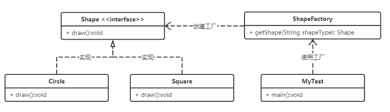
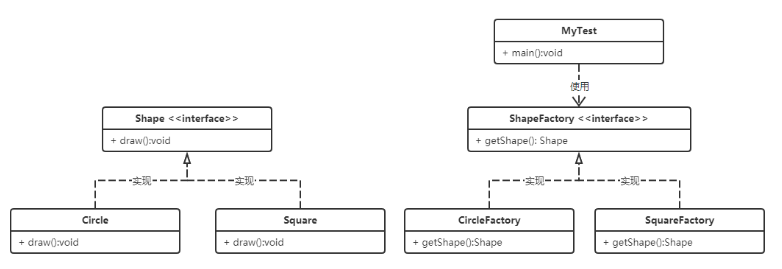
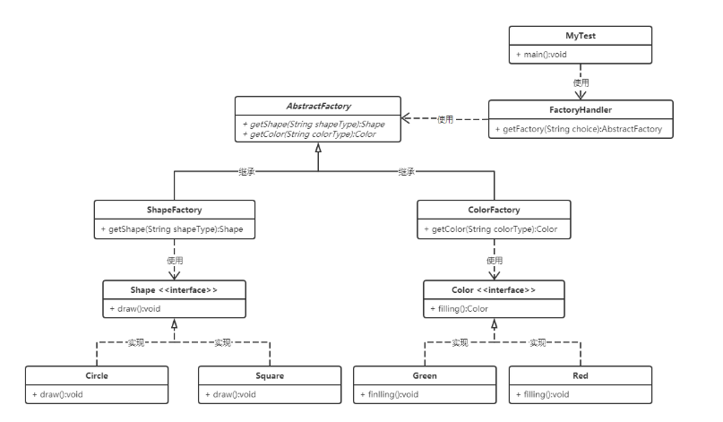
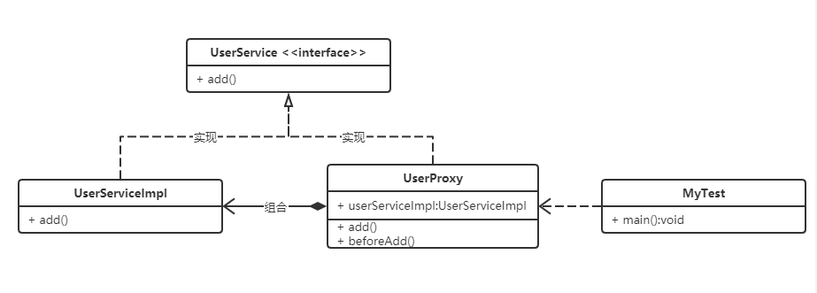
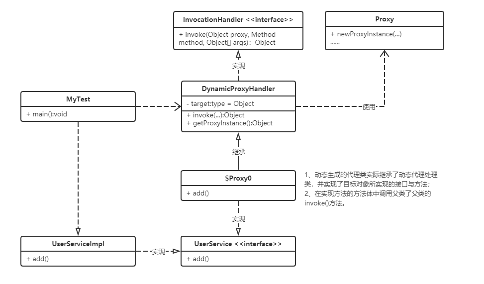

# 一、设计模式

### 1、介绍

- Design Patterns；
- 针对特定上下文的特定问题的解决方案；
- 代表了最佳的实践，是一套被反复使用的、多数人知晓的、经过分类编目的、代码设计经验的总结。

### 2、类型（23）

##### 2.1 创建型模式（5）

> 提供一种在创建对象的同时，隐藏创建逻辑的方式，而不是使用new运算符直接实例化对象。

- 工厂模式（Factory Pattern）
- 抽象工厂模式（Abstract Factory Patttern）
- 单例模式（Singleton Pattern）
- 建造者模式（Builder Pattern）
- 原型模式（Prototype Pattern）

##### 2.2 结构型模式（7）

> 关注类和对象的组合

- 适配器模式（Adapter Pattern）
- 桥接模式（Bridge Pattern）
- 组合模式（Composite Pattern）
- 装饰器模式（Decorator Pattern）
- 外观模式（Facade Pattern）
- 享元模式（Flyweight Pattern）
- 代理模式（Proxy Pattern）

##### 2.3 行为型模式（11）

> 关注对象之间的通信

- 责任链模式（Chain of Responsibility Pattern）
- 命令模式（Command Pattern）
- 解释器模式（Interpreter Pattern）
- 迭代器模式（Iterator Pattern）
- 中介者模式（Mediator Pattern）
- 备忘录模式（Memento Pattern）
- 观察者模式（Observer Pattern）
- 状态模式（State Pattern）
- 策略模式（Strategy Pattern）
- 模板模式（Template Pattern）
- 访问者模式（Visitor Pattern）

### 3、六大原则

# 二、创建型

### 1、工厂模式

#### 1.1 简单工厂模式

（1）介绍

- 定义一个创建对象的类，封装实例化对象的行为；

- 优点：实现对象的创建和对象的使用分离，将对象的创建交给专门的工厂类负责；
- 缺点：不够灵活，新增加一个具体产品时，需要新增一个具体的产品类，修改工厂方法的判断逻辑。

（2）UML类图



（3）代码示例

```java
// 形状接口
public interface Shape {

    /**
     * 画一个图形
     */
    void draw();

}
```

```java
// 圆形
public class Circle implements Shape {
    
    public void draw() {
        System.out.println("======画了一个圆形");
    }
}

// 正方形
public class Square implements Shape {
    
    public void draw() {
        System.out.println("======画了一个正方形");
    }
}
```

```java
// 常量
public class Consts {
    
    public static final String SHAPE_SQUARE = "正方形";
    public static final String SHAPE_CIRCLE = "圆形";
    public static final String SHAPE_TRIANGLE= "三角形";
}
```

```java
// 形状工厂
public class ShapeFactory {

    //  获取形状实例
    public Shape getShape(String shapeType) {
        Shape shape = null;
        
        if (Consts.SHAPE_CIRCLE.equals(shapeType)) {
            shape = new Circle();
        } else if (Consts.SHAPE_SQUARE.equals(shapeType)) {
            shape = new Square();
        }

        return shape;
    }
}
```

```java
public class MyTest {

    public static void main(String[] args) {

        // 实例化形状工厂
        ShapeFactory shapeFactory = new ShapeFactory();
        // 获取指定形状
        Shape shape = shapeFactory.getShape(Consts.SHAPE_CIRCLE);
        // 调用方法
        shape.draw();
    }
}
```

#### 1.2 工厂模式

（1） 介绍

- 定义创建产品对象的接口，创建具体产品实例的工作延迟到其工厂子类去完成；
- 其是简单工厂模式的进一步抽象和推广；
- 优点：当需要新增产品时，无需修改原有代码，只需要添加一个具体产品类和其对应的工厂子类即可，扩展性好。

（2）UML类图



（3） 代码示例

```java
// 形状接口
public interface Shape {

    // 画一个图形
    void draw();
}
```

```java
// 圆形类
public class Circle implements Shape {
    
    public void draw() {
        System.out.println("======画了一个圆形");
    }
}

// 正方形类
public class Square implements Shape {
    
    public void draw() {
        System.out.println("======画了一个正方形");
    }
}
```

```java
// 形状工厂接口接口
public interface ShapeFactory {
    
    // 获取形状
    Shape getShape();
}
```

```java
// 圆形工厂类
public class CircleFactory implements ShapeFactory {

    public Shape getShape() {
        return new Circle();
    }
}

// 正方形工厂类
public class SquareFactory implements ShapeFactory {

    public Shape getShape() {
        return new Square();
    }
}
```

```java
public class MyTest {

    public static void main(String[] args) {

        // 实例化正方形工厂
        ShapeFactory squareFactory = new SquareFactory();
        // 获取正方形实例
        Shape square = squareFactory.getShape();
        // 调用方法
        square.draw();
    }
}
```

### 2、抽象工厂模式

（1）介绍

- 定义一个创建一系列相关或相互依赖对象的接口；
- 是工厂模式的进一步扩展，由一个工厂生产多种产品对象；
- 举例：衣服属于一个产品族（抽象工厂），分为上衣、裤子、鞋子等（具体工厂），这些又分各种款式（具体产品）；
- 优点：能够保证始终只使用同一个产品族中的对象；
- 缺点：扩展困难，需要在抽象与具体实现中增加代码。

（2）UML类图



（3）代码示例

```java
// 形状接口
public interface Shape {

    // 画一个图形
    void draw();
}

// 圆形类
public class Circle implements Shape {
    
    public void draw() {
        System.out.println("======画了一个圆形");
    }
}

// 正方形类
public class Square implements Shape {
    
    public void draw() {
        System.out.println("======画了一个正方形");
    }
}

```
```java
// 颜色接口
public interface Color {

    // 填充颜色
    void filling();
}

// 绿色类
public class Green implements Color {

    public void filling() {
        System.out.println("======填充绿色");
    }
}

// 红色类
public class Red implements Color {

    public void filling() {
        System.out.println("======填充红色");
    }
}
```
```java
// 常量
public class Consts {

    // ********************** 形状 **********************
    public static final String SHAPE = "shape";
    public static final String SHAPE_SQUARE = "square";
    public static final String SHAPE_CIRCLE = "circle";
    public static final String SHAPE_TRIANGLE= "triangle";

    // ********************** 颜色 **********************
    public static final String COLOR = "color";
    public static final String COLOR_GREEN = "green";
    public static final String COLOR_RED = "red";
    public static final String COLOR_BLACK = "black";
}
```

```java
// 抽象工厂类
public abstract class AbstractFactory {

    // 获取形状
    public abstract Shape getShape(String shapeType);
    // 获取颜色
    public abstract Color getColor(String colorType);
}
```
```java
// 颜色工厂类
public class ColorFactory extends AbstractFactory {

    // 获取颜色实例
    @Override
    public Color getColor(String colorType) {
        Color color = null;

        if (Consts.COLOR_GREEN.equals(colorType)) {
            color = new Green();
        } else if (Consts.COLOR_RED.equals(colorType)) {
            color = new Red();
        }

        return color;
    }

    @Override
    public Shape getShape(String shapeType) {
        return null;
    }
}
```
```java
// 形状工厂类
public class ShapeFactory extends AbstractFactory {

    //  获取形状实例
    @Override
    public Shape getShape(String shapeType) {
        Shape shape = null;
        if (Consts.SHAPE_CIRCLE.equals(shapeType)) {
            shape = new Circle();
        } else if (Consts.SHAPE_SQUARE.equals(shapeType)) {
            shape = new Square();
        }

        return shape;
    }

    @Override
    public Color getColor(String colorType) {
        return null;
    }
}
```
```java
// 工厂处理器
public class FactoryHandler {

    // 获取工厂实例
    public static AbstractFactory getFactory(String choice) {
        AbstractFactory factory = null;

        if (Consts.COLOR.equals(choice)) {
            factory = new ColorFactory();
        } else if (Consts.SHAPE.equals(choice)) {
            factory = new ShapeFactory();
        }

        return factory;
    }
}
```
```java
public class MyTest {

    public static void main(String[] args) {

        // 获取形状工厂
        AbstractFactory shapeFactory = FactoryHandler.getFactory(Consts.SHAPE);
        // 获取形状
        Shape shape = shapeFactory.getShape(Consts.SHAPE_SQUARE);
        shape.draw();

        // 获取颜色工厂
        AbstractFactory colorFactory = FactoryHandler.getFactory(Consts.COLOR);
        // 获取颜色
        Color color = colorFactory.getColor(Consts.COLOR_RED);
        color.filling();
    }
}
```
### 3、单例模式

##### 3.1 介绍

- 保证一个类仅有一个实例，并提供一个访问它的全局访问点；
- 特点：
  - 构造方法私有化；
  - 实例化的变量引用私有化；
  - 获取实例的方法共有；
- 优点：
  - 内存中只有一个实例，减少内存开销；
  - 避免对资源的多重占用（写文件等操作）。

##### 3.2 实现方式

###### 3.2.1 懒汉式

- 线程不安全

```java
public class LazyPattern {

    /** 私有化构造函数 */
    private LazyPattern() {

    }

    private static LazyPattern instance;

    /**
     * 获取实例
     * @return
     */
    public static LazyPattern getInstance() {
        if (instance == null)
        {
            instance = new LazyPattern();
        }
        return instance;
    }

}
```

###### 3.2.2 懒汉式2

- 加同步锁保证线程安全，但加锁会影响效率

```java
public class LazyPattern2 {
    
    /** 私有化构造函数 */
    private LazyPattern2() {

    }

    private static LazyPattern2 instance;

    /**
     * 获取实例
     * @return
     */
    public static synchronized LazyPattern2 getInstance() {
        if (instance == null) {
            instance = new LazyPattern2();
        }
        return instance;
    }

}
```

###### 3.2.3 饿汉式

- 线程安全，且未加锁，效率高
- 但类加载时就初始化，浪费内存

```java
public class HungryPattern {

    /** 私有化构造函数 */
    private HungryPattern() {

    }

    private static HungryPattern instance = new HungryPattern();

    /**
     * 获取实例
     * @return
     */
    public static HungryPattern getInstance() {
        return instance;
    }

}
```

###### 3.2.4 双重校验锁

- 线程安全 性能高

```java
public class DoubleCheckLock {

    /** 私有化构造函数 */
    private DoubleCheckLock() {

    }

    // volatile 不稳定的，表示修饰的变量的值可能随时被别的线程修改
    // 使用volatile修饰的变量会强制将修改的值立即写入主存，主存中值的更新会使缓存中的值失效
    private static volatile DoubleCheckLock instance;

    /**
     * 获取实例
     * @return
     */
    public static DoubleCheckLock getInstance() {
        if (instance == null) {
            synchronized (DoubleCheckLock.class) {
                if (instance == null) {
                    instance = new DoubleCheckLock();
                }
            }
        }
        return instance;
    }

}
```

###### 3.2.5 静态内部类

```java
public class InnerClassPattern {

    private InnerClassPattern() {

    }

    public static final InnerClassPattern getInstance() {
        return InstanceHandler.INSTANCE;
    }

    // 静态内部类
    private static class InstanceHandler {
        // 静态常量
        private static final InnerClassPattern INSTANCE = new InnerClassPattern();
    }

}
```

###### 3.2.6 枚举

```java
public enum EnumPattern {

    // 枚举类的构造器只能是private修饰
    // 枚举项实质是静态常量 => public static final EnumPattern INSTANCE;
    // 每一个枚举项都是本类的实例
    INSTANCE;

    public void doSomething() {
        System.out.println("===通过枚举实现单例");
    }

}
```

### 4、原型模式

##### 4.1 介绍

- 用原型实例指定创建对象的种类，并且通过拷贝这些原型创建新的对象；
- 实例：Java中的Object clone()方法；
- 优点：基于内存二进制流的复制，比直接new一个对象更高效；
- 缺点：必须实现Cloneable接口；实现深克隆较麻烦。

##### 4.2 代码示例

```java
public class User implements Cloneable {

    private String name;

    @Override
    public Object clone() throws CloneNotSupportedException {
        return super.clone();
    }

    // 省略...
}
```

```java
public class MyTest {

    public static void main(String[] args) throws CloneNotSupportedException {

        User user = new User();
        User user2 = (User) user.clone();

        boolean result = user == user2;
        System.out.println("======对象是否相同：" + result);
    }

}
```

### 5、建造者模式

##### 5.1 介绍

- 使用多个简单的对象一步一步构建成一个复杂的对象，将构建与表示分离；
- 与工厂模式的区别：建造者模式更加关注于对象创建的过程，工厂模式则关注于整体对象的创建；
- 

# 三、结构型

### 1、代理模式

##### 1.1 静态代理

（1）介绍

- 通过代理对象访问目标对象，并且可以增加额外功能；
- 代理对象 = 增强代码 + 目标对象；
- 实例：房产中介、windows中的快捷方式；
- 关键：实现与代理类组合；
- 优点：
  - 职责清晰；
  - 高扩展性；
  - 可在不影响原有业务的情况下增加一些额外业务；
- 缺点：目标接口扩展功能，则代理对象与目标对象都需要做相应的扩展。

（2）UML 类图



（3）代码示例

```java
// 接口
public interface UserService {

    void add();

}

// 实现类
public class UserServiceImpl implements UserService {

    public void add() {
        System.out.println("****** 新增一个用户 ******");
    }

}

// 代理类
public class UserProxy implements UserService {

    // 目标对象
    private UserService userService;

    public UserProxy(UserService service) {
        this.userService = service;
    }

    public void add() {

        if (userService != null) {
            // 执行一些其他操作
            this.beforeAdd();
            userService.add();
        }

    }

    private void beforeAdd() {
        System.out.println("=== 准备新增用户 ===");
    }

}
```

```java
public class MyTest {

    public static void main(String[] args) {
		
        // 创建代理对象，使用代理对象访问目标对象
        UserService userService = new UserProxy(new UserServiceImpl());
        userService.add();

    }

}
```

##### 1.2 动态代理

（1）介绍

- 根据代理对象动态的在内存中创建代理对象；
- 动态代理也可称作JDK代理、接口代理，通过java反射实现；
- 依赖于`java.lang.reflect.Proxy`类与`java.lang.reflect.InvocationHandler`接口；
- 通过传递目标对象的类加载器和一组接口，创建代理类对象；
- 实现：
  - 创建一个动态代理处理类，实现`InvocationHandler`接口，并重写`invoke`方法；
  - 通过`Proxy`的`newProxyInstance(ClassLoader loader, Class<?>[] interfaces, InvocationHandler h)`方法创建代理类；

（2）UML 类图



（3）代码示例

```java
// 动态代理处理类
public class DynamicProxyHandler implements InvocationHandler {

    // 目标对象，必须是接口的实现对象
    private Object target;

    // 有参构造，传递目标对象
    public DynamicProxyHandler(Object target) {
        this.target = target;
    }

    /**
     * 实现 InvocationHandler 接口方法
     * 动态生成的代理类继承了 DynamicProxyHandler 类，实现了 target（目标对象）所实现的接口与方法
     * 实现的方法中会调用父类的 invoke 方法（即此方法）
     * @param proxy
     * @param method 调用的方法
     * @param args 方法的参数
     * @return
     * @throws Throwable
     */
    public Object invoke(Object proxy, Method method, Object[] args) throws Throwable {

        // 业务其他
        System.out.println("=== 准备中... ===");

        // 目标对象调用
        Object obj = method.invoke(target, args);

        // 其他业务
        System.out.println("=== 结束... ===");

        return obj;
    }

    /**
     * 获取代理对象
     * @return
     */
    public Object getDynamicProxy() {

        if (target == null) {
            return null;
        }

        // 创建代理对象
        // ClassLoader loader表示当前使用到的appClassloader;
        // Class<?>[] interfaces表示目标对象实现的一组接口;
        // InvocationHandler h表示当前的InvocationHandler实例对象，此处用this即可
        Object proxyInstance = Proxy.newProxyInstance(target.getClass().getClassLoader(), target.getClass().getInterfaces(), this);

        return proxyInstance;
    }

}
```

```java
public class MyTest {

    public static void main(String[] args) {
		
        // 生成$Proxy0的class文件，在项目根目录的com/sun/proxy文件夹下
        // System.getProperties().put( "sun.misc.ProxyGenerator.saveGeneratedFiles" , "true" );
        
        // 创建动态代理处理对象
        DynamicProxyHandler dynamicProxy = new DynamicProxyHandler(new UserServiceImpl());
        // 获取目标代理对象，返回值是代理的接口，并非其实现类
        UserService proxy = (UserService) dynamicProxy.getDynamicProxy();
        proxy.add();

    }

}
```

```java
// 动态生成的代理类
public final class $Proxy0 extends Proxy implements UserService {
    private static Method m1;
    private static Method m2;
    private static Method m3;
    private static Method m0;

    public $Proxy0(InvocationHandler var1) throws  {
        super(var1);
    }

    public final boolean equals(Object var1) throws  {
        try {
            return (Boolean)super.h.invoke(this, m1, new Object[]{var1});
        } catch (RuntimeException | Error var3) {
            throw var3;
        } catch (Throwable var4) {
            throw new UndeclaredThrowableException(var4);
        }
    }

    public final String toString() throws  {
        try {
            return (String)super.h.invoke(this, m2, (Object[])null);
        } catch (RuntimeException | Error var2) {
            throw var2;
        } catch (Throwable var3) {
            throw new UndeclaredThrowableException(var3);
        }
    }

    // 业务方法
    public final void add() throws  {
        try {
            super.h.invoke(this, m3, (Object[])null);
        } catch (RuntimeException | Error var2) {
            throw var2;
        } catch (Throwable var3) {
            throw new UndeclaredThrowableException(var3);
        }
    }

    public final int hashCode() throws  {
        try {
            return (Integer)super.h.invoke(this, m0, (Object[])null);
        } catch (RuntimeException | Error var2) {
            throw var2;
        } catch (Throwable var3) {
            throw new UndeclaredThrowableException(var3);
        }
    }

    static {
        try {
            m1 = Class.forName("java.lang.Object").getMethod("equals", Class.forName("java.lang.Object"));
            m2 = Class.forName("java.lang.Object").getMethod("toString");
            m3 = Class.forName("com.xinx.service.UserService").getMethod("add");
            m0 = Class.forName("java.lang.Object").getMethod("hashCode");
        } catch (NoSuchMethodException var2) {
            throw new NoSuchMethodError(var2.getMessage());
        } catch (ClassNotFoundException var3) {
            throw new NoClassDefFoundError(var3.getMessage());
        }
    }
}
```

##### 1.3 Cglib 代理

（1）介绍

- 静态代理和JDK动态代理所代理的都是接口，要求目标对象必须实现一个或多个接口；
- Cglib 代理，也叫做子类代理，动态生成被代理类的子类，覆盖父类方法，从而扩展功能；
- 代理的目标对象不能声明为final，否则无法创建其子类，所代理的方法也不能是final与static修饰；
- Cglib 代理并不是通过java反射实现，而是采用ASM字节码生成框架生成代理类，比Java反射效率高；
- Spring 核心包包含 Cglib 功能，使用时引入 spring-core 包即可；
- 实现：
  - 创建代理工厂，实现`MethodInterceptor` 接口并实现接口的`intercept`方法；
  - 使用工具类与字节码技术生成代理对象；

（2）代码示例

```java
// 目标对象
public class Manager {

    public void addAccount() {
        System.out.println("====== 管理员增加了一个账号 ======");
    }

}
```

```java
// Cglib 代理工厂
public class CglibProxyFactory implements MethodInterceptor {

    // 目标对象，必须是接口的实现对象
    private Object target;

    // 有参构造，传递目标对象
    public CglibProxyFactory(Object target) {
        this.target = target;
    }

    /**
     * 实现的接口方法
     * @param o
     * @param method 方法
     * @param objects 方法参数
     * @param methodProxy 
     * @return
     * @throws Throwable
     */
    public Object intercept(Object o, Method method, Object[] objects, MethodProxy methodProxy) throws Throwable {

        // 业务其他
        System.out.println("=== 准备中... ===");

        // 目标对象调用
        Object obj = method.invoke(target, objects);

        // 其他业务
        System.out.println("=== 结束... ===");

        return obj;
    }

    /**
     * 创建代理对象
     */
    public Object getProxyInstance(){

        // 工具类
        Enhancer en = new Enhancer();

        // 设置父类
        en.setSuperclass(target.getClass());

        // 设置回调函数
        en.setCallback(this);

        // 创建子类(代理对象)
        return en.create();

    }

}
```

```java
// 测试
public class MyTest {

    public static void main(String[] args) {

        // ********** Cglib 代理 **********
        CglibProxyFactory cglibProxyFactory = new CglibProxyFactory(new Manager());
        Manager manager = (Manager) cglibProxyFactory.getProxyInstance();
        manager.addAccount();
    }

}
```

# 四、行为型

### 1、策略模式

