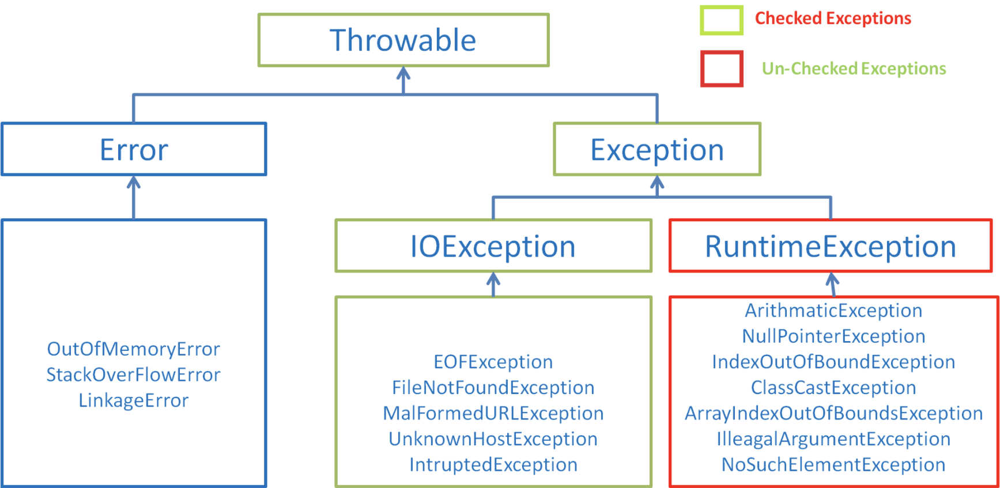
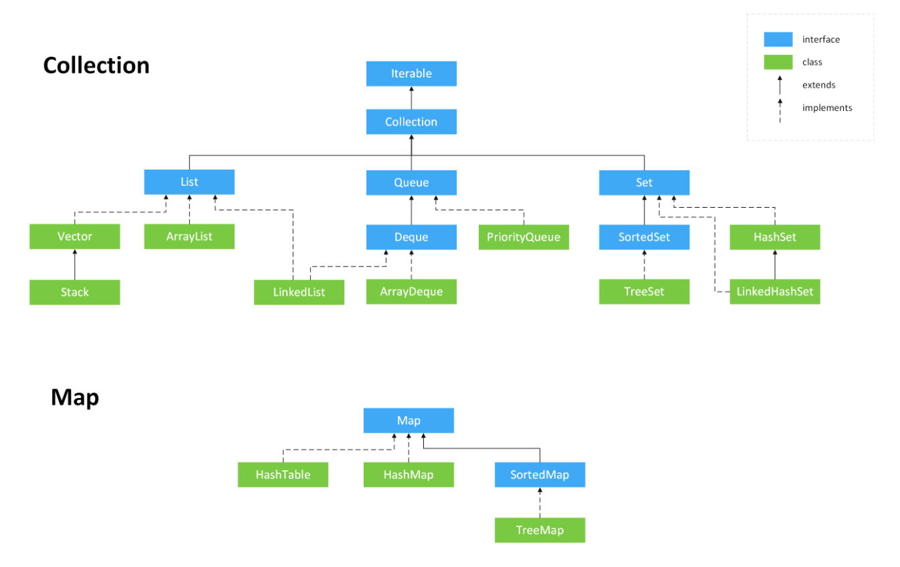

[TOC]

# 基础

### 基础概念

##### Java 语言的特点

- 面向对象（封装、继承、多态）；
- 平台无关性
  - 即一次编写，到处运行，由Java虚拟机实现；
- 简单易学；
- 可靠性；
- 安全性；
- 支持网络编程；

##### JDK 与 JRE

- Java Development Kit
  - Java开发工具包，主要包含各种类库和工具；
  - 也包含Java运行时环境JRE；
- Java Runtime Environment
  - Java程序的运行环境；

##### 字节码

- 即`.class`文件，Java文件`.java`编译后形成字节码文件；
- 字节码文件经由Java解释器与`JIT`编译后形成机器可理解的机器码；

##### Java与C++

- 都是面向对象的语言，都支持封装、继承和多态；
- Java不提供指针来直接访问内存，程序内存更加安全；
- Java的类单继承，而C++支持多继承，但Java都接口可以多继承（实现）；
- Java拥有自动内存管理机制，无需开发者手动释放内存；
- C++同时支持方法重载和操作符重载，Java只支持方法重载；

##### Java与C#

- 90%相同

### 基本知识

##### 值传递与引用传递

- 值传递
  - 方法接接收的是实参值的拷贝，会创建副本；
- 引用传递
  - 方法接收的直接是实参所引用的对象在堆中的地址，不会创建副本；
  - 对形参的修改将影响到实参；
- 在Java中只有值传递
  - 若参数是基本类型，传递的就是基本类型字面量值的拷贝，会创建副本；
  - 若参数是引用类型，传递的是实参所引用的对象在堆中地址值的拷贝，同样会创建副本；

##### 字符常量与字符串常量

- **字符常量**-单引号标注的1个字符，**字符串常量**-双引号标注的0个或多个字符；
- **字符常量**相当于一个整型值（ASCII值），可以参与表达式运算；
- **字符串常量**代表一个地址值（在内存中的存放位置）；
- **字符常量**只占2个字节，字符串常量占若干个字节；


##### == 与 equals()

- ==
  - 基本数据类型，`==`比较的是值;
  - 引用数据类型，`==`比较的是对象的内存地址；
  - Java只有值传递，`==`比较的都是值，只是引用类型变量存储值是该对象的地址；
- equals()
  - 类未覆盖`equals()`方法，比较对象时等价于通过`==`比较；
  - 类覆盖了`equals()`方法，根据`equals()`方法比较的内容判断；
  - `String`类中的`equals()`是被重写过的，比较的是`String`对象的值；

##### hashCode() 与 equals()

- `hashCode()`用于获取哈希码值（`int`类型，也称作散列值）；
- 通过哈希码确定该对象在哈希表中的索引位置；
- 重写`equals()`方法必须重写`hashCode()`方法；

##### String 不可变的原因

```java
public final class String implements java.io.Serializable, Comparable<String>, CharSequence {
    private final char value[];
	//...
}
```

- 保存字符串的数组被`final`修饰且为私有的，并且`String`类没有提供/暴露修改这个字符串的方法；
- `String` 类被`final`修饰致使其不能被继承，从而避免了子类破坏该类的不可变性；

##### String、StringBuffer、StringBuilder

| String                                                       | StringBuffer                             | StringBuilder        |
| ------------------------------------------------------------ | ---------------------------------------- | -------------------- |
| 不可变                                                       | 可变                                     | 可变                 |
| 线程安全                                                     | 线程安全                                 | 线程不安全           |
| 每次对`String`类型修改时，都会生成一个新对象（常量池没有的情况下），然后将指针指向新对象； | 每次修改仅对对象本身操作，不产生新对象； | 同`StringBuffer`     |
| 适用于操作少量数据                                           | 适用于大数据、单线程                     | 适用于大数据、多线程 |

### 基本数据类型

##### 八种基本数据类型

- 6种数值类型：`byte`、 `short`、 `int`、`long`、 `float`、 `double` 
- 1种字符类型：`char`
- 1种布尔型：`boolean`

| 基本类型  | 位数 | 字节 | 默认值  | 包装类型    |
| --------- | ---- | ---- | ------- | ----------- |
| `byte`    | 8    | 1    | 0       | `Byte`      |
| `short`   | 16   | 2    | 0       | `Short`     |
| `int`     | 32   | 4    | 0       | `Integer`   |
| `long`    | 64   | 8    | 0L      | `Long`      |
| `float`   | 32   | 4    | 0f      | `Float`     |
| `double`  | 64   | 8    | 0d      | `Double`    |
| `char`    | 16   | 2    | 'u0000' | `Character` |
| `boolean` | 1    |      | false   | `Boolean`   |

##### 基本数据类型常量池技术

- `byte`、 `short`、 `int`、`long` 这4种包装类默认创建了数值 **[-128, 127]** 的相应类型的缓存数据，此范围都使用同一个引用（已缓存）；

- `Character` 创建了 **[0, 127]** 范围的缓存数据；

- `Boolean` 直接返回 `true` 或 `false`；

- `Integer` 源码

  ```java
  public static Integer valueOf(int i) {
      if (i >= IntegerCache.low && i <= IntegerCache.high)
          return IntegerCache.cache[i + (-IntegerCache.low)];
      return new Integer(i);
  }
  private static class IntegerCache {
      static final int low = -128;
      static final int high;
      static {
          // high value may be configured by property
          int h = 127;
      }
  }
  ```

- `Character` 源码

  ```java
  public static Character valueOf(char c) {
      if (c <= 127) { // must cache
        return CharacterCache.cache[(int)c];
      }
      return new Character(c);
  }
  
  private static class CharacterCache {
      private CharacterCache(){}
      static final Character cache[] = new Character[127 + 1];
      static {
          for (int i = 0; i < cache.length; i++)
              cache[i] = new Character((char)i);
      }
  }
  ```

-  `Boolean` 源码

  ```java
  public static Boolean valueOf(boolean b) {
      return (b ? TRUE : FALSE);
  }
  ```

##### 自动装箱与拆箱

- 装箱

  - 将基本类型用它们对应的引用类型包装起来；
  - 实际调用了包装类`valueOf()`方法；

- 拆箱

  - 将包装类型转换为基本数据类型；

  - 实际调用了`xxxValue()`方法；

### 面向对象

##### 面向对象与面向过程

|      | 面向对象                                                     | 面向过程                               |
| ---- | ------------------------------------------------------------ | -------------------------------------- |
| 说明 | 以对象为中心，采用基于对象（实体）的概念建立模型，重视各对象之间的关系； | 以过程为中心，一种基础顺序的思维方式； |
| 特性 | 抽象、继承、封装、多态                                       | 功能模块化、代码流程化                 |
| 优点 | 易维护、易复用、易扩展、低耦合                               | 性能高、适合资源紧张、实时性强的场合   |
| 举例 | `Java`、`C++`、`C#` 等；                                     | `C`、`COBOL` 等；                      |

##### 成员变量与局部变量

| 成员变量                                          | 局部变量                       |
| ------------------------------------------------- | ------------------------------ |
| 属于实例或类                                      | 代码块或方法中定义的变量或参数 |
| 可用 `public`、`private`、`static` 、`final` 修饰 | 只能被 `final`修饰             |
| 未赋初始值会自动赋默认值                          | 不会自动赋值                   |

##### 面向对象三大特征

- 封装
  - 把一个对象的状态信息（属性）隐藏在对象内部，不允许外部对象直接访问，但是可提供一些可以被外界访问的方法来操作这些属性；
- 继承
  - 使用已存在的类的定义为基础建立新的类，新类可以使用父类的功能，也可以增加新的定义或功能；
  - 子类拥有父类对象所有属性和方法（对于私有属性和方法只是拥有，并不能访问）；
  - 子类可以用自己的方式实现父类的方法（重写）；
- 多态
  - 同一个行为具有多个不同表现形式或形态；
  - 对象类型和引用类型之间具有继承/实现的关系；
  - 引用类型变量具体调用的是哪个类中的方法，唯有在程序运行期间才能确定；
  - 多态不能调用 “只存在于子类但不存在于父类” 的方法；
  - 若子类重写了父类的方法，真正执行的是子类重写的方法，否则执行的是父类的方法；

##### 重载与重写

- 重载
  - 编译时多态；
  - 同一个类中多个同名方法根据不同传参执行不同的逻辑处理；
  - 即方法名必须相同外，参数、返回值类型、访问修饰符都可以不同；
- 重写
  - 运行时多态；
  - 指子类重写编写父类的允许访问的方法；
  - 方法名、返回值类型、参数必须相同，异常范围<=父类，访问修饰符>=父类；
  - 构造方法无法被重写；

### 反射

##### 概念

- 在程序运行期间，借助Reflection API，可以获取任何类的内部信息，并能够直接操作任意对象的内部属性与方法；

##### 提供的功能

- 在运行时判断任意一个对象所属的类；
- 在运行时构造任意一个类的对象；
- 在运行时判断任意一个类所具有的成员变量和方法；
- 在运行时调用任意一个对象的方法；
- 生成动态代理；
- 应用
  - jdbc 的数据库连接；
  - Spring 转载 Bean；
  - 动态代理......

##### 优缺点

- 优
  - 提高程序的灵活性与扩展性；
  - 允许程序创建和控制任何类的对象，无需提前硬编码目标类；
- 缺
  - 性能低：反射是一种解释操作，性能低于直接编码；
  - 模糊程序内部逻辑：反射绕过了源代码；
  - 增大复杂性：使用反色比直接编码更复杂；

##### 获取Class对象的四种方式

- 通过具体类获取

  ```java
  Class clazz1 = MyObject.class;
  ```

- 通过对象实例获取

  ```java
  MyObject myObject = new MyObject();
  Class clazz3 = myObject.getClass();
  ```

- 通过全路径类名获取

  ```java
  Class clazz2 = Class.forName("com.xx.MyObject");
  ```

- 通过类加载器获取

  ```java
  Class clazz4 = ClassLoader.loadClass("com.xx.MyObject");
  ```


### 异常

##### 体系结构



- 所有异常的祖先：`java.lang.Throwable` 类，其下有两个重要的子类`Error` （错误）和 `Exception`（异常）；

##### Error

- 程序无法处理的错误，无法在程序中捕获，应尽量避免，若发生该错误，JVM一般会选择线程终止；
- 如：`OutOfMemoryError`、`StackOverFlowError`；

##### Exception

- 程序自身可以处理的异常，分为**受检查异常**与**不受检查时异常**；

- 受检查异常（非运行时异常）
  - 编译时被强制检查的异常（`RuntimeException`及其子类以外的异常）；
  - 若受检查异常在程序中未处理（`catch`/`throw`）的话，程序将无法通过编译；
  - 如：`IOException`、`SQLException` 、`ClassNotFoundException` 等；

- 不受检查异常（运行时异常）
  - 未声明，但在运行时发生的各种异常（`RuntimeException`及其子类异常）；
  - 一般由程序逻辑错误引起，会被自动捕获，应尽量避免；
  - 如：`NullPointerException`、`IndexOutOfBoundsException` 等；

##### 异常处理

- `try`块
  - 用于捕获异常；
  - 可跟零个或多个`catch`块，若没有`catch`块，则必须跟一个`finally`块；
- `catch`块
  - 用于处理try捕获的异常；
- `finally`块
  - 无论是否捕获或处理异常，`finally`里面的语句总会被执行；
  - 若在`try`或`catch`块中遇到`return`语句时
    - `finally`块中的语句会在此前先执行；
    - 且`try` 与`catch`块中`return`的数据将会暂时保存（即若是基本数据类型，不受`finally`块中操作影响，若是引用类型则会被影响）；
  - 若`finally`块中含有`return`语句时，`try` 与`catch`块中的`return`语句将会失效；

### I/O流

##### 序列化与反序列化

- 对象状态的保存和重建；

- 序列化
  - 将数据结构或对象转换成二进制字节流的过程；
  - 作用：在传递或保存对象时，保证对象的完整性和可传递性
- 反序列化
  - 将在序列化过程中所生成的二进制字节流恢复为数据结构或者对象的过程；

- `transient`
  - 只修饰变量，不能修饰类与方法；
  - 被`transient`修饰的变量不会被序列化，当被反序列化时，变量值会被赋予默认值；
  - `static` 修饰的变量不属于任何对象，而是属于类，因而不会被序列化；

##### IO流

- 分类
  - 按流向划分：输入流与输出流；
  - 按操作单元划分：字节流与字符流；
  - 按流的角色划分：节点流与处理流；
- Java IO流所有类都是由４个抽象基类派生
  - `inputStream`：字节输入流基类；
  - `OutputStream`：字节输出流基类；
  - `Reader`：字符输入流基类；
  - `Writer `：字符输出流基类；
- 关流顺序
  - 无依赖情况：先开后关；
  - 有依赖关系：a依赖b，先关a；

##### 有字节流为什么还需要字符流？

- 提要：信息最小的存储单元是字节；
- 字符流 = 字节流 + 编码/解码；
- 字符流是由Java虚拟机将字节转换而成，转换过程非常耗时；
- 若是编码类型未知，任意乱码，提供字符流方便操作；
- 对于音频文件、图片等媒体文件适合使用字节流，涉及字符操作可考虑使用字符流；

##### IO模型

# 容器

### 概述

- Java集合，也称为容器，主要由两大接口派生而来；
- `Collection` ：用于存放单一元素，三个主要子接口：`List`、`Set`、`Queue`；
- `Map`：主要用于存放键值对；
- 相比于数组（大小固定，元素有序、可重复，限定类型），集合提高了数据存储的灵活性，还可保存具有映射关系的数据；

### 体系结构（主要部分）



### List 接口

> 有序，元素可重复；

##### 概述

| 类型         | 底层数据结构                                           | 线程安全性 | 内存占用                          |
| ------------ | ------------------------------------------------------ | ---------- | --------------------------------- |
| `ArrayList`  | `Object[]` 数组                                        | 非线程安全 | 列表末尾预留一定空间              |
| `LinkedList` | 双向链表（JDK1.6为双向循环链表，JDK1.7之后为双向链表） | 非线程安全 | 每一个元素比`ArrayList`多消耗空间 |
| `Vector`     | `Object[]` 数组                                        | 线程安全   |                                   |

##### ArrayList 扩容机制

- `ArrayList` 默认容量为10；
- 

### Set 接口

> 无序，不可重复，使用hashcode判断元素是否重复；

##### 概述

| 类型            | 底层数据结构                | 线程安全性 | 说明                                             |
| --------------- | --------------------------- | ---------- | ------------------------------------------------ |
| `HashSet`       | 哈希表                      | 非线程安全 | 基于`HashMap`实现，底层采用`HashMap`来保存元素； |
| `LinkedHashSet` | 哈希表 + 链表（保证有序性） | 非线程安全 | `HashSet`的子类，内部通过`LinkedHashMap`实现     |
| `TreeSet`       | 红黑树                      | 非线程安全 | 元素有序，可定制排序方式                         |

### Queue 接口

> 队列，先进先出

##### 概述

| 类型            | 底层数据结构                | 线程安全性 |      |
| --------------- | --------------------------- | ---------- | ---- |
| `PriorityQueue` | `Object[]` 数组来实现二叉堆 |            |      |
| `ArrayQueue`    | `Object[]`  + 双指针        |            |      |
|                 |                             |            |      |

### Map 接口

> key-value 键值对

##### 概述

| 类型            | 底层数据结构                                                 | 线程安全性 | 元素有序性 | null 键与 null 值              | 容量                                  |      |
| --------------- | ------------------------------------------------------------ | ---------- | ---------- | ------------------------------ | ------------------------------------- | ---- |
| `HashMap`       | JDK1.8前由数组 + 链表组成；<br />数组为主体，链表主要用于解决哈希冲突；<br />JDK1.8之后为数组 + 链表/红黑树； | 非线程安全 | 无序       | 允许一个`null`键，多个`null`值 | 默认16，每次扩容2n（总是为2的幂次方） |      |
| `LinkedHashMap` | 继承自`HashMap`，在`HashMap`结构基础上，增加了一条双向链表； | 非线程安全 | 有序       | 同 `HashMap`                   |                                       |      |
| `HashTable`     | 数组 + 链表                                                  | 线程安全   |            | 不允许`null`键`与null`值       | 初始11，每次扩容2n + 1                |      |
| `TreeMap`       | 红黑树                                                       | 非线程安全 | 有序       |                                |                                       |      |

##### ConcurrentHashMap 与 HashMap

- 最主要的区别是线程安全问题

##### 为什么 HashMap 的容量是2的幂次方？

- 尽量将数据分配均匀，减少Hash值碰撞，提高`HashMap`的存取效率 。

##### HashMap 遍历方式

- 使用`EntrySet`性能最好；使用`KeySet`时，获取值需要`map.get(key)`，需要遍历Map集合去查询key所对应的值，相当于又遍历一次；

- Iterator

  ```java
  // entrySet
  Iterator<Map.Entry<Integer, String>> iterator = map.entrySet().iterator();
  while (iterator.hasNext()) {
      Map.Entry<Integer, String> entry = iterator.next();
      Integer key = entry.getKey());
      String value = entry.getValue();
  }
  
  // keySet
  Iterator<Integer> iterator = map.keySet().iterator();
  while (iterator.hasNext()) {
      Integer key = iterator.next();
      String value = map.get(tempkey);
  }
  ```

- For Each

  ```java
  // entrySet
  for (Map.Entry<Integer, String> entry : map.entrySet()) {
      Integer key = entry.getKey();
      String value = entry.getValue();
  }
  // keySet
  for (Integer tempkey: map.keySet()) {
      Integer key = tempkey;
      String value = map.get(tempkey);
  }
  ```

- Lambda（JDK1.8之后）

  ```java
  map.forEach((key, value) -> {
      Integer tempkey = key;
      String tempValue = value;
  });
  ```

- Streams API（JDK1.8之后）

  ```java
  map.entrySet().stream().forEach((entry) -> {
      Integer tempkey = entry.getKey();
      String tempValue = entry.getValue();
  });
  ```

### Collections 工具类

- 排序

  ```java
  void reverse(List list)//反转
  void shuffle(List list)//随机排序
  void sort(List list)//按自然排序的升序排序
  void sort(List list, Comparator c)//定制排序，由Comparator控制排序逻辑
  void swap(List list, int i , int j)//交换两个索引位置的元素
  void rotate(List list, int distance)//旋转。当distance为正数时，将list后distance个元素整体移到前面。当distance为负数时，将 list的前distance个元素整体移到后面
  ```

- 查找、替换

  ```java
  int binarySearch(List list, Object key)//对List进行二分查找，返回索引，注意List必须是有序的
  int max(Collection coll)//根据元素的自然顺序，返回最大的元素。 类比int min(Collection coll)
  int max(Collection coll, Comparator c)//根据定制排序，返回最大元素，排序规则由Comparatator类控制。类比int min(Collection coll, Comparator c)
  void fill(List list, Object obj)//用指定的元素代替指定list中的所有元素
  int frequency(Collection c, Object o)//统计元素出现次数
  int indexOfSubList(List list, List target)//统计target在list中第一次出现的索引，找不到则返回-1，类比int lastIndexOfSubList(List source, list target)
  boolean replaceAll(List list, Object oldVal, Object newVal)//用新元素替换旧元素
  ```

# Java8 新特性

### Interface

- 新`interface`新增默认方法（`default`修饰）与静态方法（`static`修饰）；
- 默认方法-`default`
  - 修饰的方法是普通实例方法，可以用`this`调用，可以被继承、重写；
  - 可以在不破坏现有架构情况下在接口中新增方法；
- 静态方法-`static`
  - 修饰的方法，为静态方法，只能用`interface`调用；
  - 可在接口中调用程序入口`main()`方法；

- 接口和抽象类
  - 接口多实现，类单继承；
  - 接口方法只能是`public abstract`修饰；变量是`public static final`修饰；抽象类可以用其他修饰符；

### 函数式接口

- 也称为SAM接口（single Abstract Method interfaces）；

- 有且只有一个抽象方法，但可以有多个非抽象方法；

- 广泛应用于`Lambda`表达式中；

- 自定义函数式接口

  ```java
  @FunctionalInterface // 该注解只是在编译期起到强制规范定义的作用，可不使用
  public interface LambdaInterface {
  	void customInterface();
  }
  ```

### Lambda 表达式

##### 简介

- 是一个匿名函数，Java8 允许将函数作为参数传递进方法中；

  ```java
  // parameters 可有可无，且无需指定数据类型
  (parameters) -> expression 
  或
  (parameters) ->{ statements; }
  ```

- 可以引用外部变量，但该变量默认拥有`final`属性，不可被修改；

##### 用法

- 代替匿名内部类

  ```java
  // Java8 之前
  new Thread(new Runnable() {
              @Override
              public void run() {
                  System.out.println("The runable now is using!");
              }
  }).start();
  
  // Java8 用lambda
  new Thread(() -> System.out.println("It's a lambda function!")).start();
  
  ```

- 方法引用
  - Java8 使用 `::`关键字传递方法或者构造函数引用；
  - 可引用静态方法、实例方法、构造方法；

### Stream 流

##### 简介

- Java8 新增`java.util.stream`包，和之前的流大同小异；
- `Stream` 不存储数据，不改变数据源，但可以检索和逻辑处理集合数据（筛选、排序、统计等），可理解为`sql`语句；
- 它的方法参数都是函数式接口，通常与`Lambda`表达式一同使用；
- 分为`stream`（串行流）和`parallelStream`（并行流，可多线程执行）；
- 一个`stream`流只能操作一次，一次过后就关闭；

##### 使用

- 待完善

### Optinoal 类

- 用于防止`NPE`（`java.lang.NullPointerException`）；

  ```java
  /**
  * Common instance for {@code empty()}. 全局EMPTY对象
  */
  private static final Optional<?> EMPTY = new Optional<>();
  
  /**
  * Optional维护的值
  */
  private final T value;
  
  /**
  * 如果value是null就返回EMPTY，否则就返回of(T)
  */
  public static <T> Optional<T> ofNullable(T value) {
     return value == null ? empty() : of(value);
  }
  /**
  * 返回 EMPTY 对象
  */
  public static<T> Optional<T> empty() {
     Optional<T> t = (Optional<T>) EMPTY;
     return t;
  }
  /**
  * 返回Optional对象
  */
  public static <T> Optional<T> of(T value) {
      return new Optional<>(value);
  }
  /**
  * 私有构造方法，给value赋值
  */
  private Optional(T value) {
    this.value = Objects.requireNonNull(value);
  }
  /**
  * 所以如果of(T value) 的value是null，会抛出NullPointerException异常，这样貌似就没处理NPE问题
  */
  public static <T> T requireNonNull(T obj) {
    if (obj == null)
           throw new NullPointerException();
    return obj;
  }
  ```

- `ofNullable()` 与 `of()` 的区别是当`value`为`null`时，`ofNullable()` 返回 `Empty`，`of`则会抛出 `NullPointerException` 异常；

- `flatMap()` 参数返回值如果是 `null` 会抛 `NullPointerException`，而 `map()` 返回`EMPTY`；

- 判断`value`是否为`null`

  ```java
  /**
  * value是否为null
  */
  public boolean isPresent() {
      return value != null;
  }
  /**
  * 如果value不为null执行consumer.accept
  */
  public void ifPresent(Consumer<? super T> consumer) {
     if (value != null)
      consumer.accept(value);
  }
  ```

- 获取 `value`

  ```java
  /**
  * 如果value != null 返回value，否则返回other的执行结果
  */
  public T orElseGet(Supplier<? extends T> other) {
      return value != null ? value : other.get();
  }
  
  /**
  * 如果value != null 返回value，否则返回T	
  */
  public T orElse(T other) {
      return value != null ? value : other;
  }
  
  /**
  * 如果value != null 返回value，否则抛出参数返回的异常
  */
  public <X extends Throwable> T orElseThrow(Supplier<? extends X> exceptionSupplier) throws X {
          if (value != null) {
              return value;
          } else {
              throw exceptionSupplier.get();
          }
  }
  /**
  * value为null抛出NoSuchElementException，不为空返回value。
  */
  public T get() {
    if (value == null) {
        throw new NoSuchElementException("No value present");
    }
    return value;
  }
  
  ```

- 过滤值

  ```java
  /**
  * 1. 如果是empty返回empty
  * 2. predicate.test(value)==true 返回this，否则返回empty
  */
  public Optional<T> filter(Predicate<? super T> predicate) {
          Objects.requireNonNull(predicate);
          if (!isPresent())
              return this;
          else
              return predicate.test(value) ? this : empty();
  }

### Date-Time API

##### java.time 包主要时间类

- Java8 新增`java.time`包，简化日期转换、计算、获取指定日期等功能；
  - `LocalDateTime.class`：日期+时间 `yyyy-MM-ddTHH:mm:ss.SSS`；
  - `LocalDate.class`：日期 `yyyy-MM-dd`；
  - `LocalTime.class`：时间 `HH:mm:ss`；

- 格式化

  ```java
  // Java8 之前
  	Date now = new Date();
      SimpleDateFormat sdf = new SimpleDateFormat("yyyy-MM-dd HH:mm:ss");
      String date  = sdf.format(now);
      System.out.println(String.format("date format : %s", date));
  
  // Java8 后
  	LocalDateTime dateTime = LocalDateTime.now();
      DateTimeFormatter dateTimeFormatter = DateTimeFormatter.ofPattern("yyyy-MM-dd HH:mm:ss");
      String dateTimeStr = dateTime.format(dateTimeFormatter);
      System.out.println(String.format("dateTime format : %s", dateTimeStr));
  ```

- 字符串转日期

  ```java
  // Java8 之前
  	SimpleDateFormat sdf = new SimpleDateFormat("yyyy-MM-dd");
  Date date1 = sdf.parse("2021-12-12");
  
  // Java8 后
  	LocalDate date1 = LocalDate.of(2021, 1, 26);
      LocalDate date2 = LocalDate.parse("2021-12-12");
  
      LocalDateTime dateTime1 = LocalDateTime.of(2021, 1, 26, 12, 12, 22);
      LocalDateTime dateTime2 = LocalDateTime.parse("2021-12-12 13:14:22");
  
      LocalTime time1 = LocalTime.of(13, 14, 22);
      LocalTime time2 = LocalTime.parse("13:14:22");
  ```

- JDBC 对应 类型
  - `Date` ---> `LocalDate`
  - `Time` ---> `LocalTime`
  - `Timestamp` ---> `LocalDateTime`

##### 时区

- 时区：正式的时区划分为每隔经度 15° 划分一个时区，全球共 24 个时区，每个时区相差 1 小时；
- 但为了行政上的方便，常将 1 个国家或 1 个省份划在一起，比如我国幅员宽广，大概横跨 5 个时区，实际上只用东八时区的标准时即北京时间为准；

- `java.util.Date` 本身不支持国际化，需要借助`java.util.TimeZone`
  - 北京时间：`TimeZone.getTimeZone("Asia/Shanghai")`；
  - 东京时间：`TimeZone.getTimeZone("Asia/Tokyo")`；

- Java8 新特性中引入`java.time.ZonedDateTime`表示带时区的时间，可看成是`LocalDateTime + ZoneId`

  ```java
  // 当前时区时间
  ZonedDateTime zonedDateTime = ZonedDateTime.now();
  
  // 东京时间-JST
  ZoneId zoneId = ZoneId.of(ZoneId.SHORT_IDS.get("JST"));
  ZonedDateTime tokyoTime = zonedDateTime.withZoneSameInstant(zoneId);
  
  // ZonedDateTime 转 LocalDateTime
  LocalDateTime localDateTime = tokyoTime.toLocalDateTime();
  
  //LocalDateTime 转 ZonedDateTime
  ZonedDateTime localZoned = localDateTime.atZone(ZoneId.systemDefault());
  ```

# 枚举类

### 空枚举

- 定义一个空枚举

  ```java
  public enum MyEnum {
      
  }
  ```

- jad反编译后

  - 空枚举类被转换成`final`类，且继承`Enum`；
  - 提供一个私有构造器，包含两个参数（name, odinal）且调用父类的构造器；
    - name：枚举实例的名称；
    - odinal：枚举实例索引大小；
  - 初始化了一个`private static final`的空数组 $VALUES；
  - 提供两个`public static`方法；
    - `values()`：返回内部初始化的数组的拷贝（通过`clone()`方法），结合私有构造器实现单例模式；
    - `valueOf()`：调用父类`Enum`的`valueOf()`；

  ```java
  public final class MyEnum extends Enum
  {
  	// 默认提供一个私有的两个参数的构造器，并调用父类Enum的构造器
      private MyEnum(String s, int i)
      {
          super(s, i);
      }
  	// 初始化一个private static final的本类空数组
      private static final MyEnum $VALUES[] = new MyEnum[0];
      
      // 功能和单例模式的getInstance()方法相同
      public static MyEnum[] values()
      {
          return (MyEnum[])$VALUES.clone();
      }
  	// 调用父类的valueOf方法，并强转返回
      public static MyEnum valueOf(String s)
      {
          return (MyEnum)Enum.valueOf(MyEnum, s);
      }
      
  }
  ```

### 正常枚举

- 正常枚举类

  ```java
  public enum MyEnum {
      
      FIRST("first", 01), SECOND("second", 02);
      
      private String name;
      private Integer value;
      
      MyEnum(String name, Integer value) {
          this.name = name;
          this.value = value;
      }
  }
  ```

- 反编译后的变化

  - 构造函数多增加了自定义的参数，默认参数仍然存在；
  - 多增加了 `public static final` 成员变量（即自定义的枚举实例），初始化过程在 `static` 块中；
  - 数组 `$VALUES[]` 初始化时放入枚举实例；

  ```java
  public final class MyEnum extends Enum
  {
      public static MyEnum[] values()
      {
          return (MyEnum[])$VALUES.clone();
      }
  
      public static MyEnum valueOf(String s)
      {
          return (MyEnum)Enum.valueOf(MyEnum, s);
      }
  
      // 构造器参数增加了自定义的参数，将前两个参数传递给父类Enum，剩下的参数自身使用
      private MyEnum(String s, int i, String name, Integer value)
      {
          super(s, i);
          this.name = name;
          this.value = value;
      }
  
      // 多增加了 public static final 成员变量，初始化过程在 static 块中
      public static final MyEnum FIRST;
      public static final MyEnum SECOND;
      private String name;
      private Integer value;
      private static final MyEnum $VALUES[];
  
      // 初始化枚举实例，并存入数组中
      static
      {
          FIRST = new MyEnum("FIRST", 0, "first", 01);
          SECOND = new MyEnum("SECOND", 1, "second", 02);
          $VALUES = (new MyEnum[] {
              FIRST, SECOND
          });
      }
      
  }
  ```

### 包含抽象方法的枚举

- 枚举类可以包含抽象方法，但是必须定义枚举实例且立即重写抽象方法；

  ```java
  public enum MyEnum {
      
      FIRST {
          public void myMethod() {
              System.out.println("first 重写");
          }
      }, 
      SECOND {
           public void myMethod() {
              System.out.println("second 重写");
          }
      };
  
      // 自定义抽象方法
      abstract void myMethod();
      
  }
  ```

- 反编译后原来的`final class`会转变成`abstract class` ，因为包含抽象方法，类也必须是抽象类；

- 自定义的枚举实例在初始化时，将会重写抽象方法，类似于匿名内部类的形式（同一个类中定义抽象方法与重写抽象方法）；

# 注解

### 简介

- Java中的类、接口、枚举、注解都可以看作是类类型；

- 注解`@interface`

  ```java
  import java.lang.annotation.Retention;
  import java.lang.annotation.RetentionPolicy;
  
  @Retention(RetentionPolicy.RUNTIME)
  public @interface CustomAnnotation {
    String[] value();
    boolean bar();
  }
  ```

- 反编译后

  - 注解类将转变成接口，并且继承`Annotation`接口；
  - 原先定义的注解类中的方法被转变成抽象方法；

  ```java
  import java.lang.annotation.Annotation;
  
  public interface CustomAnnotation extends Annotation {
      public abstract String[] value();
  
      public abstract boolean bar();
  }
  ```

  
