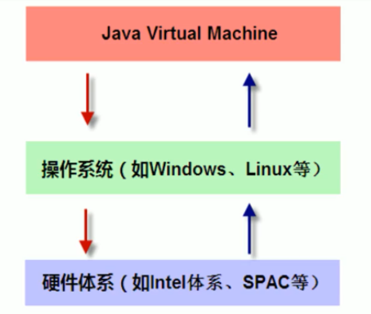
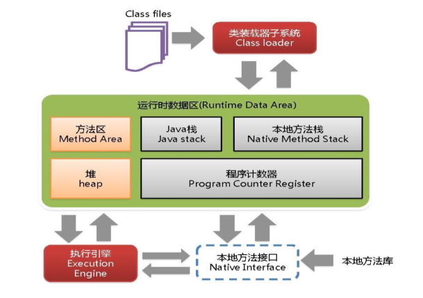
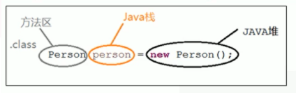
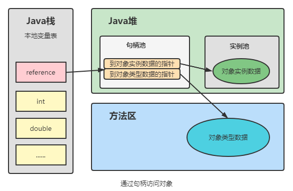
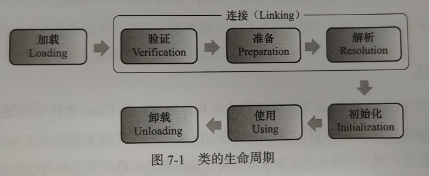
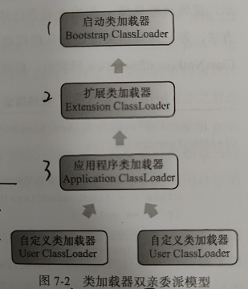

# JVM 简介

### 1、概述

- JVM 是 Java Virtusl Machine（Java虚拟机）的缩写，是一种用于计算设备的规范，它是一个虚构出来的计算机，通过在实际的计算机上仿真模拟各种计算功能来实现的；
- Java虚拟机有自己完善的硬件架构，如处理器、堆栈等，还具有相应的指令系统；
- Java语言的可移植性正是建立在Java虚拟机的基础上，Java源程序（.java）编译成字节码文件（.class）后，通过Java虚拟机中的Java解释器将字节码文件解释成特定的机器码进行运行；
- 任何平台只要具备针对该平台的Java虚拟机，字节码文件（.class）就可以在该平台上运行；即**一次编译，到处运行**；
- 几种虚拟机：
  - SUN HotSpot（当前）；
  - BEA JRockit；
  - IBM J9；
  - ......

### 2、位置

- JVM是运行在操作系统之上的，它与硬件没有直接的交互；

### 3、体系结构

> JVM体系结构分为三部分：类装载子系统、运行时数据区、执行引擎；

- **方法区**、**堆**：所有线程共享的数据区；垃圾回收99%发生在堆；
- **Java栈**、**本地方法栈**、**程序计数器**：线程隔离的数据区；且不会有垃圾回收；

# 运行时数据区

> 主要为五个内存区域：程序计数器、Java虚拟机栈、本地方法栈、Java堆、方法区。

### 1、程序计数器

> Program Counter Register

- 是一块较小的内存空间；
- 它可以看作是当前线程执行的字节码的行号指示器；
- 字节码解释器工作时就是通过改变这个计数器的值来选取下一条需要执行的字节码指令；
- 每条线程都有一个独立的程序计数器，使线程切换后能恢复到正确的执行位置；
- 如果线程执行的是Java方法，计数器记录的是正在执行的虚拟机字节码指令的地址；如果执行的Native方法，计数器的值空（`Undefined`）；
- 此内存区域是唯一 一个在Java虚拟机规范中没有规定任何`OutOfMemoryError`情况的区域。

### 2、Java虚拟机栈

> Java Virtual Machine Stack

- 线程私有，它的生命周期与线程相同；
- 它描述的是Java方法执行的**内存模型**，每个方法在执行的同时都会创建一个**栈帧**；每一个方法从调用直至执行完成的过程，就对应着一个**栈帧**在虚拟机中**入栈**到**出栈**的过程；程序正在运行的方法永远在栈顶；
- 栈：一种数据结构，可看作一个弹夹，先进后出；
- 栈帧：
  - Stack Frame，方法运行时的基础数据结构。用于存储**局部变量表**、**操作数栈**、**动态链接**、**方法出口信息**等；
- 局部变量表：
  - 存放了编译器可知的各种**基本数据类型**、**对象引用**、**returnAddress类型**；
  - 局部变量表所需的内存空间在编译期间完成分配，在方法允许期间不会改变局部变量表的大小；
  - 基本数据类型：`boolean`|`byte`|`char`|`short`|`int`|`float`|`long`|`double`；
  - 对象引用：refrence类型，不等同于对象本身，可能是一个指向对象起始地址的引用指针，或指向一个代表对象的句柄或其他与此对象相关的位置；
  - returnAddress类型：指向一条字节码指令的地址。
- 异常情况：
  - `StackOverflowError`异常：当前程请求的栈深度大于虚拟机的所允许的深度时抛出此异常；
  - `OutOfMemoryError`异常：当虚拟机栈可以动态扩展（大部分可扩展，也允许固定长度的虚拟机栈），且扩展时无法申请到足够的内存时抛出此异常；

### 3、本地方法栈

> Native Method Stack

- 线程私有，与虚拟机栈非常相似，HotSpot虚拟机中直接将虚拟机栈与本地方法栈合二为一；
- 区别在于虚拟机栈为虚拟机执行**Java方法**服务，本地方法栈为虚拟机执行**Native方法**服务；
- 与虚拟机栈一样，也会抛出`StackOverflowError`异常与`OutOfMemoryError`异常；
- Native方法（本地方法）：
  - 由Java调用，但并非以Java语言实现，而是以本地语言实现，本地语言可认为是可以和操作系统直接交互的语言，如C语言；
  - JNI：Java Native Interface，是Java中SDK的一部分，允许Java代码调用以其他语言编写的代码和代码库；
  - 本地方法在Java中由native关键字声明，该关键字类似于abstract关键字，表示方法只有声明没有实现。

### 4、Java堆

> Heap

- 它是Java虚拟机所管理的内存中最大的一块，**99%的垃圾回收**发生在此处，因此也被称作GC堆；
- 所有线程共享，在Java虚拟机启动时创建；
- 唯一目的就是存放对象实例，几乎所有对象实例都在此处分配内存；
- 可以细分为新生代、老年代等（垃圾回收细述）；
- 如果在堆中没有内存用于完成实例分配，且堆也无法再扩展时，将会抛出`OutOfMemoryError`异常。

### 5、方法区

> Method Area

- 所有线程共享；
- 用于存储已被虚拟机加载的**类信息**、**常量**、**静态变量**、即时编译器编译后的代码等数据；
- 当方法区无法满足内存分配需求时，将抛出`OutOfMemoryError`异常；
- **运行时常量池**是方法区的一部分；
- Class文件中除了有类的版本、字段、方法、接口等描述信息外，还有一项信息是常量池（Constant Pool Table），用于存放编译期生成的各种**字面量**和**符号引用**，这部分内容将在类加载后进入方法区的运行时常量池中存放；
- 字面量：接近于Java层面的常量概念，如文本字符串，声明为final的常量值等；
- 符号引用：属于编译原理方面的概念，包括下面下面三类常量：
  - 类和接口的全限定名；
  - 字段的名称和描述符；
  - 方法的名称和描述符。

### 6、对象的访问定位

> 创建对象内存分析

> 指针与句柄

- 指针：指针也就是内存地址，指针变量是用来存放内存地址的变量；
- 句柄：是一种特殊的智能指针；是由系统所管理的引用标识，该标识可以被系统重新定位到一个内存地址上。

> 通过句柄访问对象

- reference中存储的是稳定的句柄地址；
- 对象被移动时只会改变句柄中的实例数据指针，而refrence本身不需要修改。

> 通过直接指针访问对象

- reference中存储的是对象地址；
- 速度快，节省了一次指针定位的时间开销；
- 虚拟机 SUN HotSpot 使用此种方式进行对象访问。

# 类加载机制

> 虚拟机把描述类的数据从Class文件记载到内存，并对数据进行校验、转换解析和初始化，最终形成可以被虚拟机直接使用的Java类型。
>

### 1、类加载的时机

> 生命周期

- 类从被加载到虚拟机内存中开始，到卸载出内存为止；
- 生命周期包括：加载、验证、准备、解析、初始化、使用、卸载；
- 解析阶段在某些情况下可以在初始化阶段之后再开始，为了支持Java语言的运行时绑定；
- 这些阶段通常都是互相交叉地混合式进行的，通常会在一个阶段执行过程中调用、激活另外一个阶段；

> 类必须初始化时机（加载、验证、准备自然在此之前开始）

- 使用new关键字实例化对象、读取或设置一个类的静态字段（被final修饰、已在编译期把结果放入常量池的静态字段除外）、调用类的静态方法时；
- 使用反射包`java.lang.reflect`的方法对类进行反射调用时，如果类没有初始化；
- 初始化一个类的时候，其父类没有进行初始化，则需要对其父类进行初始化；

- 虚拟机启动时，需要初始化包含main方法的主类；
- 使用JDK1.7的动态语言支持时。

### 2、类加载过程

> 加载：类加载的一个阶段

- 通过一个类的全限定名来获取定义此类的二进制字节流；
- 将这个字节流所代表的静态存储结构转换为方法区的运行时数据结构；
- 在内存中生成一个代表这个类的`java.lang.Class`对象。

> 验证：确保Class文件的字节流中包含的信息符合当前虚拟机的要求

- 文件格式验证；
- 元数据验证；
- 字节码验证；
- 符号引用验证。

> 准备：正式为类变量分配内存并设置类变量的初始值

- 注意是类变量（`static`修饰），而不是实例变量；
- 初始值通常是指数据类型的零值（`0`、`null`等），`final`修饰的直接赋具体值；
- 这些变量的内存将在方法区中进行分配。

> 解析：虚拟机将常量池内的符号引用替换为直接引用

- 符号引用：以一组符号来描述所引用的目标，与虚拟机实现的内存布局无关；
- 直接引用：可以是直接指向目标的指针、相对偏移量或能间接定位到目标的句柄。

> 初始化：真正开始执行类中定义的Java代码（字节码），执行类构造器`<client>()`方法

- `<client>()`方法是由编译器自动收集类中的所有变量的赋值动作和静态语句块（static{ }）中的语句合并产生的；

### 3、类加载器

> 类加载器：独立于虚拟机外部，用于实现类的加载动作（类加载中的加载阶段）

- 每一个类加载器，都拥有一个独立的类名称空间；
- 即对于任意一个类，都需要加载它的类加载器和这个类本身才能确定这个类在虚拟机中的唯一性；换句话说，即使两个类来源于同一个Class文件，被同一个虚拟机加载，但只要加载它们的类加载不同，则这两个类不相等；

> 分类

- 对于虚拟机来讲，只存在两种类加载器：

  - 启动类加载器：使用C++语言实现，是虚拟机的一部分；
  - 所有其它的类加载器：Java语言实现，独立于虚拟机外部。

- 对于Java开发来讲，分为三种类加载器：

  | 名称                                      | 描述                                                         | 备注                                       |
  | ----------------------------------------- | ------------------------------------------------------------ | ------------------------------------------ |
  | 启动类加载器（`Bootstrap ClassLoader`）   | 负责加载存放于`<JAVA_HOME>\lib`目录下，并且是虚拟机识别的（根据文件名识别，如rt.jar）类库加载到虚拟机中。 | 无法被Java程序直接引用                     |
  | 扩展类加载器（`Extension ClassLoader`）   | 负责加载`<JAVA_HOME>\lib\ext`目录中的所有类库。              |                                            |
  | 启动类加载器（`Application ClassLoader`） | 负责加载用户类路径（ClassPath）上所指定的类库                | 也称为系统类加载器，是程序中默认的类加载器 |

### 4、双亲委派模型

> 类加载器之间的一种层次关系，保证Java程序的稳定运作。

- 这里类加载器之间的父子关系一般不会以继承关系来实现，而是都使用组合关系来复用父加载器的代码；
- 工作流程：
  - 当一个类加载器收到类加载请求，首先不会自己去尝试加载这个类，而是将此请求委派给父类加载器去完成；
  - 各层次的类加载都是如此，知直到加载请求传送到底层的启动类加载器中；
  - 只有当父类加载器反馈自己无法完成这个加载请求时（它的的搜索范围中没有找到所需的类），子加载器才会尝试自己去加载；
  - 总得来说是往上委派加载请求，往下反馈处理；尝试：自己创建一个Java类库中已存在的类，如：`java.lang.String`，并进行类加载，看是否加载自己创建的类。

# 垃圾收集器

> Garbage Collection，简称GC

### 1、前言

- 程序计数器、虚拟机栈、本地方法栈为线程私有，随线程而生，随线程而灭，线程结束时，内存自然随着回收，因此这三个区域不需要过多考虑内存回收的问题；
- 而Java堆与方法区，只有在运行期间才能知道会创建哪些对象，这两部分的内存分配和回收是动态的；

### 2、判断对象是否存活

# 执行引擎

# 性能调优