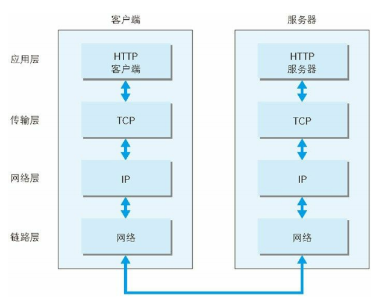
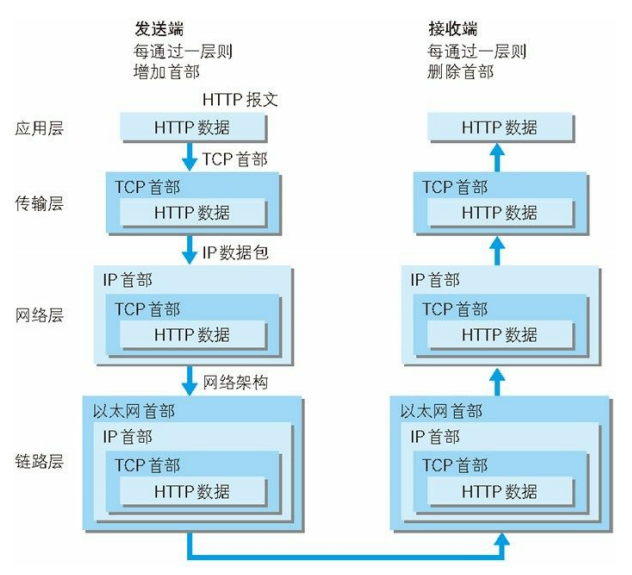

# 网络基础

## 1、TCP/IP

### 1.1 TCP/IP 协议族

> Transmission Control Protocol / Internet Protocol，传输控制协议 / 网络协议

- 协议（protocol）：不同的硬件、操作系统之间的通信所遵循的规则；
- TCP/IP：指能够在多个不同网络间实现信息传输的协议族（簇），不仅仅指TCP与IP这两个协议，只因这两个协议最具代表性而命名；

### 1.2 TCP/IP 分层

TCP/IP 按层次分为四层：应用层、传输层、网络层、数据链路层；

- 应用层
  - 决定了向用户提供应用服务时通信的活动；
  - 如：FTP（文件传输协议）、DNS（域名系统）、HTTP协议；
- 传输层
  - 对应用层提供处于网络连接中两台计算机之间的数据传输；
  - 如：TCP（传输控制协议）、UDP（用户数据报协议）；
- 网络层
  - 又名网络互连层；
  - 用于处理网络上流动的数据包（网络传输的最小单位）；
  - 该层规定了通过怎样的传输路线到达目标计算机，并传送数据包；
- 数据链路层
  - 又名链路层、网络接口层；
  - 用于处理连接网络的硬件部分，硬件上的范畴均在数据链路层作用范围内；
  - 包括控制操作系统、硬件的设备驱动、网络适配器、光纤等物理可见部分；

### 1.3 TCP/IP 通信传输流

- 利用 TCP/IP 协议族进行通信时，发送端从应用层往下走，接收端相反；

  

- 以 `HTTP` 请求为例：

  - 客户端作为发送端；在应用层（`HTTP`协议）发送一个`HTTP`请求；
  - 为了传输方便，在传输层（`TCP`协议）把从应用层接收到的数据（`HTTP` 请求报文）进行分割，并在各个报文上打上标记序号及端口号，然后转发给网络层；
  - 在网络层（`IP`协议），增加作为通信目的地的`MAC`地址后转发给数据链路层；
  - 接收端的服务器在数据链路层接收到数据，按序往上发送，一直到应用层，当传输到应用层，才算真正接收到由客户端发送过来的 HTTP 请求。

  

