# 数据结构

### 定义

- 计算机存储、组织数据的方式；
- 是带有结构特性的数据元素的集合，是相互之间存在一种或多种特定关系的数据元素的集合；
- ”结构“就是指数据元素之间存在的关系，分为逻辑结构和存储结构（物理结构）；

### 逻辑结构与存储结构

- 逻辑结构
  - 指反映数据元素之间的逻辑关系的数据结构；
  - 其中的逻辑关系是指数据元素之间的前后间关系，而与它们在计算机中的存储位置无关；
  - 逻辑结构包括
    - 集合：数据结构中的元素之间除了”同属一个集合“的相互关系外，没有其他关系；
    - 线性结构：数据结构中的元素存在一对一的相互关系；
    - 树形结构：数据结构中的元素存在一对多的相互关系；
    - 图形结构：数据结构中的元素存在多对多的相互关系；
- 物理结构（存储结构）
  - 指数据的逻辑结构在计算机存储空间的存放形式；
  - 是数据结构在计算中的表示（又称映像）；
  - 一种数据结构的逻辑结构根据需要可以表示成多种存储结构；
  - 常用的存储结构
    - 顺序存储
    - 链式存储
    - 索引存储
    - 哈希存储

### 逻辑结构分类

- 线性结构
  - 线性结构是非空集，且各个结点具有线性关系；
  - 有且仅有一个开始结点和一个终端结点；
  - 所有结点都最多只有一个直接前驱结点和一个直接后继结点；
  - 线性表（**链表、队列**等）就是典型的线性结构，还有**一维数组、栈、串**等；
- 非线性结构
  - 非空集，各个结点之间具有多个对应关系；
  - 一个结点可能有多个直接前驱结点和多个直接后继结点；
  - 包括**多维数组、广义表、树结构和图结构**等；

# 数组（Array）

- 最基本的数据结构，由相同类型的元素组成，并且使用一块连续内存来存储；

- 可以利用元素的索引计算出该元素对应的存储地址；

- 特点：随机访问、容量有限；

- 复杂度

  - 访问：`O(1)`，访问特定位置的元素；
  - 插入：`O(n)`，最坏的情况是在首部插入元素，需要移动所有元素；
  - 删除：`O(n)`，最坏情况同插入；

  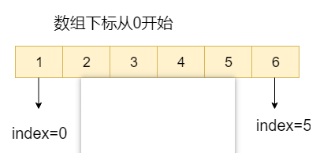

# 链表（Linked List）

### 简介

- 是一种线性表，但是并不会按线性的顺序存储数据；
- 使用的不是连续的内存空间来存储数据，可以充分利用计算机内存空间；
- 但链表不会节省空间，相比于数组而言链表会占用更多的空间，因为链表中的每个结点存放的还有指向其他节点的指针；
- 不支持随机访问；
- 复杂度
  - 插入和删除：`O(1)`，因为必须知道目标元素的位置；
  - 查找：`O(n)`

### 分类

- **单向链表**

  - 只有一个方向；
  - 结点最多只有一个后继指针next指向后面的结点；
  - 通常由一个不保存任何值的head结点（头结点，第一个结点）；
  - 通过头结点可遍历整个链表，尾结点通常指向`null`；

  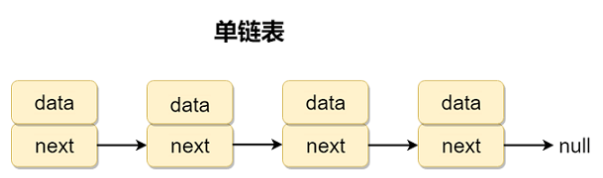

- **循环链表**

  - 一种特殊的单向链表，区别在于循环链表的尾结点不是指向`null`，而是指向链表的头结点；

  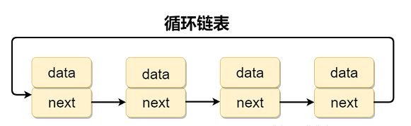

- **双向链表**

  - 各结点包含两个指针`prev`与`next`，`prev`指向前一个结点，`next`指向后一个结点；

  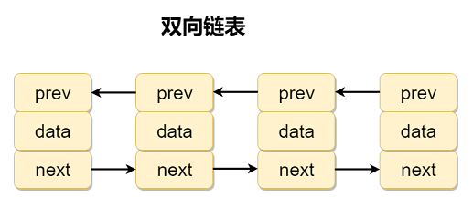

- **双向循环链表**

  - 尾结点的`next`指向头结点，头结点的`prev`指向尾结点；

  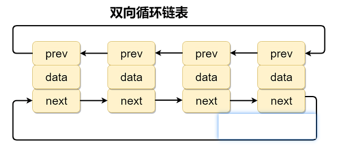

### 链表与数组

- 数组支持随机访问，链表不支持；
- 数组使用连续的内存空间，对CPU的缓存机制友好，链表相反；
- 数组大小固定，扩容比较耗时，而链表天然支持动态扩容；
- 应用场景
  - 数组：元素个数固定，不经常添加或删除；
  - 链表：元素个数不固定，经常添加或删除；

# 栈（Stack）

- 线性结构；

- 遵循**后进先出（LIFO，Last In First Out）**，可想象成手枪弹夹；

- `push`-入栈，`pop`-出栈，都发生与栈顶`top`；

- 常用一维数组或链表来实现，用数组实现称为**顺序栈**，用链表实现称为**链式栈**；

- 复杂度

  - 访问：`O(n)`
  - 入栈与出栈：`O(1)`，发生于顶端；

  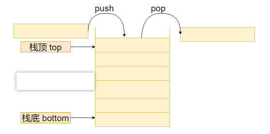

# 队列（Queue）

### 简介

- 线性表，遵循**先进先出（FIFO，FirstIn First Out）**；

- 常用一维数组或链表来实现，用数组实现称为**顺序队列**，用链表实现称为**链式队列**；

- 队列只允许在**队尾**`rear`进行**入队**`enqueue`，在**队头**`front`进行**出队**`dequeue`；

- 复杂度

  - 访问：`O(n)`
  - 入队与出队：`O(1)`

  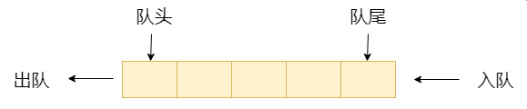

### 分类

- **单队列**

  - 包含两个指针， `front`指向队头元素，`rear`指向队尾元素；
  - 顺序队列（数组实现）容易发生假溢出和越界问题；
    - 即顺序队列使用数组实现，大小固定，每次入队、出队操作时，`front`与`rear`都会持续往后移动；
    - 当`rear`移动到最后时，无法再往队列添加元素，单此时队列仍有空余空间；
    - 且添加最后一个元素时，`rear`指针移动到数组之外导致越界；
  - 队头队尾可能重合，即`front`等于`rear`，此时队列并非还剩一个元素，而是空队列；

  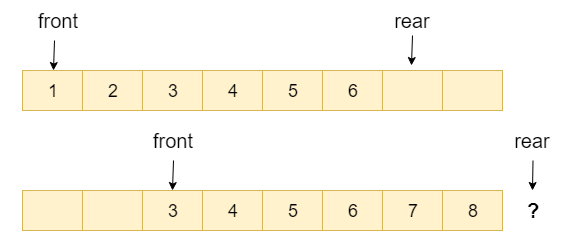

- **循环队列**
  - 循环队列可以解决顺序队列的假溢出与越界问题；
  - 当往队列中添加元素，若`rear`指针已在队尾，则将会移动到队头，如此循环；
  - 当front等于`rear`时，`队列`可能空也可能满；

### 应用场景

- 阻塞队列
  - 在队列基础上增加阻塞操作；
  - 当队列为空时，出队操作阻塞；当队列满时，入队操作阻塞；
- 消息队列等等......

# 树（Tree）

### 简介

- 类似现实中倒置的树；
- 任何一颗非空树只有一个根结点；
- 树中的任意两个结点有且仅有唯一的一条路径连通；
- 一棵树如果有**n**个结点，那么它一定恰好有**n-1**条边；

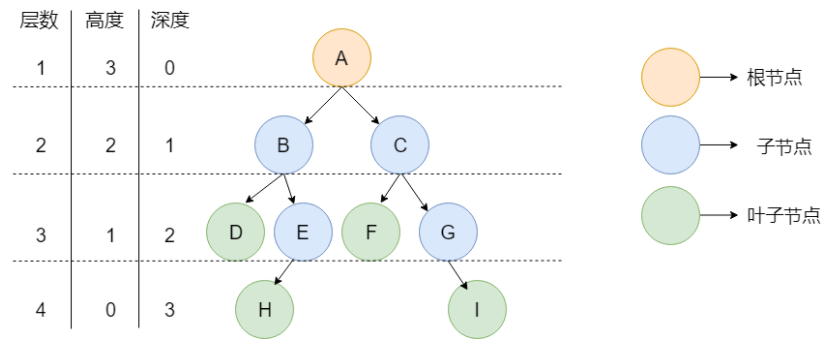

### 基本概念

- 叶子结点：没有子结点的节点；
- 度：即树的宽度，指结点的分支数；
- 层数：根节点的层次为1，子结点依次累加；
- 高度：从下往上算，初始为0或1；
- 深度：从上往下，初始为0或1；

### 分类

- **二叉树**

  - Binary tree
  - 每个结点最多只有两个子结点的树结构；
  - 二叉树的分支通常被称为**左子树**和**右子树**，且顺序不可随意颠倒；

- **满二叉树**

  - 即每一层的结点数都达到最大值；
  - 层数为**k**，则结点数为**2^k -1**；

  ​	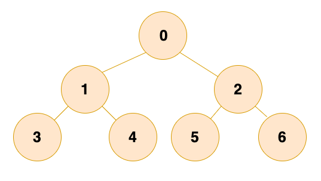

- **完全二叉树**

  - 除最后一层外，其余层的结点数都达到做大值，且最后一层的结点依次从左到右分布；

  ​	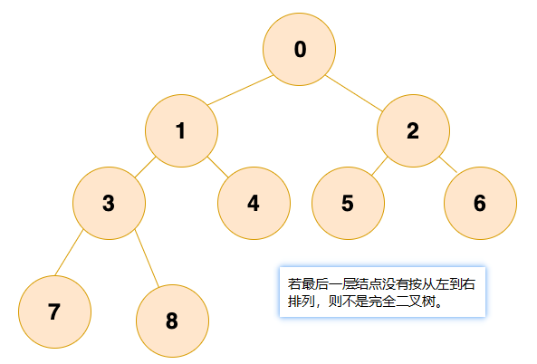

- **平衡二叉树**

  - 可以是一颗空树；
  - 若非空树，则树中两个子树的高度差绝对值不超过1，且左右两个子树都是一颗平衡二叉树；

  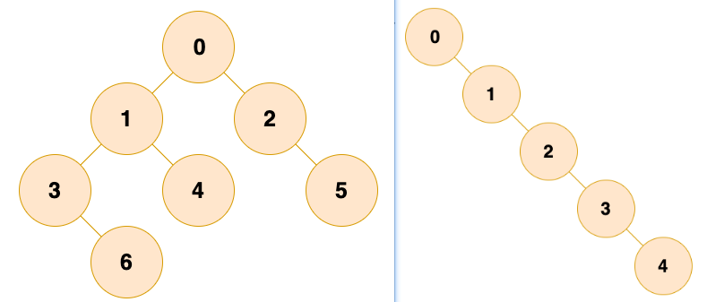

### 存储

- **链式存储**：每个结点包括三个属性；

  - 数据`data`：可以是多个具有不同类型的数据；
  - 左结点指针`left`：`Java`无指针，实际上是引用地址；
  - 右结点指针`right`；

  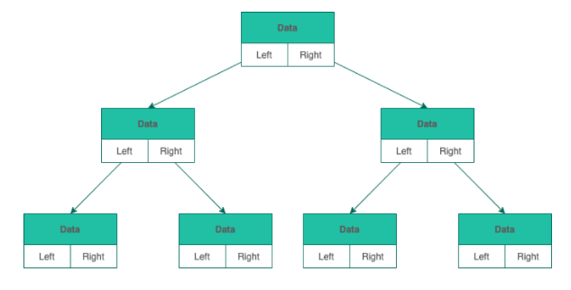

- **顺序存储**：利用数组进行存储，只存储数据；

  - 若是非完全二叉树，则数组中会存在空值，导致内存利用率低；

    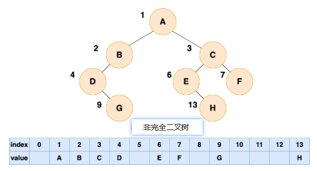

### 遍历

- 分类
  - 分为前序（先序）、中序、后续三种遍历；
  - 此处所说的"序"为遍历时父结点在 [父结点、左结点、右结点] 的遍历顺序；
  - 遍历树都是先遍历左子树，再遍历右子树，在遍历左、右子树中再依据结点顺序遍历；

- **前序（先序）遍历**

  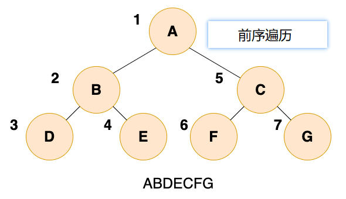

- **中序遍历**

  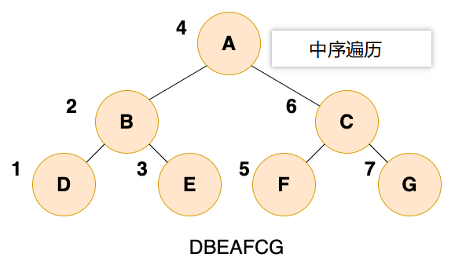

- **后序遍历**

  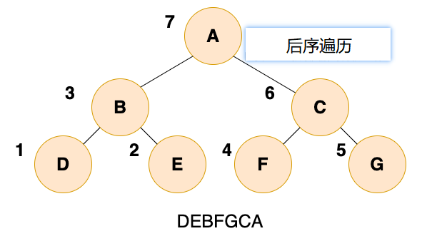

# 图（Graph）

# 堆（Heap）

# 散列表（Hash）