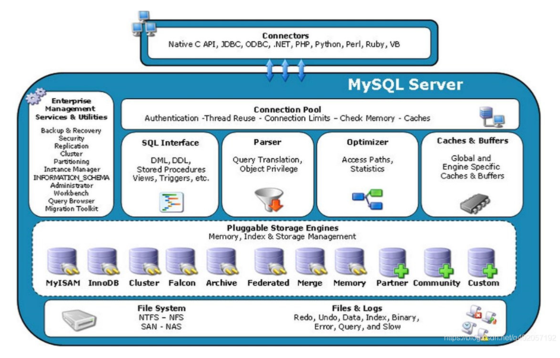

[TOC]

# 1、MySQL 数据类型

### 1）数值

| 类型        | 大小（byte）                             | 范围（无符号X2）                | 说明         | 对应Java类型                      |
| ----------- | ---------------------------------------- | ------------------------------- | ------------ | --------------------------------- |
| tinyint     | 1                                        | (-128，127)                     | 小整数值     | java.lang.Integer                 |
| smallint    | 2                                        | (-32 768，32 767)               | 大整数值     | java.lang.Integer                 |
| mediumint   | 3                                        | (-8 388 608，8 388 607)         | 大整数值     | java.lang.Integer                 |
| int/integer | 4                                        | (-2 147 483 648，2 147 483 647) | 大整数值     | java.lang.Integer（无符号是Long） |
| bigint      | 8                                        |                                 | 极大整数值   | java.math.BigInteger              |
| float       | 4                                        |                                 | 单精度浮点数 | java.lang.Float                   |
| double      | 8                                        |                                 | 双精度浮点数 | java.lang.Double                  |
| decimal     | 对DECIMAL(M,D) ，如果M>D，为M+2否则为D+2 | 取决于M和D的值                  | 小数值       | java.math.BigDecimal              |

### 2）日期和时间

| 类型      | 大小（byte） | 格式                | 范围                                    | 说明             | 对应Java类型       |
| --------- | ------------ | ------------------- | --------------------------------------- | ---------------- | ------------------ |
| date      | 3            | YYYY-MM-DD          | 1000-01-01/9999-12-31                   | 日期值           | java.sql.Date      |
| time      | 3            | HH:MM:SS            |                                         | 时间值或持续时间 | java.sql.Time      |
| year      | 1            | YYYY                |                                         | 年份值           | java.sql.Date      |
| datetime  | 8            | YYYY-MM-DD HH:MM:SS | 1000-01-01 00:00:00/9999-12-31 23:59:59 | 混合日期和时间值 | java.sql.Timestamp |
| timestamp | 4            | YYYYMMDD HHMMSS     | 1970-01-01 00:00:00/2038                | 时间戳           | java.sql.Timestamp |

### 3）字符串

| 类型       | 大小（byte）    | 说明                            | 对应Java类型     |
| ---------- | --------------- | ------------------------------- | ---------------- |
| char       | 0-255           | 定长字符串                      | java.lang.String |
| varchar    | 0-65535         | 变长字符串                      | java.lang.String |
| tinyblob   | 0-255           | 不超过 255 个字符的二进制字符串 | byte[]           |
| tinytext   | 0-255           | 短文本字符串                    | java.lang.String |
| blob       | 0-65535         | 二进制形式的长文本数据          | byte[]           |
| text       | 0-655           | 长文本数据                      | java.lang.String |
| mediumblob | 0-16 777 215    | 二进制形式的中等长度文本数据    | byte[]           |
| mediumtext | 0-16 777 215    | 中等长度文本数据                | java.lang.String |
| longblob   | 0-4 294 967 295 | 二进制形式的极大文本数据        | byte[]           |
| longtext   | 0-4 294 967 295 | 极大文本数据                    | java.lang.String |

# 2、数据语言

### 1）操作数据库

- 创建数据库

  ```sql
  CREATE DATABASE [IF NOT EXISTS] myDataBase;
  ```

- 删除数据库

  ```sql
  DROP DATABASE [IF EXISTS] myDataBase;
  ```

- 使用数据库

  ```sql
  USE myDataBase;
  ```

- 查看数据库

  ```sql
  SHOW DATABASES myDataBase;
  ```

### 2）DDL

> 数据定义语言 Data Defination Language

- 建表

  ```sql
  CREATE TABLE `tb_user` (
    `id` int(11) NOT NULL,
    `name` varchar(30) NOT NULL COMMENT '名称',
    `age` int(3) unsigned DEFAULT NULL COMMENT '年龄',
    `address` varchar(200) DEFAULT NULL COMMENT '地址',
    `money` decimal(16,4) unsigned zerofill DEFAULT NULL COMMENT '钱',
    `create_time` datetime DEFAULT NULL COMMENT '创建日期',
    `update_time` datetime DEFAULT NULL COMMENT '更新日期',
    PRIMARY KEY (`id`)
  ) ENGINE=InnoDB DEFAULT CHARSET=utf8 COMMENT='用户表';
  ```

- 修改表

  ```sql
  -- 修改表名
  ALTER TABLE `tb_user` RENAME AS `newName`;
  
  -- 删除表字段
  ALTER TABLE `tb_user` DROP `age`
  
  -- 添加表字段
  ALTER TABLE `tb_user` ADD `age` INT(3);
  
  -- 修改表字段
  ALTER TABLE `tb_user` CHANGE `age1` `age` INT(10);
  
  -- 修改表的属性名字
  -- modify 方式
  ALTER TABLE `tb_user` MODIFY `age` INT(10);
  -- change 方式：后面紧跟要修改的字段与指定新的字段名及类型
  ALTER TABLE `tb_user` CHANGE `age` `new_age` INT(3);
  ```

- 删除表

  ```sql
  -- drop 删除表数据与结构
  DROP TABLE `tb_user`;
  -- truncate 删除表数据
  truncate `tb_user`;
  ```

### 3）DML

> 数据操作语言 Data Manipulation Language

- 新增

  ```mysql
  -- 插入一条数据（若不指定特定字段，后面字段数据要一一对应）
  insert into `tb_user` (`id`, `name`) values (1, '张三');
  
  -- 插入多个语句，英文逗号隔开
  insert into `tb_user` (`id`, `name`) values (2, '李四'), (3, '王五');
  ```

- 修改

  ```mysql
  -- 修改指定数据
  update `tb_user` set `name` = '张三三', age = 18 where `id` = 1;
  -- 不带条件将修改所有数据
  update `tb_user` set `name` = '张三三', age = 18;
  ```

- 删除

  ```mysql
  -- 不带条件将删除所有数据
  delete from `tb_user` where `id` = 1;
  -- 若给表设置了别名
  delete t from `tb_user` t;
  ```

### 4）DQL

> 数据查询语言 Data Query Language 

- 查询

  ```mysql
  -- 查询指定数据
  select `id`, `name`, `age` from `tb_user`;
  -- 查询所有
  select * from `tb_user`;
  ```

- 多条件查询

  ```mysql
  -- 
  select * from `tb_user` where `age` > 20 group by `money` having `money` > 100 order by `money` desc;
  ```

- 联表查询

  ```mysql
  -- 内联接/等值连接
  select * from `tb_user` t inner join `tb_deptment` d on t.dept_id = d.id;
  -- 左连接left join、右连接right join 语法一致，返回数据不一致
  -- 无论是否匹配条件，都会返回左、右连接表的所有数据
  select * from `tb_user` t left join `tb_deptment` d on t.dept_id = d.id;
  ```

- 子查询

  ```mysql
  -- 子查询数据作为结果
  select `name`, (select `name` from `tb_deptment` where `id` = 1 ) as deptName 
  from `tb_user` where `id` = 1;
  -- 子查询作为条件
  select `name` from `tb_user` where `dept_id` = (select `id` from `tb_deptment` where `id` = 1);
  -- 多重嵌套
  select * from 
  (select * from `tb_user` where `dept_id` <> 1) t where `id` = 1;
  ```

### 5）DCL

> 数据控制语言 Data Control Language

- 权限

  ```mysql
  -- grant、revoke
  ```

# 3、注意事项

### 1）where 与 having

- where在分组前对数据进行过滤；
- having则是在分组后对数据进行过滤；
- where后面不能跟聚合函数；

### 2）where 与 on

- 联表查询会生成一张临时表；

- `on`是生成临时表时使用的条件，在左连接（或右连接）时，不管`on`后面的条件是否起到作用，都会返回左表（或右表）的所有数据；
- `where`是在生成临时表之后的过滤条件；
- 若是内连接则`where`与`on`无区别；

# 4、索引

### 1）简介

- 索引是对数据库表中一列或多列的值进行排序的一种数据结构，包含着对数据表里记录的引用指针；

- 索引可类比为书籍的目录，可通过索引快速访问数据表中特定信息；

- 索引存储在索引表（中，该表保存了数据的主键与索引字段，并指向实体表的记录；
- 优点
  - 大大减小了服务器需要扫描的数据量；
  - 可以帮助服务器避免排序和创建临时表；
  - 可以将随机IO转变为顺序IO;
  - 通过创建唯一索引可以保证一条数据的唯一性；

- 缺点
  - 索引需要占用物理空间（储存于磁盘）；
  - 每次更新表（插入、更新、删除数据）都需要动态维护索引文件；
  - 对于数据量较小的表，大部分情况下全表扫描更高效；

### 2）索引原则

- 需要建立索引的列
  - 主键强制建立唯一索引；
  - 经常需要搜索的列；
  - 经常用于连接（join）的列；
  - 经常作为搜索条件、范围搜索和排序的列（因为索引已经排好序）；
- 不应建立索引的列
  - 数据量较小的表不应该建立索引；
  - 重复值多的列，例如性别、是否等，检索的结果集占表中总数据很大比例，检索效率不高；
  - 大文本或超长字段不适合建立索引；
  - 修改需求远远大于检索需求时不适合建立索引，索引的建立能够提升检索性能，但会降低修改性能；

### 3）索引分类

- 普通索引

  - `index` / `key`
  - 最基本的索引，无限制，值可以为空；

  ```mysql
  -- 直接创建索引
  create index index_name on `tb_user`(`name`(50));
  -- 修改表结构从而创建索引
  alter table `tb_user` add index index_name (`name`(50));
  -- 删除索引
  drop index index_name on `tb_user`;
  ```

- 唯一索引

  - `unique index`
  - 与普通索引唯一不同的是索引列的值在表中必须唯一；

- 主键索引

  - `primary key`
  - 主键索引是一种特殊的唯一索引，一张表只能存在一个主键索引，不允许空值；

- 组合索引

  - 指将多列组成一个索引；

  ```mysql
  alter table `tb_user` add index name_age (`name`, `age`);
  ```

- 全文索引

  - `fulltext`
  - 主要用来查找文本中的关键字，并非等值查询；
  - 对于大数据量，全文检索比 like 的模糊查询更为高效；

  ```mysql
  -- 创建全文索引
  create fulltext index fulltext_name_address on `tb_user` (`name`, `address`);
  -- 修改表结构方式
  alter table `tb_user` add fulltext index fulltext_name_address on (`name`, `address`);
  ```

### 4）explain

- 通过explain 命令获取 select 语句的执行计划，可以知道表的读取顺序、哪些索引被使用等信息

  ```mysql
  explain select * from `tb_user` where name = '张三';
  ```

  

- id

  - select 查询序号，表示查询中执行select子句或操作表的顺序；
  - id越大，执行优先级越高；id相同，执行顺序从上到下;

- select_type

  - select语句的类型，有以下几种；
  - simple：表示简单查询，不包括连接查询与子查询；
  - primary：复杂查询中最外层的查询语句；
  - union：表示连接查询的第二个或后面的查询语句，不依赖于外部查询的结果集；
  - dependent union：同union，但依赖于外部查询；
  - union result：连接查询的结果；
  - subquery：子查询中的第一个语句，不依赖于外部查询的结果集；
  - ......

- table

  - 表示访问的表；

- partitions

- type

  - 关联类型或访问类型；
  - system：仅有一行的系统表，const的一个特例；
  - const：数据表最多只有一个匹配行，只读取一次，速度快；
  - eq_ref：最多只会返回一条符合条件的记录，primary key或 unique key 索引被使用；
  - ref：相比 eq_ref 不使用唯一索引，可能匹配到多条记录；
  - ref_or_null：类似ref, 但可以搜索值为NULL的行；
  - index_merge：表示使用索引合并优化；
  - range：使用一个索引检索指定范围的行；
  - index：全表扫描索引树；
  - all：全表扫描；

- possible_keys

  - 可能使用的索引；

- key

  - 实际采用哪个索引进行优化；
  - 若possible_key列有值，key列为NULL，则表示mysql认为索引对此查询帮助不大，选择了全表扫描；

- key_len

  - 实际使用的索引的字节数，计算规则如下；

  - 字符串

  - - char(n)：n字节长度
    - varchar(n)：2字节存储字符串长度，如果是utf-8，则长度 3n + 2

  - 数值类型

  - - tinyint：1字节
    - smallint：2字节
    - int：4字节
    - bigint：8字节　　

  - 时间类型

  - - date：3字节
    - timestamp：4字节
    - datetime：8字节

  - 如果字段允许为 NULL，需要1字节记录是否为 NULL

  - 索引最大长度是768字节，当字符串过长时，mysql会做一个类似左前缀索引的处理，将前半部分的字符提取出来做索引；

- ref

  - 表示使用哪一列或常数与索引一起检索数据；

- rows

  - 表示必须检索的行数；

- Extra
  - 额外信息。

### 5）索引结构

- MySQL索引常用Hash、B树、B+等数据结构进行数据存储；
- 

# 5、其他

### 1）视图

###### 定义

- 视图是虚拟的表，包含的不是数据而是根据需要检索数据的查询；

- 是用来查看存储在别处的数据的一种设施；

- 视图本身不包含数据，视图所返回的数据是从其他表中检索出来的；

- 例子

  ```mysql
  -- 原SQL
  SELECT cust_name, cust_contact 
  FROM customers, orders, orderitems 
  WHERE customers. cust_id=orders. cust_id 
  	AND orderitems. order_num=orders. order_num 
  	AND prod_id=' TNT2';
  	
  -- 将整个查询包装成一个虚拟表（即视图）
  SELECT cust_name,cust_contact 
  FROM productcustomers 
  WHERE prod_id='TNT2';
  ```

###### 优势

- 重用SQL语句；
- 简化复杂的SQL操作；
- 使用表的组成部分而不是整个表；
- 保护数据，给用户授权表的特定部分的访问权限而不是整个表的访问权限；
- 可返回与底层表的表示和格式不同的数据；

###### 规则与约束

- 视图必须唯一命名（与表一样）；
- 可创建的视图数目无限制；
- 创建视图必须有足够的访问权限；
- 视图可以嵌套，即可从其他视图中检索数据；
- 若从该视图中检索数据的查询语句中包含ORDER BY ，那么该视图再使用ORDER BY无效；
- 视图不能索引，也不能有关联的触发器或默认值；
- 视图可以和表一同使用；
- 视图常用于检索数据，但也是可更新的，更新一个视图将会更新基础表数据；

###### 使用

```mysql
-- 创建视图
CREATE VIEW viewName AS # 后接需创建视图的查询语句
SELECT cust_name, cust_contact, prod_id 
FROM customers, orders, orderitems 
WHERE customers. cust_id=orders. cust_id 
	AND orderitems. order_num=orders. order_num 
	
-- 查看视图
SHOW CREATE VIEW viewName;

-- 删除视图
DROP VIEW viewname;

-- 更新创建的视图（也可先删除再创建）- 若更新的视图不存在则会创建视图
CREATE OR REPLACE VIEW viewname AS ...

```

### 2）存储过程

###### 定义

- 为以后的使用而保存的一条或多条SQL语句的集合；
- 存储于数据库中，经过一次编译后再次调用无需编译；

###### 优势

- 将处理封装在容易使用的单元中，简化复杂操作；
- 效率高，编译一次后将会存储到数据库中，后续直接调用；
- 安全性，通过存储过程限制对基础数据的访问；

缺陷

- 存储过程的编写比基本SQL语句复杂；
- 创建存储过程许需要一定的数据库权限（MySQL将创建与使用的权限区分开）；

###### 使用

- 创建存储过程

  ```mysql
  -- 创建存储过程
  CREATE PROCEDURE productpricing() 
  BEGIN 
  	# 存储过程体
  	SELECT Avg(prod_price)AS priceaverage 
  	FROM products; 
  END;
  
  # 带参的存储过程
  CREATE PROCEDURE ordertotal(
  	IN onumber INT,  # IN 传入参数至存储过程
      OUT ototal DECIMAL(8,2) # OUT 从存储过程返回值
  )
  BEGIN 
      SELECT Sum(item_price*quantity)
  	FROM orderitems WHERE order_num=onumber 
  	INTO ototal; # INTO 将结果存储于变量中
  END;
  ```

- 查看

  ```mysql
  -- 查看存储过程的语句
  SHOW CREATE PROCEDURE ordertotal;
  -- 查看所有存储过程的详细详细
  SHOW PROCEDURE STATUS; # 可加限制条件 LIKE 'ordertotal';
  ```

- 调用

  ```mysql
  -- 调用存储过程
  CALL productpricing();
  CALL ordertotal(20005, @total); # 变量以 @ 开始， 传入参数并返回相应值至变量中
  SELECT @priceaverage; # 查询变量的值
  ```

- 删除

  ```mysql
  -- 删除存储过程，只需指定名称
  DROP PROCEDURE productpricing; # 不存在会报错
  DROP PROCEDURE IF EXISTS productpricing;
  ```

### 3）游标

### 4）触发器

# 6、体系结构

### 1）层级划分



##### 网络连接层

- Connetors
  - 指不同语言的应用程序接口（JDBC、ODBC、.NET等）与MySQL的连接交互层；
- Connection Pool
  - 连接池，用于连接管理、授权认证、安全管理等；
  - 服务器上维护了一个线程池，每个客户端连接都对应着服务器上的一个线程；
  - 连接池将连接缓存下来，下次可直接使用已经建立好的连接，以提升服务器性能；

##### 服务层

- Management Serveices & Utilities
  - 系统管理和控制工具，例如备份恢复、MySQL复制、集群等；

- SQL Interface
  - SQL接口，用于接收用户的SQL命令，并返回用户需查询的结果；
- Parser
  - 解析器，验证和解析SQL命令；
  - 将SQL语句分解成数据结构，判断SQL语句是否合理；

- Optimizer
  - 优化器，SQL语句在查询之前由优化器对该查询进行优化；

- Cache & Buffer
  - 缓存区，若查询缓存命中，则直接从缓存中获取相应数据；

##### 存储引擎层

- Engine
  - 存储引擎，负责数据的存储于读取，与数据库文件打交道；
  - 存储引擎是基于数据库表的，同一个数据库支持多个存储引擎；
  - 服务器中的查询执行引擎通过API与相应的存储引擎进行通信；

##### 文件系统层

- File System
  - 文件系统，将数据库的数据存储于文件系统之上，并完成与存储引擎的交互；

### 2）存储引擎

##### 简介

- 存储引擎这一概念并非所有关系型数据库都都存在；
- MySQL中的数据使用各种不同的技术存储于文件或内存中，每一种技术都使用不同的存储机制、索引技巧、锁定水平等，这种不同技术及配套的相关功能在MySQL中被称作存储引擎（亦或称作表类型）；

##### MyISAM & InnoDB

|            | MyISAM                           | InnoDB                                                       |
| ---------- | -------------------------------- | ------------------------------------------------------------ |
| 事务支持   | 不支持事务；                     | 支持事务，且每条SQL语句默认被封装成一个事务，自动提交；<br />但这影响了速度，可将多条SQL组成一个事务提交； |
| 存储结构   | 在磁盘上分成三个文件存储；       | 所有表都保存在同一个数据文件中；                             |
| 存储空间   | 可被压缩、所需存储空间小；       | 需要更多的内存空间；                                         |
| 全文索引   | 支持；                           | 不支持；                                                     |
| 表锁差异   | 支持表级锁；                     | 支持行级锁，提高了多用户并发操作的性能；<br />但只在where的主键有效； |
| 外键       | 不支持；                         | 支持；                                                       |
| 表主键     | 允许表中没有主键；               | 必须有主键，若没有会自动生成（用户不可见）；<br />数据是主键索引的一部分，其他所有保存的是主键索引的值； |
| 表具体行数 | 已保存表的总行数，直接获取即可； | 未保存表的总行数，须全表扫描；                               |

# 7、事务

> 事务：一般是指要做的或所做的事情，在计算术语中是指访问并可能更新数据库中各项数据项的一个程序执行单元。

### 1）ACID 特性

- 原子性（Atomicity）：事务是一个原子操作，由一系列当作组成，事务中的操作要么都生效，要么都不生效；
- 一致性（Consistency）：在事务开始之前与结束之后，数据库的完整性没有被破坏；
- 隔离性（Isolation）：一个事务的执行不能别其他的事务干扰；
- 持久性（Durability）指一个事务一旦提交，它对数据库中数据的改变是永久性的。

### 2）事务的并发

> 即多用户同时访问数据库相同数据的场景，可能造成一些并发问题，破坏数据库的完整性：

| 名称                              | 描述                                                         |      |
| --------------------------------- | ------------------------------------------------------------ | ---- |
| 脏读（Dirty Read）                | 一个事务读取到另一个事务更改且未提交的数据；                 |      |
| 不可重复读（Non-Repeatable Read） | 即不一致读取，同一个事务中前后两次读取的同一个数据不一致（中途被其它事务更改了数据）； |      |
| 幻读（Phantom Read）              | 同一个事务前后两次读取同一个范围的数据，读取的数据量不一致（其它事务新增或减少了符合条件的数据）； |      |
| 丢失更新（Lost Update）           | 第一类：两个事务更新同一个数据，A事务回滚将B事务已提交的更新数据覆盖了；造成B事务已提交的更新数据丢失；<br />第二类：两个事务更新同一个数据，A事务提交的更新数据覆盖了B事务提交的更新数据； |      |

- 注：幻读强度的是数据的增减，不可重复读强调的是单个数据的修改；

### 3）隔离级别

> 级别越高，性能越差

| 名称                         | 描述                                                        | 脏读 | 不可重复读 | 幻读 |
| ---------------------------- | ----------------------------------------------------------- | ---- | ---------- | ---- |
| Read uncommitted（读未提交） | 最低隔离级别，允许读取并发事务尚未提交的数据                | √    | √          | √    |
| Read committed（读已提交）   | 允许读取并发事务已提交的数据                                | ×    | √          | √    |
| Repeatable read（可重复读）  | MySQL默认的事务隔离级别，保证对同一个数据多次读取的结果一致 | ×    | ×          | √    |
| Serializable（序列化）       | 最高隔离级别，事务串行化顺序执行                            | ×    | ×          | ×    |
