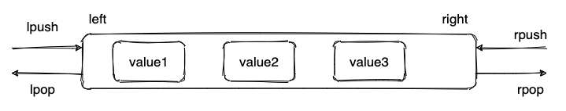

# redis概述

### 简介

> Remote Dictionary Server 远程字典服务

- redis是一个开源的使用ANSI C语言编写、支持网络、可基于内存亦可持久化的日志型、key-value数据库，提供多种语言的API；
- redis数据缓存在内存中，会周期性地把更新数据写入到磁盘或把修改操作写入追加的记录文件中，重启时再次加载进行使用；
- redis默认有16个数据库DB 0 ~ DB 15，默认使用DB 0；
- 应用
  - 缓存
  - 分布式锁
  - 消息队列
  - Redis + Lua 脚本实现限流
  - ......

### 使用

- 启动：

  - 安装目录启动`redis-server.exe` 可执行文件；

  - `cmd`方式启动

    ```sh
    # 定位至redis安装目录
    cd /d D:\software\Redis-x64-5.0.9
    # 启动redis服务
    redis-server.exe redis.windows.conf
    ```

- 连接

  ```sh
  # 定位至redis安装目录
  cd /d D:\software\Redis-x64-5.0.9
  # 连接
  redis-cli
  ```

- 关闭

  ```sh
  # 关闭redis连接
  quit
  # 退出cmd
  exit
  ```

### Redis 为什么快？

- redis基于内存操作，远大于磁盘的速度；
- 采用单线程模型；
  - 单线程指`Redis`的网络`IO`以及键值对指令读写由一个线程执行；
  - 但对于`Redis`的持久化、集群数据同步、异步删除等都由其他线程执行；
- 高效的数据结构；
  - Redis整体就是一个全局哈希表，通过哈希表来保存所有的键值对；
  - 哈希表的时间复杂度是`O(1)`；
- 采用多路复用技术；
  - **多路**指多个`Scoket`连接，**复用**指复用一个线程；

### 为什么使用单线程？

- 单线程编程容易且易于维护；
- `Redis`的性能瓶颈不是CPU，而是机器内存和网络带宽；

- 多线程需要CPU切换线程上下文，较为耗时；对于内存系统来说，没有上下文切换的操作效率是最高的，多次读写都是在一个CPU上；
- 且多线程会存在死锁等问题；

### 给缓存数据设置过期时间有何作用？

- 内存有限，缓存数据过期后将被删除，释放内存空间；
- 可应用于特定场景，如设置短信验证码在一分钟内有效等；

### 怎样判断数据过期？

- `Redis`使用一个过期字典（可看作`hash`表）来保存数据过期的时间；
- 过期的字典的`key`指向`Redis`数据库中的某个数据的`key`；
- 过期字典的`value`是一个`Long`类型的整数，保存`key`所指向的数据库键的过期时间；

# 数据结构

### 简介

| 常用类型 | 说明                                                         | 应用场景                                   |      |
| -------- | ------------------------------------------------------------ | ------------------------------------------ | ---- |
| `String` | 最基本、简单的key-value类型，最大支持512MB；                 | 缓存、计数器、分布式锁等；                 |      |
| `List`   | Redis 自身实现的数据结构-**双向链表**，支持反向查找与遍历，方便操作，但带来了额外的内存开销； | 消息队列、慢查询；                         |      |
| `Hash`   | 类似于JDK1.8之前的`HashMap`（数组+链表）；                   | 适合存储对象，如用户信息等；               |      |
| `Set`    | 类似于`Java`中的`HashSet`，支持判断元素是否在某个`Set`中；   | 存放不重复数据，获取多个数据源交集和并集； |      |
| `Zset`   | 或称为`Sorted Set`，相比于`Set`，增加了一个权重参数`score`，使得集合中的顺序能够按`score`排序； | 对数据权重排序，如访问量排行等；           |      |
| `Bitmap` | 存储连续的二进制数字（0和1），用一个`bit`位表示元素状态，`key`就是元素本身；<br />8个`bit`组成1个`byte`， 因此`Bitmap`会节省很多存储空间； | 用于保存状态信息等；                       |      |

### 操作

##### String

- 基本操作

  ```sh
  127.0.0.1:6379> set key value #设置 key-value 类型的值
  OK
  127.0.0.1:6379> get key # 根据 key 获得对应的 value
  "value"
  127.0.0.1:6379> exists key  # 判断某个 key 是否存在
  (integer) 1
  127.0.0.1:6379> strlen key # 返回 key 所储存的字符串值的长度。
  (integer) 5
  127.0.0.1:6379> del key # 删除某个 key 对应的值
  (integer) 1
  127.0.0.1:6379> get key
  (nil)
  ```

- 批量设置

  ```sh
  127.0.0.1:6379> mset key1 value1 key2 value2 # 批量设置 key-value 类型的值
  OK
  127.0.0.1:6379> mget key1 key2 # 批量获取多个 key 对应的 value
  1) "value1"
  2) "value2"
  ```

- 计数（若字符串内容不为整数则报错）

  ```sh
  127.0.0.1:6379> set mykey 1
  OK
  127.0.0.1:6379> incr mykey # 将 key 中储存的数字值增一
  (integer) 2
  127.0.0.1:6379> get mykey
  "2"
  127.0.0.1:6379> decr mykey # 将 key 中储存的数字值减一
  (integer) 1
  127.0.0.1:6379> get mykey
  "1"
  ```

- 过期（默认永不过期）

  ```sh
  127.0.0.1:6379> expire key  60 # 数据在 60s 后过期
  (integer) 1
  127.0.0.1:6379> setex key 60 value # 数据在 60s 后过期 (setex:[set] + [ex]pire)
  OK
  127.0.0.1:6379> ttl key # 查看数据还有多久过期
  (integer) 56
  ```

##### List

- 常用命令：`rpush, lpop, lpush, rpop, lrange, len` 等；

  

- 应用场景：消息队列、慢查询；

- 通过`rpush/lpop`实现**队列**

  ```sh
  127.0.0.1:6379> rpush myList value1 # 向 list 的头部（右边）添加元素
  (integer) 1
  127.0.0.1:6379> rpush myList value2 value3 # 向list的头部（最右边）添加多个元素
  (integer) 3
  127.0.0.1:6379> lpop myList # 将 list的尾部(最左边)元素取出
  "value1"
  ```

- 通过`rpush/rpop`实现**栈**

  ```sh
  127.0.0.1:6379> rpush myList2 value1 value2 value3
  (integer) 3
  127.0.0.1:6379> rpop myList2 # 将 list的头部(最右边)元素取出
  "value3"
  ```

- `lrange`查看对应下标范围的列表元素

  ```sh
  127.0.0.1:6379> lrange myList 0 1 # 查看对应下标的list列表， 0 为 start,1为 end
  1) "value2"
  2) "value3"
  127.0.0.1:6379> lrange myList 0 -1 # 查看列表中的所有元素，-1表示倒数第一
  1) "value2"
  2) "value3"
  ```

- `llen`查看链表长度

  ```sh
  127.0.0.1:6379> llen myList
  (integer) 3
  ```

##### Hash

- 常用命令：`hset, hmset, hexists, hget, hgetall, hkeys, hvals` 等；

##### Set

- 常用命令：`sadd, spop, smembers, sismember, scard, sinterstore, sunion` 等；

  ```sh
  127.0.0.1:6379> sadd mySet value1 value2 # 添加元素进去
  (integer) 2
  127.0.0.1:6379> sadd mySet value1 # 不允许有重复元素
  (integer) 0
  127.0.0.1:6379> smembers mySet # 查看 set 中所有的元素
  1) "value1"
  2) "value2"
  127.0.0.1:6379> scard mySet # 查看 set 的长度
  (integer) 2
  127.0.0.1:6379> sismember mySet value1 # 检查某个元素是否存在set 中，只能接收单个元素
  (integer) 1
  127.0.0.1:6379> sadd mySet2 value2 value3
  (integer) 2
  127.0.0.1:6379> sinterstore mySet3 mySet mySet2 # 获取 mySet 和 mySet2 的交集并存放在 mySet3 中
  (integer) 1
  127.0.0.1:6379> smembers mySet3
  1) "value2"
  ```

##### Zset（Sorted Set）

- 常用命令：`zadd, zcard, zscore, zrange, zrevrange, zrem` 等；

  ```sh
  127.0.0.1:6379> zadd myZset 3.0 value1 # 添加元素到 sorted set 中 3.0 为权重
  (integer) 1
  127.0.0.1:6379> zadd myZset 2.0 value2 1.0 value3 # 一次添加多个元素
  (integer) 2
  127.0.0.1:6379> zcard myZset # 查看 sorted set 中的元素数量
  (integer) 3
  127.0.0.1:6379> zscore myZset value1 # 查看某个 value 的权重
  "3"
  127.0.0.1:6379> zrange myZset 0 -1 # 顺序输出某个范围区间的元素，0 -1 表示输出所有元素
  1) "value3"
  2) "value2"
  3) "value1"
  127.0.0.1:6379> zrange  myZset 0 1 # 顺序输出某个范围区间的元素，0 为 start  1 为 stop
  1) "value3"
  2) "value2"
  127.0.0.1:6379> zrevrange  myZset 0 1 # 逆序输出某个范围区间的元素，0 为 start  1 为 stop
  1) "value1"
  2) "value2"
  ```

##### Bitmap

- 常用命令：`setbit, getbit, bitcount, bitop` 等；

  ```sh
  # SETBIT 会返回之前位的值（默认是 0）这里会生成 7 个位
  127.0.0.1:6379> setbit mykey 7 1
  (integer) 0
  127.0.0.1:6379> setbit mykey 7 0
  (integer) 1
  127.0.0.1:6379> getbit mykey 7
  (integer) 0
  127.0.0.1:6379> setbit mykey 6 1
  (integer) 0
  127.0.0.1:6379> setbit mykey 8 1
  (integer) 0
  # 通过 bitcount 统计被被设置为 1 的位的数量。
  127.0.0.1:6379> bitcount mykey
  (integer) 2
  ```

# 体系结构

### 删除策略

- Redis采用**定期删除+惰性删除**的方式处理过期数据；

- **惰性删除**
  - 在获取key时，检查是否过期，若过期则删除；
  - 对CPU友好，但会遗留太多过期的数据在内存中；
- **定期删除**
  - 每隔一段时间抽取一批过期的key删除；
  - 并且会限制删除操作执行的时间和频率来减少删除操作对CPU时间的影响；

### 内存淘汰机制

- 惰性删除和定期删除仍然可能导致大量的数据堆积在内存中，造成内存溢出，需要使用内存淘汰机制处理；

  | 分类                | 说明                                                         | 备注   |
  | ------------------- | ------------------------------------------------------------ | ------ |
  | **volatile-lru**    | 从已设置过期时间的数据集（server.db[i].expires）中挑选最近最少使用的数据淘汰 |        |
  | **volatile-ttl**    | 从已设置过期时间的数据集（server.db[i].expires）中挑选将要过期的数据淘汰 |        |
  | **volatile-random** | 从已设置过期时间的数据集（server.db[i].expires）中任意选择数据淘汰 |        |
  | **allkeys-lru**     | 当内存不足以容纳新写入数据时，在键空间中，移除最近最少使用的 key | 最常用 |
  | **allkeys-random**  | 从数据集（server.db[i].dict）中任意选择数据淘汰              |        |
  | **no-eviction**     | 禁止驱逐数据，也就是说当内存不足以容纳新写入数据时，新写入操作会报错 |        |
  | 4.0版本后增加两种   |                                                              |        |
  | **volatile-lfu**    | 从已设置过期时间的数据集（server.db[i].expires）中挑选最不经常使用的数据淘汰 |        |
  | **allkeys-lfu**     | 当内存不足以容纳新写入数据时，在键空间中，移除最不经常使用的 key |        |

### 持久化机制

- 持久化机制保障了出现机器重启或故障等情况后，数据不会丢失；

- Redis支持两种持久化操作**快照**与**追加文件**；

- **快照（RDB）**

  - `Redis` 默认采用的持久化机制，保存的是键值对数据；
  - 创建快照来获取存储在内存中的数据在某个时间点的副本；
  - 创建快照后，可以对快照进行备份；
  - 可以将快照恢复至其他服务器从而船家女相同数据的服务器服务器副本；
  - 可以将快照留在原地以便重启服务后使用；

- **追加文件（AOF）**

  - 默认关闭；

  - 保存的是写命令，Redis将写的命令记录保存到AOF文件中；

  - 提供了多种的同步频率；

    | 分类                 | 说明                                         | 备注                  |
    | -------------------- | -------------------------------------------- | --------------------- |
    | appendfsync always   | 每次有数据修改发生时都会写入AOF文件          | 会严重降低Redis的速度 |
    | appendfsync everysec | 每秒钟同步一次，显示地将多个写命令同步到硬盘 | 最多丢失1秒的数据     |
    | appendfsync no       | 让操作系统决定何时进行同步                   |                       |

### 事务

- Redis事务提供了一种将多个命令请求打包的功能；然后按照顺序执行打包的所有命令，且不会被中途打断；
- 过程
  - 开启事务（`MULTI`）;
  - 命令入队（Redis操作命令）；
  - 执行事务（`EXEC`）；
- 使用
  - `MULTI`：开启事务；
  - `EXEC`：执行事务，即顺序执行开启事务后的Redis命令；
  - `DISCARD`：取消事务，清空事务队列中保存所有命令；
- 注意Redis的事务是不会回滚的（即不满足原子性），即使发生错误也会继续执行余下命令；

# 缓存问题

### 缓存穿透

- 大量请求传递的**`key`根本不存在于`Redis`缓存中**，导致请求没有经过缓存层，直接请求到数据库上；
- 解决方案：缓存无效的key、使用布隆过滤器；
- **缓存无效的key**
  - 如果缓存和数据中都查询不到某个key的数据，那就将该key保存至缓存中并且设置过期时间（尽量短时间）；
  - 但只适用于请求的key变化不频繁的情况；
- **布隆过滤器**
  - 将所有可能存在的值都放入布隆过滤器中；
  - 当请求时，先判断请求的key是否存在于布隆过滤器中；若不存在直接返回空数据；
  - 注意布隆过滤器存在小概率误判；

### 缓存击穿

- 某时刻大量并发请求时，某个**热点key失效**，导致请求直接到达数据库上；
- 解决方案
  - 热点`key`考虑不设置过期时间；
  - 考虑降低同一时刻对数据库的请求数量；

### 缓存雪崩

- 某时刻**大规模缓存数据失效**，导致大量请求直接到达数据库上，如果是高比发情况，容易造成数据库宕机；
- 大规模缓存数据失效原因
  - 设置了相同的过期时间；
  - `Redis`宕机；
- 解决方案
  - 在原失效时间上增加短时间的随机值，避免大量缓存数据采用了相同的过期时间；
  - 使用熔断机制，当请求达到阈值后返回相应信息，防止过多请求到达数据库；
  - 提高数据库的容灾能力，如：分库分表、读写分离等；
  - 搭建`Redis`集群，防止`Redis`宕机导致缓存雪崩问题；

# Jedis

> Redis 官方推荐的使用Java连接redis的客户端；简单封装了Redis的API库，可看作是Redis客户端；

- 导入依赖

  ```xml
  <!--jredis-->
  <dependency>
      <groupId>redis.clients</groupId>
      <artifactId>jedis</artifactId>
      <version>3.2.0</version>
  </dependency>
  <!--fastjson-->
  <dependency>
      <groupId>com.alibaba</groupId>
      <artifactId>fastjson</artifactId>
      <version>1.2.70</version>
  </dependency>
  ```

- java中使用

  ```java
  public class TestJedis {
      public static void main(String[] args) {
          
          // 指定redis服务与端口
          Jedis jedis = new Jedis("127.0.0.1", 6379);
          // 如需密码
          jedis.auth("123456");
          // 测试redis连接结果:PONG
          String response = jedis.ping();
          System.out.println("ping结果：" + response);
  
          // 访问redis
          jedis.append("mykey", "this is a value");
          String myValue = jedis.get("mykey");
          System.out.println("获取的结果：" + myValue);
          // 关闭连接
          jedis.close();
  
          // ************ 使用jedis连接池 ***********
  
          // 连接池配置
          JedisPoolConfig poolConfig = new JedisPoolConfig();
          // 设置最大连接数，默认8
          poolConfig.setMaxTotal(1024);
          // 设置最大空闲数
          poolConfig.setMaxIdle(100);
          // ......
  
          // 创建jedis连接池
          JedisPool jedisPool = new JedisPool(poolConfig, "127.0.0.1", 6379);
          // 使用
          Jedis jedis1 = jedisPool.getResource();
          jedis1.ping();
      }
  }
  ```

# SpringBoot整合

- SpringBoot 2.X的后续版本中，使用`lettuce`代替原先的`jedis`

  - `jedis`：采用直连方式，多线程不安全，可使用 `JedisPool`连接池解决；
  - `luttuce`：采用 netty ，实例可在多个线程中共享，线程安全；

- 引入依赖

  ```xml
  <dependency>
      <groupId>org.springframework.boot</groupId>
      <artifactId>spring-boot-starter-data-redis</artifactId>
  </dependency>
  ```

- 整合到`SpringBoot`会有一个`RedisAutoConfiguration`自动配置类与`RedisProperties`类

  ```java
  @Configuration(proxyBeanMethods = false)
  @ConditionalOnClass(RedisOperations.class)
  @EnableConfigurationProperties(RedisProperties.class)
  @Import({ LettuceConnectionConfiguration.class, JedisConnectionConfiguration.class })
  public class RedisAutoConfiguration {
  
      // 操作redis
  	@Bean
  	@ConditionalOnMissingBean(name = "redisTemplate") // 条件注解。若Spring容器中已存在RedisTemplate对象，则此对象不再实例化
  	@ConditionalOnSingleCandidate(RedisConnectionFactory.class)
  	public RedisTemplate<Object, Object> redisTemplate(RedisConnectionFactory redisConnectionFactory) {
  		RedisTemplate<Object, Object> template = new RedisTemplate<>();
  		template.setConnectionFactory(redisConnectionFactory);
  		return template;
  	}
  
      // 操作redis中的String数据类型
  	@Bean
  	@ConditionalOnMissingBean // 条件注解
  	@ConditionalOnSingleCandidate(RedisConnectionFactory.class)
  	public StringRedisTemplate stringRedisTemplate(RedisConnectionFactory redisConnectionFactory) {
  		StringRedisTemplate template = new StringRedisTemplate();
  		template.setConnectionFactory(redisConnectionFactory);
  		return template;
  	}
  
  }
  ```

- redis配置

  ```yaml
  spring:
    redis:
      host: 127.0.0.1
      port: 6379
      # 无密码可不配
      # password: 123456
  ```

- 使用 RedisTemplate

  ```java
  @SpringBootTest
  class SpringbootDemoApplicationTests {
  
      // 注入RedisTemplate即可操作redis
      @Autowired
      private RedisTemplate redisTemplate;
  
      @Test
      void contextLoads() {
          // redis测试
          redisTemplate.opsForValue().set("mykey", "this is a value");
  		Object value = redisTemplate.opsForValue().get("mykey");
          System.out.println("redis操作结果：" + value);
      }
  
  }
  ```

- 乱码问题

  - `RedisTemplate`存储对象后默认采用JDK序列化器，会存在乱码情况，可自定义配置；

  - 调用 `RedisSerializer`的静态方法获取序列化器，然后设置；
  - 亦或实现 `RedisSerializer<T>` 接口，设置相应序列化器；

- 定制 RedisTemplate 模板

  - 创建一个Bean放入Spring容器中，Spring启动时会触发 `RedisTemplate` 上的条件注解，使默认的 `RedisTemplate` 失效；

    ```java
    @Configuration
    public class RedisConfig {
    
        @Bean
        public RedisTemplate<String, Object> redisTemplate(RedisConnectionFactory redisConnectionFactory) {
    
            // 将template 泛型设置为 <String, Object>
            RedisTemplate<String, Object> template = new RedisTemplate();
            // 连接工厂，不必修改
            template.setConnectionFactory(redisConnectionFactory);
            // key、hash的key 采用 String序列化方式
            template.setKeySerializer(RedisSerializer.string());
            template.setHashKeySerializer(RedisSerializer.string());
            // value、hash的value 采用 Jackson 序列化方式
            template.setValueSerializer(RedisSerializer.json());
            template.setHashValueSerializer(RedisSerializer.json());
            template.afterPropertiesSet();
    
            return template;
        }
    
    }
    ```

- Redis 工具类

  - `RedisTemplate` 需要通过调用`.opForxxx` 进行相应的操作，可使用工具类封装相关操作；

    ```java
    // Redis工具类
    @Component
    public class RedisUtil {
    
        // ......
      	
    }
    ```


