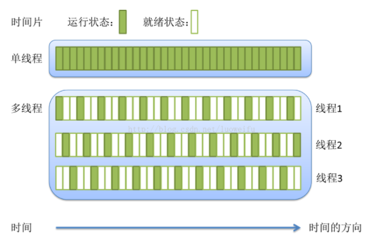
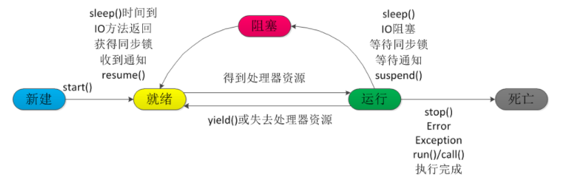
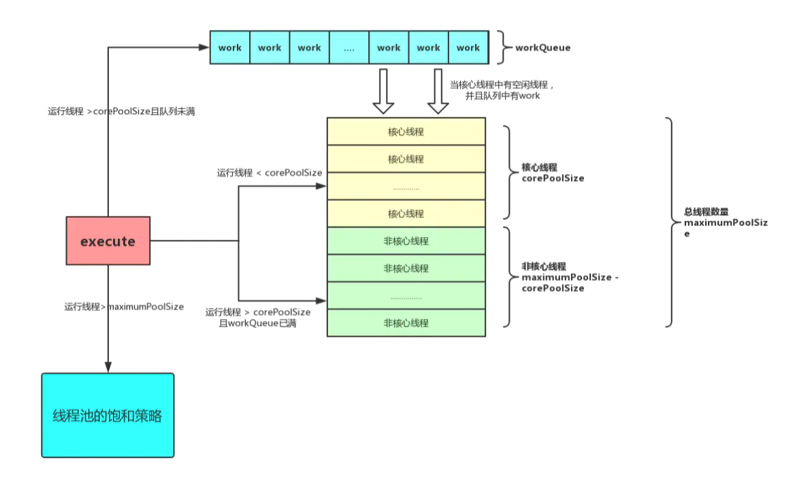
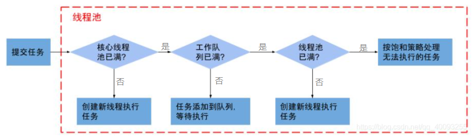

[TOC]

# 1、线程与进程

### 1.1 任务调度

- 大部分的操作系统（Windows、Linux）的任务调度方式采用时间片轮转的抢占式调度；
- 即一个任务执行一小段时间（时间片）后强制暂停去执行下一个任务，每个任务轮流执行；被暂停的任务状态转变为就绪状态，等待它的下一个时间片到来继续执行；
- 采用时间片轮转方式是操作系统为了防止一个线程或者进程长时间占用 CPU 导致其他线程或进程饿死；
- 由于CPU的执行效率非常高，时间片非常短，在各个任务之间快速切换，呈现出多个任务“同时执行”，即并发；


### 1.2 进程

- 操作系统作为计算机的管理者，负责任务的调度、资源的分配和管理；应用程序是具有某种功能的程序，运行在操作系统之上；
- 而进程是一个具有一定独立功能的程序，在一个数据集上的一次动态执行的过程，是操作系统进行资源分配和调度的一个独立单位，是应用程序运行的载体；
- 在 Java 中，当启动 main 函数时，就是启动了一个 JVM 的进程，而 main 函数所在的线程就是中共进程中的一个线程，也被称为主线程；
- 组成：
  - 程序：用于描述进程要完成的功能，是控制进程执行的指令集；
  - 数据集合：程序在执行时所需要的数据和工作区；
  - 程序控制块（PCB）：包含进程的描述信息和控制信息。
- 特性：
  - 动态性：进程是程序的一次执行过程，是临时的，有生命期的，是动态产生，动态消亡的；
  - 并发性：任何进程都可以同其他进程一起并发执行；
  - 独立性：进程是系统进行资源分配和调度的一个独立单位；
  - 结构性：进程由程序、数据和进程控制块三部分组成。

### 1.3 线程

- 线程是程序执行中一个单一的顺序控制流程，是程序执行的最小单位，处理器调度和分派的基本单位；
- 一个进程包含一个或多个线程，各个线程之间共享进程所在的内存空间；
- 与进程区别：

| 进程                       | 线程                                     |
| -------------------------- | ---------------------------------------- |
| 操作系统分配资源的最小单位 | 程序执行的最小单位                       |
| 各进程间相互独立           | 同一进程下各线程共享该进程内存空间及资源 |
| 进程包含一个或多个线程     | 线程上下文切换比进程高效                 |

- 单线程与多线程：



### 1.4 多线程好处

- 更好利用CPU资源，在主线程执行任务的同时可以执行其他任务；
- 进程之间不能共享数据，而线程可以，线程间通信快；
- 系统创建进程需要重新分配系统资源，创建线程代价较小。

### 1.5 上下文切换

- 上下文：线程在执行过程中需要的运行条件和自身的状态；
- 上下文切换：线程被切换时，需要保留当前线程的上下文，等待线程下次占用 CPU 的时候恢复现场；并且加载下一个将要占用 CPU 的线程上下文；
- 当出现某些情况时，线程会从占用CPU状态中退出（前三种会发生线程切换）
  - 调用`sleep()`、`wait()`等主动让出CPU；
  - 时间片用完；
  - 调用了阻塞类型的系统中断，如请求IO、线程阻塞等；
  - 线程被终止或结束运行；

# 2、Java 线程

### 2.1 生命周期

> 任何程序至少需要一个线程，程序一开始执行就会有一个默认的线程，被称为主线程；

- 新建状态（New）：新建线程对象后，该线程对象就处于新建状态，直到程序调用 `start()` 方法；

- 就绪状态（Runnable）：线程对象调用 `start()` 方法后该线程对象进入就绪状态，就绪状态的线程处于就绪队列中，等待`JVM`中线程调度器的调度；

- 运行状态（Running）：就绪状态的线程获得CPU资源执行 `run()` 方法后，此线程便处于运行状态；

- 阻塞状态（Blocked）：线程执行 `sleep()`（睡眠）、`suspend()`（挂起）等方法，失去所占用的资源之后，该线程进入阻塞状态；在睡眠时间到达或再次获得资源后将会重新进入就绪状态；

  - 等待阻塞：运行状态中的线程执行 `wait()` 方法后；
  - 同步阻塞：线程获取`synchronized`同步锁失败后（同步锁被其他线程占用）；
  - 其他阻塞：调用线程的 `sleep()` 或 `join()` 发出 `I/O` 请求时，线程进入阻塞状态；

- 死亡状态（Dead）：一个运行状态的线程完成任务或其他终止条件发生时，该线程变为死亡状态。

  



### 2.2 创建线程的方式

##### （1）继承 Thread 类

- 创建一个类，继承自 `Thread`  类，重写 `Thread` 中的 `run() `方法 ，`run() `方法中为所需的线程业务；
- 启动线程：
  - 实例化该类；
  - 调用 `start()` 方法开启线程，`start()` 会在内部自动调用 `run()` 方法；
- 代码示例：

```java
// 创建一个类继承自 Thread
public class MyThread extends Thread
{

    @Override
    public void run()
    {
//        super.run();
        for (int i = 0; i < 10000; i++)
        {
            System.out.println("****** 子线程正在运行 ****** " + i);
        }
    }
    
}

// 使用线程
public class ThreadTest
{

    public void threadTest()
    {
        // 创建一个新线程
        MyThread myThread = new MyThread();
        
        // 开启线程，start() 方法会在内部自动调用 run() 方法
        myThread.start();
        
        // 主线程业务...
        
    }
    
}
```

##### （2）实现 Runnable 接口

- 创建一个类，实现 `Runnable` 接口，实现该接口中的 `run()` 方法，在 `run()` 方法中开发所需线程业务；
- 启动线程：
  - 调用`Thread` 类有参构造器创建一个`Thread`对象（将该 `Runnable` 接口子类对象作为实参，告知所要调用 `run()` 的对象）；
  - 调用该 `Thread` 实例的 `start()` 方法启动线程；
- 代码示例：

```java
// 创建一个类，实现 Runnable 接口
public class MyRunnable implements Runnable
{
    
    @Override
    public void run()
    {
        for (int i = 0; i < 10000; i++)
        {
            System.out.println("****** 子线程正在运行 ****** " + i);
        }   
    }
}

// 使用线程
public class ThreadTest
{

    public void runnableTest()
    {
        // 创建一个Runnable实例
        MyRunnable myRunnable = new MyRunnable();
        
        // 创建一个新线程，传入Runnable实例，告知所需调用 run() 的对象
        Thread thread = new Thread(myRunnable);
        
        // 开启线程，执行传入的Runnable实例中的 run()
        thread.start();
        
        // 主线程任务...
        
    }
    
}
```

##### （3）通过 Callable 和 Future 创建线程

- 创建一个类，实现 `Callable` 接口，实现 `call()` 方法（线程业务，并有返回值）；
- 创建该类的实例对象，作为实参构造 `FutureTask` 对象；`FutureTask` 对象封装了该 `Callable`  对象的 `call()` 方法的返回值；
- 使用 `FutureTask` 对象作为 `Thread` 对象的 `target` 创建线程并启动；
- 可调用 `FutureTask` 对象的 `get()` 方法获取子线程执行结束的返回值，注意`get()`方法会阻塞当前线程直到任务完成；
- 代码示例：

```java
// 创建 Callable 接口的实现类，实现 call() 方法
public class MyCallable implements Callable<String>
{

    @Override
    public String call() throws Exception
    {
        for (int i = 0; i < 10000; i++)
        {
            System.out.println("****** 子线程正在运行 ****** " + i);
        }
        return "----------------------- 子线程结束 -----------------------";
    }

}

// 使用线程
public class ThreadTest
{
    public void callableTest() throws InterruptedException, ExecutionException
        {
            // 创建 Callable 实现类对象
            MyCallable myCallable = new MyCallable();

            // 将 Callable 实现类对象作为实参创建 FutureTask 对象，FutureTask 对象封装了 Callable 对象 call() 的返回值
            FutureTask<String> futureTask = new FutureTask<>(myCallable);

            // 使用 FutureTask 对象作为 Thread 对象的 target 创建线程并启动
            Thread myThread = new Thread(futureTask);
            // 开启线程
            myThread.start();
			
            // 主线程业务
        	this.myMainThread();
        
            // 获取返回值（需等待线程执行完成）
            String returnValue = futureTask.get();
            
            System.out.println("########## 线程名称：" + myThread.getName());
            System.out.println("########## 返回值：" + returnValue);
        }

}
```

##### （4）比较

| 方式               | 优点                                                         | 缺点                            |
| ------------------ | ------------------------------------------------------------ | ------------------------------- |
| 继承 Thread 类     | 编写简单，无需使用 `Thread.currentThread()` 获取当前线程，可直接使用`this` | 继承`Thread` 类后无法继承其他类 |
| 实现 Runnable 接口 | 线程类只是实现接口，还可继承其他类                           |                                 |
| 实现 Callable 接口 | 同上，且相比 `run()` 方法，它可以有返回值                    |                                 |

### 2.3 线程的优先级

- 抢占式：高优先级的线程抢占CPU；

- Java 线程的优先级是一个整数，其取值范围是 1~10：

  - MIN_PRIORITY ：1；

  - MAX_PRIORITY ：10；
  - NORM_PRIORITY ：5 (默认优先级)；

- 具有较高优先级的线程对程序更重要，并且应该在低优先级的线程之前分配处理器资源。但是，线程优先级不能保证线程执行的顺序，而且非常依赖于平台；

- 获取和设置优先级：

  - `getPriority()` 获取
  - `setPriority(int p)` 设置

### 2.4 Thread 类

##### 常用方法

- 常用构造函数
  - `Thread()`
  - `Thread(Runnable target)`
  - `Thread(Runnable target, String name)`
  - `Thread(String name)`
  - `Thread(ThreadGroup group, Runnable target)`
  - `Thread(ThreadGroup group, Runnable target, String name) `
  - `Thread(ThreadGroup group, Runnable target, String name, long stackSize) `
  - `Thread(ThreadGroup group, String name) `

- `start()`：启动当前线程，Java虚拟机调用当前线程的run()方法；
- `run()`：通常需要重写Thread类中的此方法, 将创建的线程要执行的操作声明在此方法中；
- `currentThread()`：静态方法, 返回当前代码执行的线程；
- `getId()`：获取当前线程的标识；
- `getName()`：获取当前线程的名字；
- `setName()`：设置当前线程的名字；
- `sleep(long militime)`：让线程睡眠指定的毫秒数，在指定时间内，线程是阻塞状态；
- `yield()`： 线程让步，释放当前CPU的执行权，即暂停当前正在执行的线程，并执行其他线程（同优先级）；
- `join()`：在线程A中调用线程B的`join()`方法，则线程A进入阻塞状态，等待线程B执行完毕再继续执行线程A；
- `isAlive()`：判断当前线程是否存活；
- ~~已弃用：`stop()`、`resume()`、`suspend()`~~ ...

##### start() 与 run()

- `start()`：启动线程，是真正实现多线程运行的方法，调用该方法后当前线程处于就绪状态，等待获得CPU资源后Java虚拟机会自动调用当前线程的`run()`方法；
- `run()`：线程体，是`Thread`类的一个普通方法；

##### sleep()、yield()、join()、wait()、await()

| 方法           | `sleep()`                                                  | `yield()`                                    | `join()`         | `wait()`               | `await()`              |
| -------------- | ---------------------------------------------------------- | -------------------------------------------- | ---------------- | ---------------------- | ---------------------- |
| 隶属           | `Thread` 类                                                | `Thread` 类                                  | `Thread` 对象    | `Object` 对象          | `Condition` 对象       |
| 是否释放锁     | 不释放                                                     | 不释放                                       | 当前线程不释放   | 释放                   | 释放                   |
| 执行后线程状态 | 阻塞状态                                                   | 就绪状态                                     | 阻塞状态         | 阻塞状态               | 阻塞状态               |
| 何时就绪       | 指定时间后                                                 | 不阻塞，立刻进入就绪状态                     | join的线程执行完 | 唤醒后                 | 唤醒后                 |
| 唤醒方法       | 指定时间后                                                 | 自动唤醒                                     | join的线程执行完 | `notify()/notifyAll()` | `signal()/signalAll()` |
| 执行环境       | 任意                                                       | 任意                                         | 任意             | 同步代码块             | 同步代码块             |
| 使用场景       | 通常被用于暂停执行，给其他线程运行机会，且不考虑线程优先级 | 线程让步，让同优先级或更高优先级线程运行机会 |                  | 常用于线程间通信       |                        |

- `sleep()`
  - `Thread`类中的方法；
  - 需要指定等待时间，使得当前线程暂停执行，进入阻塞状态，在指定时间后被唤醒进入就绪状态等待CPU资源分配；
  - 会释放**CPU资源**，但不会释放**锁**；
- `wait()`
  - `Object`类中的方法；
  - 必须在`synchronized`同步代码块中使用，使当前线程进入阻塞状态；
  - 常用于线程间通信；
  - 会释放**CPU资源**，且会释放**锁**；
  - 调用`notify()`、`notifyAll()`会唤醒当前线程，使其进入就绪状态等待CPU资源分配；

### 2.5 常见问题

##### 线程死锁

- 多个线程同时被阻塞，它们中的一个或全部都在等对方的资源释放，因而线程被无限阻塞，程序无法正常终止；

##### 锁池与等待池

- 锁池
  - 线程想要进入某对象的`synchronized`方法或`synchronized`块之前，必须获得该对象的锁；
  - 当线程A获得某对象的锁后，其余线程访问该对象的`synchronized`方法或`synchronized`时，因为该对象的锁被线程A获取，因此这些线程会进入该对象的锁池中，等候获取锁资源；
- 等待池
  - 线程A调用某对象的`wait()`方法后，线程A将会释放该对象的锁，而后进入到该对象的等待池中，等候被唤醒；
  - 等待池中的线程不会去竞争该对象的锁；

##### notify() 与 notifyAll()

- `notify()` 
  - 当有线程调用某对象的`notify()`方法后，会随机唤醒一个在该对象**等待池**中的wait线程，使被唤醒的线程移动到到该对象的**锁池**中竞争**CPU资源**；
- `notifyAll()`
  - 类似`notify()` ，区别在于此方法会唤醒所有在该对象**等待池**中的线程；

##### sleep(0)的作用

- 前言：Windows系统采用时间片轮转的抢占式调度去竞争CPU资源；
- `sleep(0)`并非真的要将当前线程挂起0毫秒；
- 而是`sleep()`方法会释放**CPU资源**，这时操作系统会重新进行一次CPU资源竞争，从而使得其他线程有机会获得CPU控制权；

# 3、Java 线程池

### 3.1 介绍

##### 1）基本概念

- 存放线程的一个容器，或者说是一种多线程处理形式；
- 处理过程中将任务添加到队列，然后在创建线程后自动执行这些任务；
- 执行完任务后线程并不会销毁，而是再线程池中等待下一个任务；
- 作用：
  - 降低资源消耗：线程池不需要重复创建和销毁线程；
  - 提高响应速度：线程池中已创建好线程，有任务可立即执行（正常情况下）；
  - 提高线程的可管理性：线程池可控制线程数量，资源统一分配和监控；
- 适用时机：
  - 单个任务处理时间短；
  - 所需处理任务量大。

##### 2）结构

- 核心线程与非核心线程：
  - 核心线程与非核心线程并无区别，线程池期望达到核心线程数的并发状态，并且允许在其他情况超载，达到最大线程数的并发状态；
  - 核心线程并非一开始就有，提交任务之后才创建；
- 任务队列 `BlockingQueue`；
- 饱和策略（拒绝策略）。



##### 3）执行流程

- 用户提交线程；
- 核心线程未满则创建新线程执行任务；
- 核心线程已满，队列未满则将任务存储到队列中；
- 队列已满，但未达到最大线程数，则创建新线程执行任务；
- 已达到最大线程数，执行饱和策略（拒绝策略）。



##### 4）生命周期

线程池构造完成并不会立即创建新线程，当进行“预启动”或接受到任务时才开始创建新线程；

- *RUNNING*：接收新的任务并处理队列中的任务；
- *SHUTDOWN*：不接收新的任务，但是处理队列中的任务；
- *STOP*：不接收新的任务，不处理队列中的任务，同时中断处理中的任务；
- *TIDYING*：所有的任务处理完成，有效的线程数是0；
- *TERMINATED*：终止状态，已经执行完`terminated()`钩子方法。


### 3.2 体系结构

```bash
一、线程池的体系结构：
    Executor 负责线程的使用和调度的 根接口
	|--ExecutorService  接口： 线程池的主要接口，增加了返回Future对象，终止、关闭线程池等方法；
		|--ThreadPoolExecutor 线程池的实现类
		|--ScheduledExceutorService 接口： 负责线程的调度
			|--ScheduledThreadPoolExecutor ： 继承ThreadPoolExecutor，实现了ScheduledExecutorService
```

##### 1）Executor与ExecutorService 接口

> `Executor`框架最基本的接口，只有一个执行接口，将任务本身与执行分离开来

```java
// java.util.concurrent
public interface Executor {

    // 在未来某个时间执行给定的命令，可能在新线程、线程池或调用中执行
    void execute(Runnable command);
}
```

> `ExecutorService` 执行器服务接口，继承了`Executor`，增加了返回`Future`对象，终止、关闭线程池等方法


```java
// java.util.concurrent
public interface ExecutorService extends Executor {
	
    // 启动有序关闭，先提交先关闭，不接受新任务，会等待线程池中已有任务执行结束
    void shutdown();
    // 关闭所有任务，无论是否执行完，并返回未执行完的任务列表
    List<Runnable> shutdownNow();
    
    // 判断任务是否关闭
    boolean isShutdown();
    
    // 若所有调用关闭的任务都已完成，返回true
    boolean isTerminated();
    
    // 阻塞，直到所有任务完成请求执行、或发生超时，或当前线程中断，终止后返回true
    boolean awaitTermination(long timeout, TimeUnit unit) throws InterruptedException;
    
    // 提交一个返回值的任务执行，并返回一个Future代表的计算结果
    <T> Future<T> submit(Callable<T> task);
    <T> Future<T> submit(Runnable task, T result);
    Future<?> submit(Runnable task);
    
    // 执行固定的任务，返回包含完成后状态和结果的Futurel列表
    <T> List<Future<T>> invokeAll(Collection<? extends Callable<T>> tasks) throws InterruptedException;
    <T> List<Future<T>> invokeAll(Collection<? extends Callable<T>> tasks, long timeout, TimeUnit unit) throws InterruptedException;
    <T> T invokeAny(Collection<? extends Callable<T>> tasks) throws InterruptedException, ExecutionException;
    <T> T invokeAny(Collection<? extends Callable<T>> tasks, long timeout, TimeUnit unit) throws InterruptedException, ExecutionException, TimeoutException;
    
}
```

##### 2）Future 接口

> 代表一个异步的计算结果，提供了检测任务是否完成，检索结果等方法；

```java
// java.util.concurrent
public interface Future<V> {
    
    // 尝试取消此任务，如果任务 已完成 或 已取消 或 不可取消，则返回false
    boolean cancel(boolean mayInterruptIfRunning);
    
    // 如果任务在完成之前已取消，返回true
    boolean isCancelled();
    
    // 此任务完成，返回true；完成可能是正常终止、异常或取消等情况
    boolean isDone();
    
    // 如果有必要，等待计算完成，并返回结果；V 为返回值类型
    // 【阻塞式方法】，若任务未完成，须等待任务执行完成后返回结果
    V get() throws InterruptedException, ExecutionException;
    
    // 同get()，加入超时时间
    V get(long timeout, TimeUnit unit)
        throws InterruptedException, ExecutionException, TimeoutException;
    
}
```

##### 3）ThreadPoolExecutor 类

> `Executor`的具体实现，以内部线程池的方式对外提供管理任务执行、线程调度、线程池管理等服务
>
> 使用`ThreadPoolExecutor`创建线程池，工具类`Executors`创建线程池的内部实现也是通过该类的构造方法；

```java
// java.util.concurrent
public class ThreadPoolExecutor extends AbstractExecutorService {
    
    // 构造方法之一
    public ThreadPoolExecutor(int corePoolSize, // 核心线程数 >= 0
                              int maximumPoolSize, // 最大线程数 >= 1，且大于核心线程数
                              long keepAliveTime, // 线程存活时间 >= 0
                              TimeUnit unit, // 存活时间单位
                              BlockingQueue<Runnable> workQueue, // 任务队列，不能为空，用于传输和保存等待执行任务的阻塞队列
                              ThreadFactory threadFactory, // 线程工厂，不能为空，用于创建新线程
                              RejectedExecutionHandler handler) { // 线程饱和策略，不能为空
    }
    // 省略...
}
```

##### 4）Executors 工具类

> 提供了工厂方法来创建不同类型的线程池

- 方法内部实际使用`ThreadPoolExecutor`的构造方法创建线程池；

- 不建议使用`Executors` ，而推荐使用`ThreadPoolExecutor`，原因是可让开发者更加明确线程池的创建规则，规避资源耗尽的风险；

```java
// 创建固定大小的线程池
ExecutorService  pool = Executors.newFixedThreadPool() ;

// 缓存线程池，线程池的数量不固定，可以根据需求自动的更改数量
ExecutorService  pool = Executors.newCachedThreadPool();

// 创建单个线程池。 线程池中只有一个线程
ExecutorService  pool = Executors.newSingleThreadExecutor() ;
		
// 创建固定大小的线程，可以延迟或定时的执行任务
ScheduledExecutorService  pool = Executors.newScheduledThreadPool();
```

##### 5）拒绝策略

| 名称                      | 说明                                                         | 备注 |
| ------------------------- | ------------------------------------------------------------ | ---- |
| `AbortPolicy`（默认策略） | 抛出`RejectedExecutionException`异常                         |      |
| `CallerRunsPolicy`        | 由提交任务的线程处理被拒绝的任务                             |      |
| `DiscardOldestPolicy`     | 丢弃队列最前面的任务（最早提交的），然后重新提交被拒绝的任务 |      |
| `DiscardPolicy`           | 直接丢弃被拒绝的任务，不抛出异常                             |      |

### 3.3 常见问题

##### 线程池使用

- 创建线程或线程池只定义有意义的线程名称，方便出错时回溯；
- 线程资源通过线程池提供；
  - 可减少在创建和销毁线程上所消耗的时间及系统资源的开销，解决资源不足的问题；
  - 如果不使用线程池，有可能造成系统创建大量同类线程而导致消耗完内存或者**过度切换**问题。
- 线程池尽量不使用 `Executors` 创建，而通过 `ThreadPoolExecutor` 的方式，规避资源耗尽的风险；
  - `FixedThreadPool` 和 `SingleThreadPool`: 允许的请求队列长度为 `Integer.MAX_VALUE`，可能会堆积大量的请求，从而导致 `OOM`；
  - `CachedThreadPool` 和 `ScheduledThreadPool`: 允许的创建线程数量为 `Integer.MAX_VALUE`，可能会创建大量的线程，从而导致 `OOM`。

##### execute() 与 submit()

- `excecute()`
  - 用于提交不需要返回值的任务；
  - 因此也无法判断任务是否被线程池执行成功；
- `submit()`
  - 用于提交需要返回值的任务；
  - 线程池会返回一个`Future`类型的对象，通过该对象可判断任务是否执行成功，且可通过该对象的`get()`方法获取返回值数据；
  - 注意调用`get()`方法会阻塞当前线程直到任务完成；

##### 配置线程池线程数量

- CPU密集型任务
  - 利用CPU计算能力的任务，如：需在内存中对大量数据计算、排序等；
  - 主要消耗CPU资源，线程数可设置为**CPU核心数 + 1**；
- IO密集型任务
  - 涉及网络读取、文件读取之类的任务，此类任务等待IO操作完成时间较CPU计算耗费时间多；
  - 系统会占用大部分时间处理I/O交互，线程数可设置为**CPU核心数 *2**

# 4、常见关键字

### 4.1 并发特性

- 原子性
  - 一个或多个操作，要么所有的操作全部都得到执行且不会被中断，要么都不执行；
  - `synchronized` 可保证代码片段的原子性；
- 可见性
  - 当一个线程对共享变量进行了修改，那么其他的线程都可以立即知晓修改后的最新值；
  - `volatile` 可保证共享变量的可见性；
- 有序性
  - 代码在执行过程中的先后顺序；
  - Java在编译器以及运行期间会进行优化，代码执行顺序未必就是其编写顺序；
  - `volatile` 可禁止指令进行重排序优化；

### 4.2 synchronized 

##### 简介

- 解决多个线程之间访问资源的同步性；
- 即可保证使用`synchronized` 关键字修饰的方法或代码块在任意时刻只能有一个线程执行；
- 线程想要进入某对象的`synchronized`方法或`synchronized`块之前，必须获得该对象的锁；


##### 使用方式

- 修饰实例方法

  - 给当前对象实例加锁，进入同步代码前需要获取**当前对象实例的锁**

  ```java
      synchronized void myMethod(){
  		// 业务代码
      }
  ```

- 修饰静态方法

  - 给当前类加锁，会作用与类的所有对象实例，进入同步代码前需要获取**当前Class的锁**

  ```java
  	synchronized static void myMethod(){
  		// 业务代码
      }
  ```

- 修饰代码块

  - 需指定加锁对象，并对指定对象/类加锁；
  - 表示进入同步代码前需要获得**给定实例对象或类的锁**；

  ```java
  	synchronized(this|object) {
      	//业务代码
  	}
  	synchronized(类.class) {
      	//业务代码
  	}
  ```

- 构造方法本身属于线程安全，不能使用该关键字修饰；

### 4.3 volatile

##### 简介

- 只能修饰变量；

- 在Java内存模型中，线程可以把变量保存至本地内存中，使用本地内存保存的变量（其他线程不可见），结束后再将变量写回至主存中，而不是直接在主存中进行读写；

- 这样容易造成数据不一致，即一个线程在主存中修改了一个变量的值，而另一个线程还继续使用该变量在寄存器中的值；

  

- 使用`volatile` 关键字，可以防止`JVM`的指令重排，并且保证变量的可见性；

  

##### volatile  与 synchronized

- `volatile` 是线程同步的轻量级实现，性能较 `synchronized` 要好；
- `volatile` 只能用于变量，`synchronized` 可以修饰方法及代码块；
- `volatile` 可以保证数据的可见性，但无法保证数据的原子性，`synchronized` 都可；
- `volatile` 主要用于解决变量在多线程之间的可见性，`synchronized` 解决的是多个线程之间访问资源的同步性；

# 5、ThreadLocal 类

##### 简介

- `ThreadLocal` 并非一个线程，而是线程的局部变量；

- 通常情况下，我们创建的变量是可以被任何一个线程访问并修改的；
- 而 `ThreadLocal` 类则让每个线程拥有自己专属的变量；
- 创建一个 `ThreadLocal` 变量，那么访问这个变量的每个线程都会拥有这个变量的本地副本（仅本线程可见），从而避免了线程安全问题；

#####  原理

- 每一个线程中都有一个`threadLocals` 和 `inheritableThreadLocals` 变量，都属于 `ThreadLocalMap` 类型的变量；

- 实际上，变量并非存储于 `ThreadLocal` 中，而是存储于每个线程的 `ThreadLocalMap` 中；

- `ThreadLocalMap` 可理解为以 `ThreadLocal` 为key， `Object`为value的 `HashMap`；

- `ThreadLocal` 可看作是对 `ThreadLocalMap` 的封装，传递变量值；

  ```java
  // Thread类
  public class Thread implements Runnable {
      //......
      //与此线程有关的ThreadLocal值。由ThreadLocal类维护
      ThreadLocal.ThreadLocalMap threadLocals = null;
  
      //与此线程有关的InheritableThreadLocal值。由InheritableThreadLocal类维护
      ThreadLocal.ThreadLocalMap inheritableThreadLocals = null;
      //......
  }
  
  // ThreadLocal 类
  
  public void set(T value) {
      Thread t = Thread.currentThread();
      ThreadLocalMap map = getMap(t);
      if (map != null)
          map.set(this, value);
      else
          createMap(t, value);
  }
  ThreadLocalMap getMap(Thread t) {
      return t.threadLocals;
  }
  ```

# 6、Atomic 原子类


# 7、AQS

