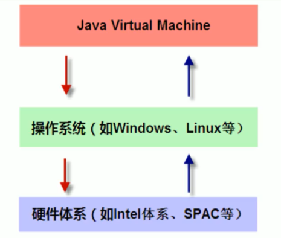

# 一、JVM 简介

### 1、概述

- JVM 是 Java Virtusl Machine（Java虚拟机）的缩写，是一种用于计算设备的规范，它是一个虚构出来的计算机，通过在实际的计算机上仿真模拟各种计算功能来实现的；
- Java虚拟机有自己完善的硬件架构，如处理器、堆栈等，还具有相应的指令系统；
- Java语言的可移植性正是建立在Java虚拟机的基础上，Java源程序（.java）编译成字节码文件（.class）后，通过Java虚拟机中的Java解释器将字节码文件解释成特定的机器码进行运行；
- 任何平台只要具备针对该平台的Java虚拟机，字节码文件（.class）就可以在该平台上运行；即**一次编译，到处运行**；
- 几种虚拟机：
  - SUN HotSpot（当前）；
  - BEA JRockit；
  - IBM J9；
  - ......

### 2、位置

- JVM是运行在操作系统之上的，它与硬件没有直接的交互；

### 3、体系结构

> JVM体系结构分为三部分：类装载子系统、运行时数据区、执行引擎；

- **方法区**、**堆**：所有线程共享的数据区；垃圾回收99%发生在堆；
- **Java栈**、**本地方法栈**、**程序计数器**：线程隔离的数据区；且不会有垃圾回收；

# 二、运行时数据区

> 主要为五个内存区域：程序计数器、Java虚拟机栈、本地方法栈、Java堆、方法区。

### 1、程序计数器

> Program Counter Register

- 是一块较小的内存空间；
- 它可以看作是当前线程执行的字节码的行号指示器；
- 字节码解释器工作时就是通过改变这个计数器的值来选取下一条需要执行的字节码指令；
- 每条线程都有一个独立的程序计数器，使线程切换后能恢复到正确的执行位置；
- 如果线程执行的是Java方法，计数器记录的是正在执行的虚拟机字节码指令的地址；如果执行的Native方法，计数器的值空（`Undefined`）；
- 此内存区域是唯一 一个在Java虚拟机规范中没有规定任何`OutOfMemoryError`情况的区域。

### 2、Java虚拟机栈

> Java Virtual Machine Stack

- 线程私有，它的生命周期与线程相同；
- 它描述的是Java方法执行的**内存模型**，每个方法在执行的同时都会创建一个**栈帧**；每一个方法从调用直至执行完成的过程，就对应着一个**栈帧**在虚拟机中**入栈**到**出栈**的过程；程序正在运行的方法永远在栈顶；
- 栈：一种数据结构，可看作一个弹夹，先进后出；
- 栈帧：
  - Stack Frame，方法运行时的基础数据结构。用于存储**局部变量表**、**操作数栈**、**动态链接**、**方法出口信息**等；
- 局部变量表：
  - 存放了编译器可知的各种**基本数据类型**、**对象引用**、**returnAddress类型**；
  - 局部变量表所需的内存空间在编译期间完成分配，在方法允许期间不会改变局部变量表的大小；
  - 基本数据类型：`boolean`|`byte`|`char`|`short`|`int`|`float`|`long`|`double`；
  - 对象引用：refrence类型，不等同于对象本身，可能是一个指向对象起始地址的引用指针，或指向一个代表对象的句柄或其他与此对象相关的位置；
  - returnAddress类型：指向一条字节码指令的地址。
- 异常情况：
  - `StackOverflowError`异常：当前程请求的栈深度大于虚拟机的所允许的深度时抛出此异常；
  - `OutOfMemoryError`异常：当虚拟机栈可以动态扩展（大部分可扩展，也允许固定长度的虚拟机栈），且扩展时无法申请到足够的内存时抛出此异常；

### 3、本地方法栈

> Native Method Stack

- 线程私有，与虚拟机栈非常相似，HotSpot虚拟机中直接将虚拟机栈与本地方法栈合二为一；
- 区别在于虚拟机栈为虚拟机执行**Java方法**服务，本地方法栈为虚拟机执行**Native方法**服务；
- 与虚拟机栈一样，也会抛出`StackOverflowError`异常与`OutOfMemoryError`异常；
- Native方法（本地方法）：
  - 由Java调用，但并非以Java语言实现，而是以本地语言实现，本地语言可认为是可以和操作系统直接交互的语言，如C语言；
  - JNI：Java Native Interface，是Java中SDK的一部分，允许Java代码调用以其他语言编写的代码和代码库；
  - 本地方法在Java中由native关键字声明，该关键字类似于abstract关键字，表示方法只有声明没有实现。

### 4、Java堆

> Heap

- 它是Java虚拟机所管理的内存中最大的一块，**99%的垃圾回收**发生在此处，因此也被称作GC堆；
- 所有线程共享，在Java虚拟机启动时创建；
- 唯一目的就是存放对象实例，几乎所有对象实例都在此处分配内存；
- 可以细分为新生代、老年代等（垃圾回收细述）；
- 如果在堆中没有内存用于完成实例分配，且堆也无法再扩展时，将会抛出`OutOfMemoryError`异常。

### 5、方法区

> Method Area

- 所有线程共享；
- 用于存储已被虚拟机加载的**类信息**、**常量**、**静态变量**、即时编译器编译后的代码等数据；
- 当方法区无法满足内存分配需求时，将抛出`OutOfMemoryError`异常；
- **运行时常量池**是方法区的一部分；
- Class文件中除了有类的版本、字段、方法、接口等描述信息外，还有一项信息是常量池（Constant Pool Table），用于存放编译期生成的各种**字面量**和**符号引用**，这部分内容将在类加载后进入方法区的运行时常量池中存放；
- 字面量：接近于Java层面的常量概念，如文本字符串，声明为final的常量值等；
- 符号引用：属于编译原理方面的概念，包括下面下面三类常量：
  - 类和接口的全限定名；
  - 字段的名称和描述符；
  - 方法的名称和描述符。

### 6、HotSpot虚拟机对象分析

#### （1）对象的内存布局

> 对于HotSpot 虚拟机，对象在内存中存储的布局分为三块区域：对象头、实例数据、对齐填充

- 对象头（Header）

  - 对象头信息是与对象自身定义的数据无关的额外存储成本，主要分为两部分；

  - 第一部分用于存储对象自身的运行时数据，如哈希码、GC分代年龄、锁状态标志等；
  - 第二部分是类型指针，即对象指向它的类元数据的指针，虚拟机通过此指针来确定这个对象是哪一个类的实例；
  - 如果对象是一个Java数组，那么在对象头中还有一块用于记录数组长度的数据。

- 实例数据（Instance Data）

  - 是对象真正存储的有效信息，也是再代码中所定义的各种类型的字段内容（包括父类继承下来的，在子类中定义的）；

- 对齐填充（Padding）

  - 不是必然存在的，仅仅起着占位符的作用。

#### （2）对象的创建

> **类加载检查**

- 虚拟机接收到一条new指令时，首先检查这个指令是否能在常量池中定位到一个类的符号引用（常量池存储了类信息），并且检查这个符号引用代表的类是否已被加载、解析和初始化过；
- 若未被加载过，则必须执行相应的类加载过程；

> **分配内存**

- 对象所需内存的大小在类加载完成后便已确定，因此为对象分配内存空间等同于在Java堆中划分出一块确定大小的内存；
- 分配方式：
  - 指针碰撞；
  - 空闲列表；

> **初始化零值**

- 初始化类的实例变量零值（类变量已在类加载的准备阶段初始化零值），保证了对象的实例字段在Java代码中可以不赋初始值就直接使用；

> **设置对象头**

- 对此对象是哪个类的实例、哈希码、GC分代年龄等信息进行设置；

> **执行<init>方法**

- 将对象按照开发者的意愿进行初始化，这样一个真正的对象才算完全创建好。

#### （3）对象的访问定位

> 创建对象简述

> 指针与句柄

- 指针：指针也就是内存地址，指针变量是用来存放内存地址的变量；
- 句柄：是一种特殊的智能指针；是由系统所管理的引用标识，该标识可以被系统重新定位到一个内存地址上。

> **通过句柄访问对象**

- reference中存储的是稳定的句柄地址；
- 对象被移动时只会改变句柄中的实例数据指针，而refrence本身不需要修改。

> **通过直接指针访问对象**

- reference中存储的是对象地址；
- 速度快，节省了一次指针定位的时间开销；
- 虚拟机 SUN HotSpot 使用此种方式进行对象访问。

# 三、类加载机制

> 虚拟机把描述类的数据从Class文件记载到内存，并对数据进行校验、转换解析和初始化，最终形成可以被虚拟机直接使用的Java类型。
>

### 1、类加载的时机

> 生命周期

- 类从被加载到虚拟机内存中开始，到卸载出内存为止；
- 生命周期包括：加载、验证、准备、解析、初始化、使用、卸载；
- 解析阶段在某些情况下可以在初始化阶段之后再开始，为了支持Java语言的运行时绑定；
- 这些阶段通常都是互相交叉地混合式进行的，通常会在一个阶段执行过程中调用、激活另外一个阶段；

> 类加载时机

- 当类被**主动引用**时，必须立即对类进行初始化（而加载、验证、准备自然在此之前开始），有以下几种情况：
  - <1> 使用`new`关键字实例化对象、读取或设置一个类的静态字段（被final修饰、已在编译期把结果放入常量池的静态字段除外）、调用类的静态方法时；
  - <2> 使用反射包`java.lang.reflect`的方法对类进行反射调用时，如果类没有初始化；
  - <3> 初始化一个类的时候，其父类没有进行初始化，则需要对其父类进行初始化；
  - <4> 虚拟机启动时，需要初始化包含main方法的主类；
  - <5> 使用JDK1.7的动态语言支持时。

### 2、类加载过程

##### （1）加载

> 类加载的一个阶段

- 通过一个类的全限定名来获取定义此类的二进制字节流；
- 将这个字节流所代表的静态存储结构转换为方法区的运行时数据结构；
- 在内存中生成一个代表这个类的`java.lang.Class`对象，作为方法区这个类的各种数据的访问接口。

##### （2）验证

> 确保Class文件的字节流中包含的信息符合当前虚拟机的要求

- 文件格式验证；
- 元数据验证；
- 字节码验证；
- 符号引用验证。

##### （3）准备

> 正式为类变量分配内存并设置类变量的初始值

- 注意是类变量（`static`修饰），而不是实例变量；
- 初始值通常是指数据类型的零值（`0`、`null`等），`final`修饰的直接赋具体值；
- 这些变量的内存将在方法区中进行分配。

##### （4）解析

> 虚拟机将常量池内的符号引用替换为直接引用

- 符号引用：以一组符号来描述所引用的目标，与虚拟机实现的内存布局无关；
- 直接引用：可以是直接指向目标的指针、相对偏移量或能间接定位到目标的句柄。

##### （5）初始化

> 真正开始执行类中定义的Java代码（字节码），即初始化类变量和其他资源

- 执行类构造器`<clinit>()`方法，`<clinit>()`方法是由编译器自动收集类中的所有**类变量**的赋值动作和静态语句块（static{ }）中的语句合并产生的；

##### （6）使用

> 分为主动引用与被动引用

- 主动引用详见类的初始化；
- 被动引用：
  - 引用一个类的静态变量，而该静态变量继承自父类，则不引起该类的初始化；
  - 定义一个类的数组；
  - 引用一个类的常量；

##### （7）卸载

> 回收方法区的类信息，主要回收废弃常量和无用的类

- 废弃常量：
  - 该常量没有被没有任何对象引用，也没有其他地方引用了这个字面量；
- 无用的类：
  - 该类所有的实例都已经被回收，也就是Java堆中不存在该类的任何实例；
  - 加载该类的`ClassLoader`已经被回收；
  - 该类对应的`java.lang.Class`对象没有任何地方被引用，无法在任何地方通过反射访问该类的方法。

### 3、类加载器

> 类加载器：独立于虚拟机外部，用于实现类的加载动作（类加载中的加载阶段）

- 每一个类加载器，都拥有一个独立的类名称空间；
- 即对于任意一个类，都需要加载它的类加载器和这个类本身才能确定这个类在虚拟机中的唯一性；换句话说，即使两个类来源于同一个Class文件，被同一个虚拟机加载，但只要加载它们的类加载不同，则这两个类不相等；

> 分类

- 对于虚拟机来讲，只存在两种类加载器：

  - 启动类加载器：使用C++语言实现，是虚拟机的一部分；
  - 所有其它的类加载器：Java语言实现，独立于虚拟机外部。

- 对于Java开发来讲，分为三种类加载器：

  | 名称                                      | 描述                                                         | 备注                                       |
  | ----------------------------------------- | ------------------------------------------------------------ | ------------------------------------------ |
  | 启动类加载器（`Bootstrap ClassLoader`）   | 负责加载存放于`<JAVA_HOME>\lib`目录下，并且是虚拟机识别的（根据文件名识别，如rt.jar）类库加载到虚拟机中。 | 无法被Java程序直接引用                     |
  | 扩展类加载器（`Extension ClassLoader`）   | 负责加载`<JAVA_HOME>\lib\ext`目录中的所有类库。              |                                            |
  | 启动类加载器（`Application ClassLoader`） | 负责加载用户类路径（ClassPath）上所指定的类库                | 也称为系统类加载器，是程序中默认的类加载器 |

### 4、双亲委派模型

> 类加载器之间的一种层次关系，保证Java程序的稳定运作。

- 这里类加载器之间的父子关系一般不会以继承关系来实现，而是都使用组合关系来复用父加载器的代码；
- 工作流程：
  - 当一个类加载器收到类加载请求，首先不会自己去尝试加载这个类，而是将此请求委派给父类加载器去完成；
  - 各层次的类加载都是如此，知直到加载请求传送到底层的启动类加载器中；
  - 只有当父类加载器反馈自己无法完成这个加载请求时（它的的搜索范围中没有找到所需的类），子加载器才会尝试自己去加载；
  - 总得来说是往上委派加载请求，往下反馈处理；尝试：自己创建一个Java类库中已存在的类，如：`java.lang.String`，并进行类加载，看是否加载自己创建的类。

# 四、垃圾收集

> Garbage Collection，简称GC

### 1、前言

- 程序计数器、虚拟机栈、本地方法栈为线程私有，随线程而生，随线程而灭，线程结束时，内存自然随着回收，因此这三个区域不需要过多考虑内存回收的问题；
- 而Java堆与方法区，只有在运行期间才能知道会创建哪些对象，这两部分的内存分配和回收是动态的；

### 2、判断对象是否存活

##### （1）引用计数法

> Reference Counting

- 给对象中添加一个引用计数器，每当有一个地方引用它时，计数器加1；当引用失效时计数器值减1；任何时刻计数器为0的对象就是不可能再使用的；
- 但很难解决对象之间相互循环引用的问题。

##### （2）可达性分析算法

> Reachability Analysis

- 通过一系列的成为【GC Roots】的对象作为起始点，从这些节点开始向下搜索，搜索所走过的路径称为【引用链】；
- 当一个对象到【GC Roots】没有任何【引用链】相连时，则证明此对象是不可用的；
- 分析过程中不应该出现对象的引用关系还在不断发生变化的情况，这导致GC进行时必须停顿所有Java执行线程；
- Java语言中，可作为【GC Roots】的对象有以下几种：
  - 虚拟机栈（栈帧中的本地变量表）中引用的对象；
  - 方法区中类静态属性引用的对象；
  - 方法区中常量引用的对象；
  - 本地方法栈中 JNI（Native方法）引用的对象。

### 3、引用

| 名称                        | 描述                                                         | 说明                                                         |
| --------------------------- | ------------------------------------------------------------ | ------------------------------------------------------------ |
| 强引用（Strong Reference）  | 指程序代码中普遍存在的，类似`Object obj = new Object();`这类的引用； | 只要强引用还存在，垃圾收集器永远不会回收掉被引用的对象；     |
| 软引用（Soft Reference）    | 描述一些有用但并非必须的对象；比如对象缓存；                 | 内存不足时被回收；                                           |
| 弱引用（Weak Reference）    | 也是用来描述非必须对象的；强度比软引用更弱；                 | 下一次垃圾收集时被回收，无论内存是否足够；                   |
| 虚引用（Phanton Reference） | 也称为幽灵引用或幻影引用，最弱的一种引用关系；               | 为一个对象设置虚引用的唯一目的是能够在这个对象被收集器回收时收到一个系统通知，可用于跟踪对象被垃圾回收的活动； |

### 4、垃圾收集算法

##### （1）标记-清除算法

> Mark-Sweep

- 算法分为标记、回收两个过程：
  - 标记：首先标记出所有需要回收的对象；
  - 清除：在标记完成后统一回收所有被标记的对象；
- 不足：
  - 效率问题：标记、清除两个过程的效率都不高；
  - 空间问题：标记清除之后会产生大量不连续的内存碎片，碎片过多会导致以后在程序运行过程中需要分配较大对象时，无法找到足够的连续内存而不得不提前触发另一次垃圾收集动作。

##### （2）复制算法

> Copying

- 为了解决效率问题，它将可用内存按容量均分成两块，每次只使用其中一块；当使用的那块内存用完了，先将还存活的对象复制到另一块内存中，然后将已使用过的内存一次清理掉；
- 此种方式每次都对半个内存块回收，且内存分配时无需考虑内存碎片等复杂情况；
- 不足：内存缩小为原来的一半。
- 注：现代商业虚拟机大部分采用此种收集算法回收**新生代**，因为新生代中的对象98%都是”朝生夕死“，无需按照1 ：1划分内存空间，而是将内存分为一块较大的`Eden`空间和两块较小的`Survivor`空间（8：1：1）。
- 复制算法在对对象存活率较高时需要进行较多的复制操作，影响效率；在老年代一般不采用复制算法；

##### （3）标记-整理算法

> Mark-Compact

- 分为标记、整理两个过程：
  - 标记：首先标记出所有需要回收的对象；
  - 整理：将所有存活的对象都向一端移动，然后直接清理掉边界以外的内存；

##### （4）分代收集算法

> Generational Collection

- 根据的对象存活周期的不同将内存划分为好几块；一般将Java堆分为新生代和老年代；根据各个年代的特点采用最适当的收集算法；
  - 新生代或年轻代（Young generation）：刚出生不久的对象，存放不是经常使用的对象；
  - 老年代（Tenured generation）：存放经常被引用的对象；
- 新生代中的对象98%是朝生夕死的，只有少量存活，采用复制算法；
- 老年代中对象存活率较高、没有额外空间对它进行担保，必须使用标记-清理或标记-整理算法进行回收；

- 当前商业虚拟机的垃圾收集都采用分代收集算法。

### 5、HotSpot 算法实现

枚举根节点

安全点

安全区域

### 6、垃圾收集器

> 内存回收的具体实现，HotSpot 虚拟机的垃圾收集器（重点GMS与G1）如下：

##### （1）相关概念

- 并发与并行
  - 并行：指多条垃圾收集线程并行工作，但此时用户线程仍处于等待状态；
  - 并发：指用户线程与垃圾收集线程同时执行（但不一定是并行的，可能会交替执行），用户程序在继续运行，而垃圾收集程序运行在另一个`CPU`上。
- 吞吐量（`Throughput`）:
  - `CPU`用于运行用户代码的时间与`CPU`总消耗时间的比值；
  - 即吞吐量 = 运行用户代码时间 / （运行用户代码时间 + 垃圾收集时间）；
- `Minor GC` 与 `Full GC`
  - 新生代GC（`Minor GC`）：指发生在新生代的垃圾收集动作，因为Java对象大多都具备朝生夕死的特性，所以`Minor GC`非常频繁，一般回收速度也快；
  - 老年代GC（`Major GC` / `Full GC`）：指发生在老年代的垃圾收集动作；出现`Full GC`经常会伴随着`Minor GC`，`Full GC`的速度一般比`Minor GC`慢10倍以上；

##### （2）CMS

##### （3）G1

### 7、内存分配与回收策略

##### （1）内存分配

- 对象的内存分配，就是在Java堆上进行分配；
- Java堆被划分为新生代与老年代，新生代又被划分为一个`Eden`区与两个`Survivor`区（内存大小比例为8：1：1）；
- 新生代使用复制算法，为了内存利用率，虚拟机每次都只使用`Eden`区和其中一个`Survivor`（S0）区，另一块`Survivor`（S1）区作为转换备份；

##### （2）内存分配策略

- 对象优先在`Eden`分配；
  - 绝大多数刚创建的对象在新生代`Eden`区中分配；
  - 当`Eden`区空间不足时，引发一次`Minor GC`。
- 大对象直接进入老年代；
  - 大对象：指需要大量连续内存空间的Java对象，如：很长的字符串以及数组。
- 长期存活的对象进入老年代；
  - 虚拟机为每个对象定义了一个对象年龄计数器；
  - 如果对象在`Eden`出生并经过一次`Minor GC`后仍然存活，并且能被`Survivor`容纳的话，将被移动到`Survivor`中，并且对象年龄设为1；
  - 对象在`Survivor`区每经历一次`Minor GC`年龄就加1，年龄达到阈值（默认15岁）将晋升到老年代中。
- 动态对象年龄判定；
  - 虚拟机并不是永远要求对象年龄达到阈值才晋升到老年代；
  - 如果在`Survivor`空间中相同年龄的所有对象大小的总大于和`Survivor`空间的一半，大于或等于该年龄的对象就可以直接进入老年代。
- 空间分配担保；
  - 在发生`Minor GC`之前，虚拟机先检查老年代最大可用的连续空间是否大于新生代所有对象总空间，如果条件成立的话，那么 `Minor GC` 可以确认是安全的；
  - 如果不成立的话虚拟机会查看 `HandlePromotionFailure` 的值是否允许担保失败，如果允许那么就会继续检查老年代最大可用的连续空间是否大于历次晋升到老年代对象的平均大小，如果大于，将尝试着进行一次 `Minor GC`；如果小于，或者 `HandlePromotionFailure` 的值不允许冒险，那么就要进行一次 `Full GC`；
  - 冒险指是否会出现大量对象在`Minor GC`后仍然存活的情况，发生此情况就需要老年代进行分配担保，把`Survivor`区无法容纳的对象直接进入老年代；

##### （3）小结

- 绝大多数刚创建的对象在新生代`Eden`区中分配；
- `Eden`区第一次满时（引发一次`Minor GC`），虚拟机将`Eden`区存活的对象复制到S0，此时S1是空的；
- 下一次`Eden`区满时，再次GC；这时会将Eden与S0区中存活的对象复制到S1，然后清除Eden与S0区中的所有对象，此时S0变为空；
- 如此反复使用S0与S1做切换，当某对象在Survivor存活15次时，该对象进入到老年代；
- 当老年代满时触发`Full GC`。

# 五、字节码执行引擎

栈帧结构

# 六、Java内存模型

`Java内存模型的定义`、`内存间交互操作` 要记清楚。`volatile` 的作用要彻彻底底的掌握，面试中经常问。Java内存模型的三大特征 `原子性、可见性和有序性` 也一定要理解。Java `线程的状态转换` 也是一个常考问题。协程了解一下。

# 七、线程安全与锁优化

理解并记牢线程安全的几种实现方法，比如`互斥同步`、`非阻塞同步` 等。互斥同步中有两个重要的同步手段一定要重视，一个是 `synchronized`，另一个是 `ReentrantLock` 。非阻塞同步中一个重要手段 `CAS` 一定要充分理解。

锁优化也是考察的重点，`适应性自旋`、`锁消除`、`锁碰撞`、`轻量级锁`、`偏向锁` 这些技术一定要充分理解和记熟。

# 八、性能调优

# 九、性能监控与故障处理工具

### 1、JDK 的命令行工具

- jps：虚拟机进程状况工具；
- jstat：虚拟机统计信息监视工具；
- jinfo：Java 配置信息工具；
- jmap：Java 内存映像工具；
- jhat：虚拟机堆转储快照工具；
- jstack：Java 堆栈跟踪工具；
- HSDIS：JIT 生成代码反汇编。

### 2、JDK 的可视化工具

- JConsole：Java 监视与管理控制台；
- VisualVM：多合一故障处理工具；

