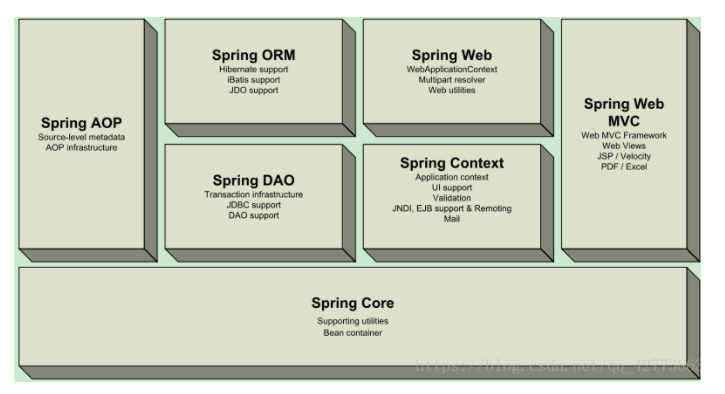
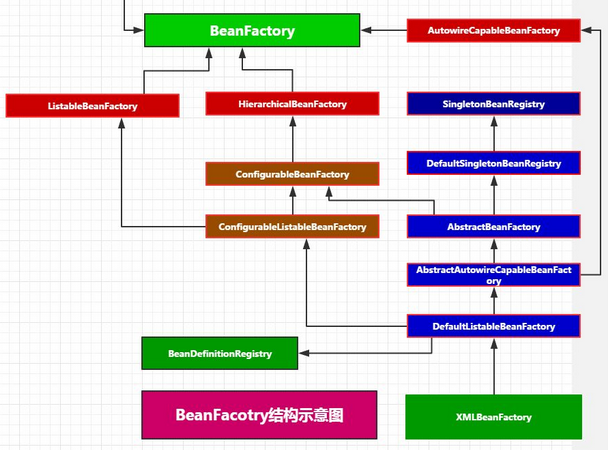
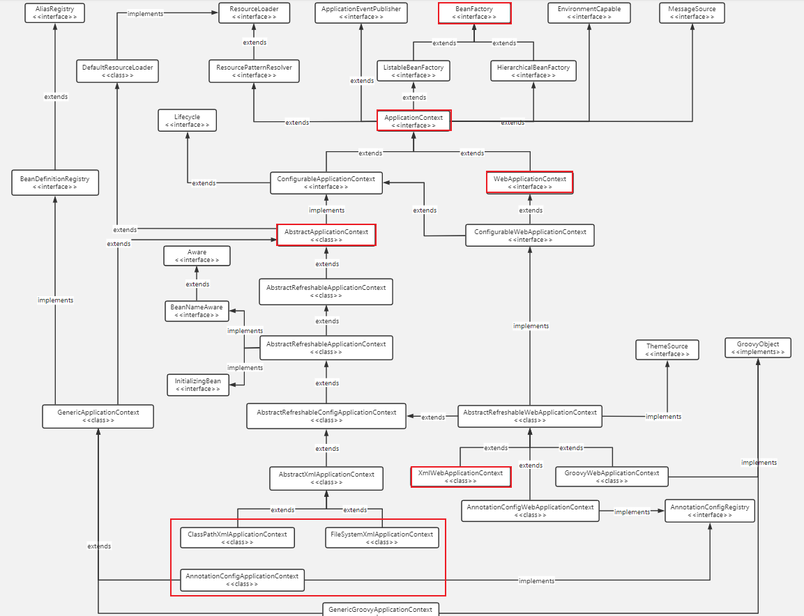
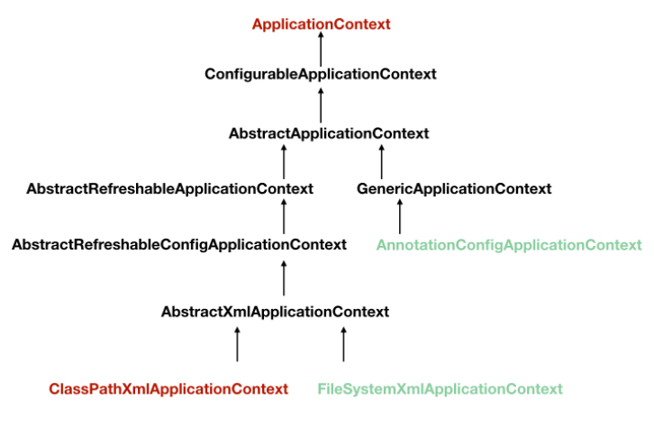
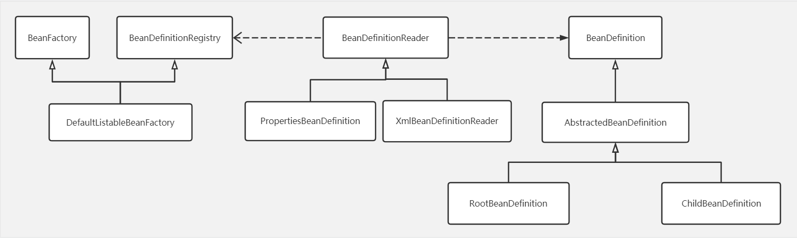
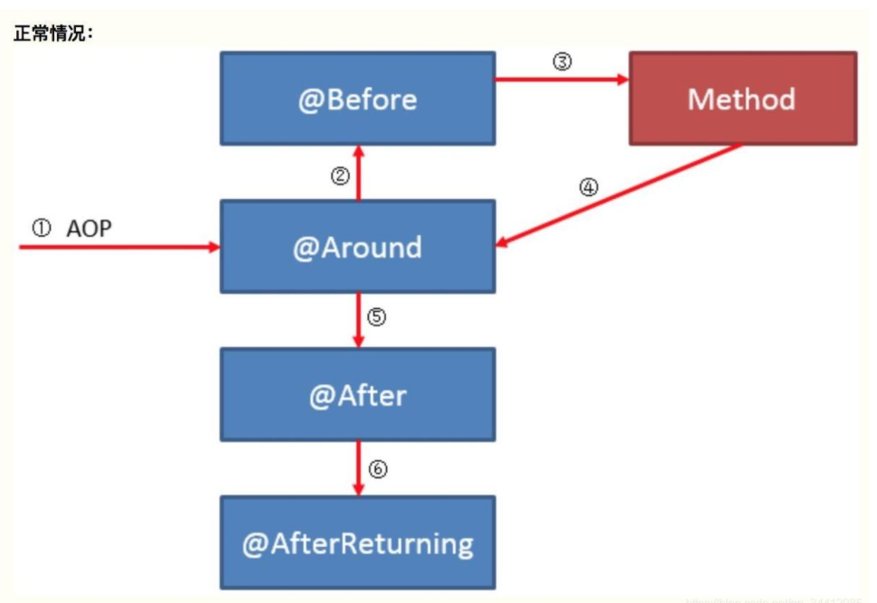
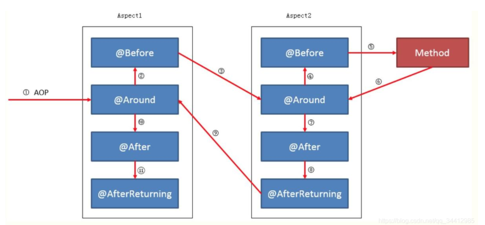

[TOC]

# 一、Spring 简介

 ### 1、简介

官方文档：https://spring.io/projects/spring-framework#learn

官方下载地址：https://repo.spring.io/release/org/springframework/spring/

GitHub：https://github.com/spring-projects/spring-framework

- 开源框架（容器）;
- 为了解决企业应用开发的复杂性;

- 轻量级、非侵入式的框架；
- 说明：非侵入式=>原代码不会产生对框架的依赖（不必要继承框架提供的接口或类），方便迁移到其他地方；
- 主要特性：控制反转（IOC）、面向切面编程（AOP）;
- 支持事务的处理，对框架整合支持。

### 2、组成



| 模块           | 说明                                                         |
| -------------- | ------------------------------------------------------------ |
| Spring-Core    | 基础部分，提供了框架的基本组成部分，包括控制反转和依赖注入功能 |
| Spring-Context | 核心容器<上下文模块>，即IoC容器，它扩展了BeanFactory，为它添加了Bean生命周期管理、框架事件体系等功能 |
| Spring-AOP     | 提供对面向切面编程的支持                                     |
| Spring-DAO     | 对传统JDBC进行了抽象，提供事务管理方法                       |
| Spring-ORM     | 对象关系映射模块，提供对Hibernate、MyBatis等的支持           |
| Spring-Web     | 提供最基础的web支持，主要建立在核心容器上，通过Servlet或者Listener来初始化IOC容器，也包括一些与Web相关的支持 |
| Spring-Web MVC | 实现了Spring MVC的Web应用                                    |

### 3、扩展

- Spring Boot

  - 一个快速开发脚手架
  - 用于简化基于Spring 的应用开发
  - 基于Spring Boot 可以快速开发单个微服务
  - 理念：约定优于配置

- Spring cloud

  - 一套分布式服务治理框架

  - 基于Spring Boot 实现

关系：Spring IOC/AOP => Spring => Spring Boot => Spring Cloud 

# 二、Spring 应用

### 1、Bean

- 在Spring中，构成应用程序主干并由Spring IO容器管理的对象称为bean

- 作用域：

  | scope                  | 描述                                                         |
  | ---------------------- | ------------------------------------------------------------ |
  | 单例模式 singleton     | spring默认机制，IOC容器仅创建一个bean实例，每次返回的都是同一个bean实例 |
  | 原型模式 propertype    | 每次调用bean都返回一个新的bean实例                           |
  |                        | 以下适用于ApplicationContext（web开发）环境中                |
  | HTTP请求  request      | 每次HTTP请求都会创建一个新的bean实例                         |
  | 会话 session           | 同一个session共享一个bean实例，不同会话使用不同的bean实例    |
  | globalSession 全局会话 | 一般运用于Portlet应用环境（Portlet是基于Java的Web组件，由Portlet容器管理，并由容器处理请求，生产动态内容） |

### 2、IOC 控制反转

- 控制：控制对象的创建，传统应用程序由程序本身控制创建对象，使用Spring后由Spring容器创建；
- 反转：程序本身不创建对象，变成被动接收对象，控制权由自身交由Spring容器；
- 核心：BenFactory，实质利用反射动态创建对象、调用对象方法。

### 3、依赖注入（DI）

- IOC的一种方式；
- 某对象需要调用另外一个对象时，不必要在代码中创建被调用对象，而是依赖于外部（spring容器）注入。

### 4、创建对象的方式

- （1）无参构造器

```xml
<?xml version="1.0" encoding="UTF-8"?>
<beans xmlns="http://www.springframework.org/schema/beans"
       xmlns:xsi="http://www.w3.org/2001/XMLSchema-instance"
       xsi:schemaLocation="http://www.springframework.org/schema/beans http://www.springframework.org/schema/beans/spring-beans.xsd">

    <!-- 使用spring创建对象:
    id等价于变量名/bean名称，唯一;
    <property>标签设置属性;
    -->
    <bean id="userInfo" class="com.xinx.pojo.UserInfo">
        <property name="id" value="001"/>
        <property name="name" value="张三"/>
        <property name="code" value="Microsoft"/>
    </bean>

</beans>
```

- （2）有参构造器

```xml
<!-- 通过有参构造函数创建对象 -->
    
    <!-- 1、参数名-->
    <bean id="byProperty" class="com.xinx.pojo.UserInfo">
        <constructor-arg name="id" value="001"/>
        <constructor-arg name="name" value="张三"/>
    </bean>
        
    <!-- 2、下标（从0开始）-->
    <bean id="byIndex" class="com.xinx.pojo.UserInfo">
        <constructor-arg index="0" value="001"/>
        <constructor-arg index="1" value="张三"/>
    </bean>

    <!-- 3、参数类型-->
	<!-- 多个相同类型时，按参数顺序 -->
    <bean id="byType" class="com.xinx.pojo.UserInfo">
        <constructor-arg type="java.lang.String" value="001"/>
        <constructor-arg type="java.lang.String" value="张三"/>
    </bean>
```
- （3） 测试

```java
public class MyTest {

    public static void main(String[] args) {

        // 在配置文件加载时初始化spring容器，实例化所有bean
        // 默认单例模式

        // 获取Spring上下文对象（Spring当前运行环境）
        ApplicationContext context = new ClassPathXmlApplicationContext("beans.xml");
        // 获取beans.xml中配置的对象，通过id

        // 1、无参构造
        UserInfo userInfo = (UserInfo) context.getBean("userInfo");

        // 2、有参构造
        UserInfo userInfo1 = (UserInfo) context.getBean("byProperty");
        UserInfo userInfo2 = (UserInfo) context.getBean("byIndex");
        UserInfo userInfo3 = (UserInfo) context.getBean("byType");

    }
    
}
```

# 三、Spring 配置

### 1、jar包

```xml
<!-- webmvc包含spring基础包 -->
<dependency>
    <groupId>org.springframework</groupId>
    <artifactId>spring-webmvc</artifactId>
    <version>5.1.10.RELEASE</version>
</dependency>

<!-- 测试 -->
<dependency>
    <groupId>junit</groupId>
    <artifactId>junit</artifactId>
    <version>4.12</version>
    <scope>test</scope>
</dependency>
```

### 2、xml命名空间

```xml
<?xml version="1.0" encoding="UTF-8"?>
<beans xmlns="http://www.springframework.org/schema/beans"
       xmlns:xsi="http://www.w3.org/2001/XMLSchema-instance"
       xsi:schemaLocation="http://www.springframework.org/schema/beans http://www.springframework.org/schema/beans/spring-beans.xsd">
    
</beans>
```

### 3、配置标签

（1） 引用 ref

```xml
<!-- ref 引用其他bean作为属性 -->

<bean id="cat" class="com.xinx.pojo.Cat">
    <property name="name" value="橘子"/>
</bean>

<bean id="user" class="com.xinx.pojo.UserInfo">
    <property name="name" value="养猫的人"/>
    <property name="cat" ref="cat"/>
</bean>

```

（2） 别名 alias

```xml
<!-- 别名 -->

<!-- 方式1 name 可作为别名，且可配置多个(逗号、空格等分割)-->
<bean id="user" class="com.xinx.pojo.UserInfo" name="user1,user2">
    <property name="id" value="001"/>
    <property name="name" value="张三"/>
    <property name="code" value="Microsoft"/>
</bean>

<!-- 方式2 -->
<alias name="user" alias="user3"/>

```

（3） 导入 import

```xml
<!-- import 导入其他xml配置信息 -->
<!-- 导入配置一般应用于团队开发，可将多个配置合并为一个总配置-->

<import resource="beans.xml"/>

```
# 四、DI依赖注入

### 1、构造器方式

- （1） 实体类

```java
public class UserInfo {

    /** 无参构造器 */
    public UserInfo() {

    }

    /** 有参构造器 */
    public UserInfo(String id, String name, int age, String hobby, Address address) {
        this.id = id;
        this.name = name;
        this.age = age;
        this.hobby = hobby;
        this.address = address;
    }

    /** ID */
    private String id;

    /** 名称 */
    private String name;

    /** 年龄 */
    private int age;

    /** 爱好 */
    private String hobby;
    
    // 无需set方法
    
}
```

```java
public class Address {

    /** ID */
    private String id;

    /** 省份 */
    private String province;

    /** 城市 */
    private String city;

    /** 详细地址 */
    private String area;

    // ......
    
}
```

- （2） bean配置

```xml
<!-- 构造器方式注入 -->
    <bean id="userInfo" class="com.xinx.pojo.UserInfo">
        <constructor-arg name="id" value="001"/>
        <constructor-arg type="java.lang.String" value="超人"/>
        <constructor-arg index="2" value="18"/>
        <constructor-arg type="java.lang.String" value="飞"/>
        <constructor-arg name="address" ref="address"/>
    </bean>

	<bean id="address" class="com.xinx.pojo.Address"/>

```


### 2、Setter方式

（1）实体类

```java
public class Person {

    /** ID */
    private String id;

    /** 名称 */
    private String name;

    /** 住址 */
    private Address address;

    /** 书 */
    private String[] books;

    /** 爱好 */
    private List<String> hobbies;

    /** 游戏 */
    private Map<String, String> games;

    /** 朋友 */
    private Set<String> friends;

    /** 钱 */
    private String money;

    /** 特性 */
    private Properties info;
    
    // getter setter 省略...
    
}
```

```java
public class Address {

    /** ID */
    private String id;

    /** 省份 */
    private String province;

    /** 城市 */
    private String city;

    /** 详细地址 */
    private String area;

    // getter setter 省略...
    
}
```

（2）bean配置

```xml
<!-- 地址 -->
<bean id="address" class="com.xinx.pojo.Address">
    <property name="id" value="001"/>
    <property name="province" value="江西"/>
    <property name="city" value="南昌"/>
    <property name="area" value="青山湖区"/>
</bean>

<!-- 人员 -->
<bean id="person" class="com.xinx.pojo.Person">
    <!-- 简单属性注入 -->
    <property name="id" value="001"/>
    <property name="name" value="小强"/>
    
    <!-- bean注入 -->
    <property name="address" ref="address"/>
    
    <!-- Array数组 -->
    <property name="books">
        <array>
            <value>三年模拟五年高考</value>
            <value>高中语文</value>
        </array>
    </property>
    
    <!-- List集合-->
    <property name="hobbies">
        <list>
            <value>钱多</value>
            <value>事少</value>
            <value>不加班</value>
        </list>
    </property>
    
    <!-- Set集合 -->
    <property name="friends">
        <set>
            <value>李四</value>
            <value>王五</value>
        </set>
    </property>
    
    <!-- Map -->
    <property name="games">
        <map>
            <entry key="a" value="消消乐"/>
            <entry key="b" value="连连看"/>
        </map>
    </property>
    
    <!-- null值 <value>标签内无值时为空字符串 -->
    <property name="money">
        <null/>
    </property>
    
    <!-- 配置信息 -->
    <property name="info">
        <props>
            <prop key="driver">driver</prop>
            <prop key="url">url</prop>
            <prop key="username">root</prop>
            <prop key="password">123456</prop>
        </props>
    </property>
</bean>
```

（3）P标签与C标签

- 导入命名空间


```xml
<beans xmlns="http://www.springframework.org/schema/beans"
       xmlns:xsi="http://www.w3.org/2001/XMLSchema-instance"
       xmlns:p="http://www.springframework.org/schema/p"
       xmlns:c="http://www.springframework.org/schema/c"
       xsi:schemaLocation="http://www.springframework.org/schema/beans http://www.springframework.org/schema/beans/spring-beans.xsd">
    
</beans>
```

- 使用


```xml
<!-- p命名空间-对应set注入 -->
    <bean id="userInfoP" class="com.xinx.pojo.UserInfo"
          p:id="001"
          p:name="赵六"
          p:age="18"
          p:hobby="学习"
    />

<!-- c命名空间-对应属性注入-需要有参构造器 -->
    <bean id="userInfoC" class="com.xinx.pojo.UserInfo"
          c:name="哈哈"
          c:age="24"
          c:hobby="赚钱"
    />
```

### 3、静态工厂与实例工厂方式

（1）实体类

```java
public class Company {

    /** ID */
    private String id;

    /** 名称 */
    private String name;

    /** 部门 */
    private Department department;
    
    // 省略...
    
}
```

```java
public class Department {

    /** ID */
    private String id;

    /** 名称 */
    private String name;
    
    // 省略...
    
}
```

```java
// 部门工厂
public class DeptFactory {

    /**
     * 静态方式-获取部门对象
     * @return
     */
    public static Department initDept() {
        Department department = new Department();
        department.setName("研发部");
        return department;
    }

    /**
     * 获取部门对象
     * @return
     */
    public Department getDept() {
        Department department = new Department();
        department.setName("产品部");
        return department;
    }

}
```

（2） xml配置

````xml
<!-- 静态工厂注入 调用静态工厂的方法获取所需的对象 -->

    <bean id="company" class="com.xinx.factory.Company">
        <property name="id" value="001"/>
        <property name="name" value="有限公司"/>
        <property name="department" ref="staticFactory"/>
    </bean>

    <bean id="staticFactory" class="com.xinx.factory.DeptFactory" factory-method="initDept"/>

<!-- 实例工厂注入 首先new一个工厂，再获取所需的对象-->

    <bean id="company2" class="com.xinx.factory.Company">
        <property name="id" value="002"/>
        <property name="name" value="文化有限公司"/>
        <property name="department" ref="deptInstance"/>
    </bean>

    <bean id="deptFactory2" class="com.xinx.factory.DeptFactory" />

    <bean id="deptInstance" factory-bean="deptFactory2" factory-method="getDept"/>
````

（3） 测试

```java
@Test
public void test() {

    ApplicationContext context = new ClassPathXmlApplicationContext("applicationContext.xml");

    Company company1 = context.getBean("company1", Company.class);
    Company company2 = context.getBean("company2", Company.class);

    System.out.println("===静态工厂方式===" + company1.toString());
    System.out.println("===实例工厂方式===" + company2.toString());

}

// ===静态工厂方式===Company{id='001', name='有限公司', department=Department{id='null', name='研发部'}}
// ===实例工厂方式===Company{id='002', name='文化有限公司', department=Department{id='null', name='产品部'}}
```


# 五、自动装配

### 1、XML显示装配

| 装配方式    | 描述                                                         |
| ----------- | ------------------------------------------------------------ |
| no          | （默认）无自动装配，bean引用必须由ref元素定义                |
| byName      | 按属性名称装配                                               |
| byType      | 按属性类型装配，若无该类型则不装配，若有多个类型则抛出异常   |
| constructor | 类似于byType，但适用于构造函数参数，若容器中不存在构造函数参数类型的bean，则抛出异常。 |

（1）实体类

```java
public class Person {

    /** 无参构造 */
    public Person() {

    }

    /** 有参构造 */
    public Person(Cat cat, Dog dog) {
        this.cat = cat;
        this.dog = dog;
    }
    
    /** ID */
    private String id;

    /** 名称 */
    private String name;

    /** 狗 */
    private Dog dog;

    /** 猫 */
    private Cat cat;
    
    // getter setter 省略...
    
}
```

```java
public class Dog {

    /** ID */
    private String id;

    /** 名称 */
    private String name;

    /** 狗吠 */
    public void barking() {
        System.out.println("======汪");
    }
    
    // getter setter 省略...
    
}
```

```java
public class Cat {

    /** ID */
    private String id;

    /** 名称 */
    private String name;

    /** 猫叫 */
    public void mew() {
        System.out.println("======喵");
    }
    
    // getter setter 省略...
    
}
```

（2） bean配置

```xml

<bean id="dog" class="com.xinx.pojo.Dog">
    <property name="name" value="旺财"/>
</bean>
<bean id="cat" class="com.xinx.pojo.Cat">
    <property name="name" value="橘子"/>
</bean>
<bean id="person" class="com.xinx.pojo.Person">
    <property name="name" value="地主"/>
    <property name="dog" ref="dog"/>
    <property name="cat" ref="cat"/>
</bean>

<!-- 自动装配，自动在容器上下文中查找对应的bean-->

	<!-- no -->
    <bean id="personByNo" class="com.xinx.pojo.Person" autowire="no">
        <property name="name" value="管家"/>
    </bean>

    <!-- ByName 根据名称装配(默认类名小写)-->
    <bean id="personByName" class="com.xinx.pojo.Person" autowire="byName">
        <property name="name" value="农民"/>
    </bean>

    <!-- ByType 根据类型装配，需保证此上下文中类型唯一 -->
    <bean id="personByType" class="com.xinx.pojo.Person" autowire="byType">
        <property name="name" value="打工仔"/>
    </bean>

    <!-- constructor 类似于byType但适用于构造函数参数 -->
    <bean id="personByConstructor" class="com.xinx.pojo.Person" autowire="constructor">
        <property name="name" value="仆人"/>
    </bean>

```

（3） 测试

```java
public class MyTest {
    
	@Test
    public void testAssembly() {

        ApplicationContext context = new ClassPathXmlApplicationContext("beans.xml");
        
        Person person = context.getBean("person", Person.class);
        Person personByNo = context.getBean("personByNo", Person.class);
        Person personByName = context.getBean("personByName", Person.class);
        Person personByType = context.getBean("personByType", Person.class);
        Person personByConstructor = context.getBean("personByConstructor", Person.class);

        System.out.println("======" + person.toString());
        System.out.println("===no===" + personByNo.toString());
        System.out.println("===byName===" + personByName.toString());
        System.out.println("===byType===" + personByType.toString());
        System.out.println("===constructor===" + personByConstructor.toString());

    }
}

// 结果
// ======Person{id='null', name='地主', dog=Dog{id='null', name='旺财'}, cat=Cat{id='null', name='橘子'}}
// ===no===Person{id='null', name='管家', dog=null, cat=null}
// ===byName===Person{id='null', name='农民', dog=Dog{id='null', name='旺财'}, cat=Cat{id='null', name='橘子'}}
// ===byType===Person{id='null', name='打工仔', dog=Dog{id='null', name='旺财'}, cat=Cat{id='null', name='橘子'}}
// ===constructor===Person{id='null', name='仆人', dog=Dog{id='null', name='旺财'}, cat=Cat{id='null', name='橘子'}}

```

### 2、隐式自动装配

##### 2.1 正常装配

（1）装配方式

| 注解       | 作用位置         | 描述                                                         |
| ---------- | ---------------- | ------------------------------------------------------------ |
| @Autowired | 属性与setter方法 | ByType，若存在多个类型，则默认查找与属性名相同的bean         |
| @Rersource | 属性与setter方法 | 可指定ByName或ByType方式，默认ByName，若未找到则通过ByType方式 |

（2） 实体类

```java
public class Person {

    /** ID */
    private String id;

    /** 名称 */
    private String name;

    @Autowired
    //@Resource(name = "dog2")
    /** 狗 */
    private Dog dog2;

    @Autowired
    //@Resource
    /** 猫 */
    private Cat cat;
    
    //  getter setter 省略...
    
}
```

```java
public class Dog {

    /** ID */
    private String id;

    /** 名称 */
    private String name;

    /** 狗吠 */
    public void barking() {
        System.out.println("======汪");
    }

    // getter setter 省略...
    
}
```

```java
public class Cat {

    /** ID */
    private String id;

    /** 名称 */
    private String name;

    /** 猫叫 */
    public void mew() {
        System.out.println("======喵");
    }

    // getter setter 省略...
    
}
```

（3） xml配置

- 导入context命名空间
- 开启注解驱动与包路径扫描

```xml
<?xml version="1.0" encoding="UTF-8"?>
<beans xmlns="http://www.springframework.org/schema/beans"
       xmlns:xsi="http://www.w3.org/2001/XMLSchema-instance"
       xmlns:context="http://www.springframework.org/schema/context"
       xsi:schemaLocation="http://www.springframework.org/schema/beans
                           http://www.springframework.org/schema/beans/spring-beans.xsd
                           http://www.springframework.org/schema/context
                           https://www.springframework.org/schema/context/spring-context.xsd" >

    <!-- 开启注解驱动-->
    <context:annotation-config/>
    
    <bean id="person" class="com.xinx.pojo.Person"/>
    
    <bean id="dog2" class="com.xinx.pojo.Dog">
        <property name="name" value="二狗子"/>
    </bean>
    <bean id="cat2" class="com.xinx.pojo.Cat">
        <property name="name" value="大猫"/>
    </bean>

    <bean id="dog" class="com.xinx.pojo.Dog">
        <property name="name" value="lucky dog"/>
    </bean>
    <bean id="cat" class="com.xinx.pojo.Cat">
        <property name="name" value="喵喵喵"/>
    </bean>

</beans>
```

##### 2.2 组件扫描

（1） 实体类

```java
@Component // 等价于在xml中配置bean
public class UserInfo {
    
    @Value("001") // 相当于配置bean中的property属性，也可用于setter
    private String id;
    
    private String name;
    
    @Value("悟空")
    public void setName(String name) {
        this.name = name;
    }
    
    
    
}
```

（2） xml配置

- 导入context命名空间
- 开启注解驱动与包路径扫描

```xml
<beans xmlns="http://www.springframework.org/schema/beans"
       xmlns:xsi="http://www.w3.org/2001/XMLSchema-instance"
       xmlns:context="http://www.springframework.org/schema/context"
       xsi:schemaLocation="http://www.springframework.org/schema/beans
                           http://www.springframework.org/schema/beans/spring-beans.xsd
                           http://www.springframework.org/schema/context
                           https://www.springframework.org/schema/context/spring-context.xsd">

    <!-- 开启注解驱动-->
    <context:annotation-config/>

    <!-- 开启包路径扫描 -->
    <context:component-scan base-package="com.xinx.pojo"/>

</beans>
```

（3） 注解说明

@Component衍生注解，在web开发中按mvc三层架构分层，功能一致

- dao 【@Respository】
- service 【@Service】
- controller 【@Controller】

### 3、Java显示装配

（1） 实体类

```java
// @Component 等价于在xml中配置bean
@Configuration // 类似于@Component
public class Person {

    @Bean // 注册一个bean,id为方法名
    public Cat getCat() {
        return new Cat();
    }

    /* ID */
    private String id;

    /* 名称 */
    private String name;
    
    @Value("悟空") // 注入属性
    public void setName(String name) {
        this.name = name;
    }
    
    // 省略...
    
}
```

（2）xml配置

- 导入context命名空间
- 开启注解驱动与包路径扫描

```xml
<beans xmlns="http://www.springframework.org/schema/beans"
       xmlns:xsi="http://www.w3.org/2001/XMLSchema-instance"
       xmlns:context="http://www.springframework.org/schema/context"
       xsi:schemaLocation="http://www.springframework.org/schema/beans
                           http://www.springframework.org/schema/beans/spring-beans.xsd
                           http://www.springframework.org/schema/context
                           https://www.springframework.org/schema/context/spring-context.xsd">

    <!-- 开启注解驱动-->
    <context:annotation-config/>

    <!-- 开启包路径扫描 -->
    <context:component-scan base-package="com.xinx.pojo"/>

</beans>
```

### 4、常用注解

| 注解名称       | 作用对象         | 描述                           |
| -------------- | ---------------- | ------------------------------ |
| @Component     | 类               | 声明一个bean，并注册到spring中 |
| @Configuration | 类               | 类似@Component                 |
| @Value         | 属性与setter方法 | 注入外部属性                   |
| @Bean          | 方法             | 声明一个bean，bean的id为方法名 |
|                |                  |                                |
|                |                  |                                |

- @Component与@Configuration
  - @Configuration 中所有带 @Bean 注解的方法都会被动态代理，因此调用该方法返回的都是同一个实例；
  - @Component中带有@Bean注解的方法，每次返回的实例不是同一个实例。

# 六、IOC运行机制

### 1、容器介绍

- IOC容器可以看成一个bean工厂，用来管理所需对象以及对象之间的依赖关系；
- 原理：Java的反射机制（动态获取对象信息及动态调用对象方法）
  - 在应用程序运行状态中；
  - 对于任意一个类，都能够知道这个类所有的属性和方法；
  - 对于任意一个对象，都能够任意调用它的属性和方法。
- 通过配置文件（xml、yml）和注解等来描述类与类之间的依赖关系；
- 最基本的启动Spring容器示例：

```java

// 创建上下文对象
ApplicationContext context = new ClassPathXmlApplicationContext("beans.xml");

// 根据bean ID获取beans.xml中配置的对象
UserInfo userInfo = (UserInfo) context.getBean("userInfo");

```

根据ClassPath查找相应的xml配置文件，然后通过xml配置文件中的内容来构建ApplicationContext，最后根据之前配置的beanName获取相应的实例对象。

### 2、体系结构

##### 2.1 简述

IOC的体系结构可简单分成两类：
- BeanFactory
  - Spring框架的基础设施，最顶层的接口，面向Spring自身；
  - 初始化容器时不会实例化Bean，第一次访问Bean的时候才实例化目标Bean。
- ApplicationContext
  - 由BeanFactory派生，扩展了更多的功能，提供面向Spring的使用者；
  - 初始化容器时就将所有Bean实例化；

| 名称               | 描述                                                        | 装载bean区别                                             |
| ------------------ | ----------------------------------------------------------- | -------------------------------------------------------- |
| BeanFactory        | Spring框架的基础设施，最顶层的接口，面向Spring自身          | 初始化容器时不会实例化Bean，第一次调用Bean的时候才实例化 |
| ApplicationContext | 由BeanFactory派生，扩展了更多的功能，提供面向Spring的使用者 | 启动时就将所有Bean实例化                                 |

##### 2.2 BeanFactory

- 顶层接口，最主要的方法是getBean()，从容器中返回特定的Bean；

- 体系结构图：



- 主要接口：

| 名称                       | 描述                                                         |
| -------------------------- | ------------------------------------------------------------ |
| ListableBeanFactory        | 该接口定义了访问容器中Bean基本信息的方法                     |
| HierarchicalBeanFactory    | 父子级联IOC容器接口                                          |
| AutowireCapableBeanFactory | 定义了Bean的自动装配方式                                     |
| 其他                       |                                                              |
| ConfigurableBeanFactory    | 定义了设置类装载器、属性编辑器、容器初始化后置处理器等方法，增强了IOC容器的可定制性 |
| SingletonBeanRegistry      | 提供注册单例Bean的相关方法，Bean 的缓存池由HashMap实现，beanName为key，bean实例为value |
| BeanDefinitionRegistry     | Spring 配置文件中每一个<bean>节点元素在 Spring 容器里都通过一个 BeanDefinition 对象表示，它描述了 Bean 的配置信息。而 BeanDefinitionRegistry 接口提供了向容器手工注册 BeanDefinition 对象的方法 |

##### 2.3 ApplicationContext

- ApplicationContext 继承了 HierarchicalBeanFactory 和 ListableBeanFactory 接口，并通过其他接口扩展了BeanFactory的功能；
- 体系结构图：





| 名称                               | 描述                                                         |
| ---------------------------------- | ------------------------------------------------------------ |
| ClassPathXmlApplicationContext     | 从类路径中加载配置文件                                       |
| FileSystemXmlApplicationContext    | 从系统路径中加载配置文件                                     |
| AnnotationConfigApplicationContext | 基于注解使用，不需要配置<bean>                               |
|                                    |                                                              |
| ConfigurableApplicationContext     | 扩展于ApplicationContext，新增了两个主要方法refresh()和 close()，让 ApplicationContext 具有启动、刷新和关闭应用上下文的能力 |

##### 2.4 BeanDefinition

- BeanDefinition是一个接口，继承了AttributeAccessor和BeanMetadataElement两个接口，主要允许修改属性值和其他Bean元数据，实际使用的是其实现类；
- BeanDefinition保存了Bean的定义信息，如类名、属性、依赖的Bean、是否是懒加载...
- 我们所说的Spring容器中的Bean会转化成一个个BeanDefinition，存储在BeanFactory中；



- 主要子类/接口：

| 名称                    | 描述                                                         |
| ----------------------- | ------------------------------------------------------------ |
| AnnotatedBeanDefinition | 扩展了BeanDefinition的功能，主要用于操作注解元数据(@component、@Bean...) |
| AbstractBeanDefinition  | 子抽象类，定义了些许常量和属性，也是其他 BeanDefinition 类型的基类 |
| RootBeanDefinition      | 扩展了更多的属性，可单独作为一个BeanDefinition或父类         |
| ChildBeanDefinition     | 相当于一个子类，不可单独存在，必须依赖一个父BeanDefinitioon  |

### 3、Bean初始化过程

##### 3.1 简述

- Bean 由最开始的xml配置、注解等转变成我们经常使用的对象会经历以下几种形态：
  - <1> 最原始的概念状态，即在xml中配置或注解标注等的形态；
  - <2> 内存中的定义状态，即 BeanDefinition，保存了Bean的相关信息；
  - <3> 对象初始状态，Bean 仅仅被 BeanFactory 创建成对象，但各属性并未装配；
  - <4> 完成状态，即已装配好各种属性，可供使用。
- 主要接口
  - Resource接口 ，将xml等配置文件读取到内存中；
  - Document接口，将xml解析保存在内存中；
  - BeanDefinitionReader接口，解析xml、将<bean>解析成为BeanDefinition；
  - BeanDefinition接口，Bean的抽象定义，保存了Bean的相关信息；
  - BeanFactory，工厂模式，用于创建真正意义上的Bean类；
  - ApplicationContext，应用程序上下文（容器），入口。

##### 3.2 源码示例

> ClassPathXmlApplicationContext启动示例：

```java
public static void main(String[] args) {
    
    /**
     * new ClassPathXmlApplicationContext对象时，会调用有参构造器中的refresh()方法；
     * refresh()会销毁原先的ApplicationContext，重新初始化。
     */
    ApplicationContext context = new ClassPathXmlApplicationContext("beans.xml");

    // 获取bean实例
    UserInfo userInfo = (UserInfo) context.getBean("userInfo");

}
```

```java
public class ClassPathXmlApplicationContext extends AbstractXmlApplicationContext {
    
    public ClassPathXmlApplicationContext(String configLocation) throws BeansException {
            this(new String[] {configLocation}, true, null);
    }
    
    public ClassPathXmlApplicationContext(
			String[] configLocations, boolean refresh, @Nullable ApplicationContext parent)
			throws BeansException {

		super(parent);
        // 根据classPath路径处理配置文件
		setConfigLocations(configLocations);
		if (refresh) {
            // 核心方法-重新初始化
			refresh();
		}
	}
    
    // ......
    
}
```

> 调用refresh()方法初始化，两个主要的方法：

- obtainFreshBeanFactory() - 初始化BeanFactory，注册Bean；
- finishBeanFactoryInitialization(beanFactory) - 实例化剩余的非懒加载的单实例。

```java
// 刷新方法：refresh()
public abstract class AbstractApplicationContext extends DefaultResourceLoader
		implements ConfigurableApplicationContext {
    
    @Override
	public void refresh() throws BeansException, IllegalStateException {
		
        synchronized (this.startupShutdownMonitor) {
			// Prepare this context for refreshing.
			prepareRefresh();

            // ******************** import *******************
			/**
             * 将配置文件解析成一个个 BeanDefinition，注册到 BeanFactory 中
      		 * 此时 Bean 未初始化，只提取了配置信息
      		 * 以 Map<beanName, beanDefinition>形式存储到注册中心
      		 */
      		ConfigurableListableBeanFactory beanFactory = obtainFreshBeanFactory();

			// Prepare the bean factory for use in this context.
			prepareBeanFactory(beanFactory);

			try {
				// Allows post-processing of the bean factory in context subclasses.
				postProcessBeanFactory(beanFactory);

				// Invoke factory processors registered as beans in the context.
				invokeBeanFactoryPostProcessors(beanFactory);

				// Register bean processors that intercept bean creation.
				registerBeanPostProcessors(beanFactory);

				// Initialize message source for this context.
				initMessageSource();

				// Initialize event multicaster for this context.
				initApplicationEventMulticaster();

				// Initialize other special beans in specific context subclasses.
				onRefresh();

				// Check for listener beans and register them.
				registerListeners();

                // ******************** import *******************
				// Instantiate all remaining (non-lazy-init) singletons.
                // 实例化剩余的非懒加载的单实例
				finishBeanFactoryInitialization(beanFactory);

				// Last step: publish corresponding event.
				finishRefresh();
			}

			catch (BeansException ex) {
				if (logger.isWarnEnabled()) {
					logger.warn("Exception encountered during context initialization - " +
							"cancelling refresh attempt: " + ex);
				}

				// Destroy already created singletons to avoid dangling resources.
				destroyBeans();

				// Reset 'active' flag.
				cancelRefresh(ex);

				// Propagate exception to caller.
				throw ex;
			}

			finally {
				// Reset common introspection caches in Spring's core, since we
				// might not ever need metadata for singleton beans anymore...
				resetCommonCaches();
			}
		}
	}
    
    // ......
    
}
```

> 创建Bean容器，加载并注册Bean

- obtainFreshBeanFactory()会初始化BeanFactory，但Bean并未初始化

```java
// 1、 刷新并获取Bean工厂：obtainFreshBeanFactory()
public abstract class AbstractApplicationContext extends DefaultResourceLoader
		implements ConfigurableApplicationContext {
    
    // 告诉子类刷新内部BeanFactory，并返回BeanFactory
    protected ConfigurableListableBeanFactory obtainFreshBeanFactory() {
        refreshBeanFactory();
        return getBeanFactory();
    }
    
    // ......
    
}
```
- 刷新Bean工厂，初始化DefaultListableBeanFactory，调用加载BeanDefinition的方法：

```java
// 1.1 刷新Bean工厂：refreshBeanFactory()
public abstract class AbstractRefreshableApplicationContext extends AbstractApplicationContext {
 
    /**
     * 此实现执行此上下文底层BeanFactory的实际刷新；
     * 销毁先前的Bean，关闭先前的BeanFactory(如果有)；
     * 并为上下文生命周期的下一阶段初始化一个新的BeanFactory
     */
    @Override
	protected final void refreshBeanFactory() throws BeansException {
		if (hasBeanFactory()) {
			destroyBeans();
			closeBeanFactory();
		}
		try {
            // 初始化DefaultListableBeanFactory，并序列化
			DefaultListableBeanFactory beanFactory = createBeanFactory();
			beanFactory.setSerializationId(getId());
            
            // 设置BeanFactory的配置属性
            //（是否允许BeanDefinition覆盖、循环引用）
			customizeBeanFactory(beanFactory);
            
            // ******************** import *******************
            // 加载Bean到BeanFactory中
			loadBeanDefinitions(beanFactory);
			synchronized (this.beanFactoryMonitor) {
				this.beanFactory = beanFactory;
			}
		}
		catch (IOException ex) {
			throw new ApplicationContextException("I/O error parsing bean definition source for " + getDisplayName(), ex);
		}
	}
    
    // ......
    
}
```
- 创建一个XmlBeanDefinitionReader对象，通过该对象加载配置并解析；


- 将配置中的<bean>一个个转化为 BeanDefinition， 然后注册到注册中心（包含beanName与别名两种形式），并且发送注册事件。


```java
// 1.1.1 加载Bean方法：loadBeanDefinitions(beanFactory)
public abstract class AbstractXmlApplicationContext extends AbstractRefreshableConfigApplicationContext {
    
    // 通过XmlBeanDefinitionReader加载BeanDefinition
    @Override
	protected void loadBeanDefinitions(DefaultListableBeanFactory beanFactory) throws BeansException, IOException {
        
		// Create a new XmlBeanDefinitionReader for the given BeanFactory.
		XmlBeanDefinitionReader beanDefinitionReader = new XmlBeanDefinitionReader(beanFactory);

		// Configure the bean definition reader with this context's
		// resource loading environment.
		beanDefinitionReader.setEnvironment(this.getEnvironment());
		beanDefinitionReader.setResourceLoader(this);
		beanDefinitionReader.setEntityResolver(new ResourceEntityResolver(this));

		// Allow a subclass to provide custom initialization of the reader,
		// then proceed with actually loading the bean definitions.
		initBeanDefinitionReader(beanDefinitionReader);
        
        // ******************** import *******************
        // 将<bean>配置一个个转化为 BeanDefinition， 然后注册到注册中心，
        // 并且发送注册事件
		loadBeanDefinitions(beanDefinitionReader);
	}
    
    // ......
}
```

- 到此执行完 obtainFreshBeanFactory() 方法，<bean>已经转化为 BeanDefinition ，但Bean并未初始化；


> 初始化所有单实例的bean

- 注：初始化Bean的动作包装在 beanFactory.getBean(...) 中；


```java
// 1.2 finishBeanFactoryInitialization()
public abstract class AbstractApplicationContext extends DefaultResourceLoader
		implements ConfigurableApplicationContext {

    /**
         * Finish the initialization of this context's bean factory,
         * initializing all remaining singleton beans.
         */
        protected void finishBeanFactoryInitialization(ConfigurableListableBeanFactory beanFactory) {
            // Initialize conversion service for this context.
            if (beanFactory.containsBean(CONVERSION_SERVICE_BEAN_NAME) &&
                    beanFactory.isTypeMatch(CONVERSION_SERVICE_BEAN_NAME, ConversionService.class)) {
                beanFactory.setConversionService(
                        beanFactory.getBean(CONVERSION_SERVICE_BEAN_NAME, ConversionService.class));
            }

            // Register a default embedded value resolver if no bean post-processor
            // (such as a PropertyPlaceholderConfigurer bean) registered any before:
            // at this point, primarily for resolution in annotation attribute values.
            if (!beanFactory.hasEmbeddedValueResolver()) {
                beanFactory.addEmbeddedValueResolver(strVal -> getEnvironment().resolvePlaceholders(strVal));
            }

            // Initialize LoadTimeWeaverAware beans early to allow for registering their transformers early.
            String[] weaverAwareNames = beanFactory.getBeanNamesForType(LoadTimeWeaverAware.class, false, false);
            for (String weaverAwareName : weaverAwareNames) {
                getBean(weaverAwareName);
            }

            // Stop using the temporary ClassLoader for type matching.
            beanFactory.setTempClassLoader(null);

            // Allow for caching all bean definition metadata, not expecting further changes.
            beanFactory.freezeConfiguration();

            // ******************** import *******************
            // Instantiate all remaining (non-lazy-init) singletons.
            beanFactory.preInstantiateSingletons();
        }

	// .......

}
```

- DefaultListableBeanFactory 中重写了实例化剩余非懒加载的单实例bean方法 - preInstantiateSingletons()


``` java
// 
public class DefaultListableBeanFactory extends AbstractAutowireCapableBeanFactory
		implements ConfigurableListableBeanFactory, BeanDefinitionRegistry, Serializable {
    
    @Override
        public void preInstantiateSingletons() throws BeansException {
            if (logger.isTraceEnabled()) {
                logger.trace("Pre-instantiating singletons in " + this);
            }

            // Iterate over a copy to allow for init methods which in turn register new bean definitions.
            // While this may not be part of the regular factory bootstrap, it does otherwise work fine.
            List<String> beanNames = new ArrayList<>(this.beanDefinitionNames);

            // Trigger initialization of all non-lazy singleton beans...
            for (String beanName : beanNames) {
                RootBeanDefinition bd = getMergedLocalBeanDefinition(beanName);
                if (!bd.isAbstract() && bd.isSingleton() && !bd.isLazyInit()) {
                    // 处理 FactoryBean
                    if (isFactoryBean(beanName)) {
                        Object bean = getBean(FACTORY_BEAN_PREFIX + beanName);
                        if (bean instanceof FactoryBean) {
                            final FactoryBean<?> factory = (FactoryBean<?>) bean;
                            boolean isEagerInit;
                            if (System.getSecurityManager() != null && factory instanceof SmartFactoryBean) {
                                isEagerInit = AccessController.doPrivileged((PrivilegedAction<Boolean>)
                                                ((SmartFactoryBean<?>) factory)::isEagerInit,
                                        getAccessControlContext());
                            }
                            else {
                                isEagerInit = (factory instanceof SmartFactoryBean &&
                                        ((SmartFactoryBean<?>) factory).isEagerInit());
                            }
                            if (isEagerInit) {
                                getBean(beanName);
                            }
                        }
                    }
                    else {
                        // 初始化普通 Bean
                        getBean(beanName);
                    }
                }
            }

            // Trigger post-initialization callback for all applicable beans...
            for (String beanName : beanNames) {
                Object singletonInstance = getSingleton(beanName);
                if (singletonInstance instanceof SmartInitializingSingleton) {
                    final SmartInitializingSingleton smartSingleton = (SmartInitializingSingleton) singletonInstance;
                    if (System.getSecurityManager() != null) {
                        AccessController.doPrivileged((PrivilegedAction<Object>) () -> {
                            smartSingleton.afterSingletonsInstantiated();
                            return null;
                        }, getAccessControlContext());
                    }
                    else {
                        smartSingleton.afterSingletonsInstantiated();
                    }
                }
            }
        }

    // ......

}
```

- getBean() - 从容器中获取 Bean ，若 Bean 未初始化则先初始化再返回相应的 Bean ；


- 通过java的反射机制创建对象，然后装配好属性返回。


##### 3.3 小结

- 过程 ：

  - 外部资源（xml、yml等）以统一接口 Resource 加载到内存；

  - 然后将 Resource 处理成Documenrt；
  - 再通过 BeanDefinitionReader 解析成 BeanDefinition；
  - 之后将BeanDefinition注册到Bean工厂（存放到全局Map<beanName, BeanDefinition>中，包含beanName与别名两种形式），发送注册事件；
  - 加载Bean（此前Bean并未初始化），包含别名转换、Bean实例化、原型模式依赖检查、类型转换等

- 调用方法链：

# 七、Spring AOP

> 前言：Spring AOP 的实现依赖动态代理（代理模式）；动态代理又有JDK动态代理与Cglib代理，Spring 会自动在这两种方式间切换；
>
> 若目标对象实现了接口，Spring 默认采用 JDK动态代理，也可强制使用 Cglib代理；
>
> 若目标对象未实现接口，则必须采用 Cglib代理。

### 1、简介

##### 1.1 介绍

- AOP，面向切面编程，通过预编译方式和运行期间动态代理实现应用程序功能的统一维护的技术；
- 利用AOP将核心业务功能与周边功能分离，从而使得业务逻辑各部分之间的耦合度降低，提高程序的可重用性，同时提高开发效率；
- 可将正常的业务看成纵向开发，而AOP在从正常业务纵向开发过程中横向切入，加入一些其他业务，只需要关注横向切入点。

##### 1.2 AOP术语

- 横切关注点：与主业务逻辑无关的，跨越应用程序多个模块的方法或功能，如日志、事务等；
- 切面（Aspect）：一个类，横切关注点被模块化的特殊对象；
- 通知（Advice）：切面要完成的工作，即类中的某个方法；
- 目标（Target）：被通知的对象；
- 代理（Proxy）：向目标对象应用通知之后创建的对象；
- 切入点（Pointcut）：切面通知执行的地点；
- 连接点（Joint point）：与切入点匹配的执行点。 

##### 1.3 通知类型

- Before（前置通知）：在连接点之前运行的通知，但不能阻止执行流继续到连接点（除非它抛出异常）；
- AfterReturning（返回后通知）：在连接点正常完成后运行的通知（例如，如果一个方法返回而没有抛出异常）；
- AfterThrowing（抛出后通知）：如果方法通过抛出异常退出，则执行通知；
- After (finally)（最终通知）：不管连接点退出的方式（正常或异常返回）都将执行的通知；
- Around（环绕通知）：环绕连接点的通知，提供了全方位的通知类型

### 2、实现

> 需要导入aop织入包

```xml
<dependency>
    <groupId>org.aspectj</groupId>
    <artifactId>aspectjweaver</artifactId>
    <version>1.9.4</version>
</dependency>
```

##### 2.1   利用Spring原生API

（1）创建一个接口及其实现类，定义两个简单接口作为测试；

```java
public interface UserService {

    void add();

    void sub();

}

public class UserServiceImpl implements UserService {

    @Override
    public void add() {
        System.out.println("****** 增加一个用户 ******");
    }

    @Override
    public void sub() {
        System.out.println("****** 减少一个用户 ******");
    }
}
```

（2）创建一个类，实现Spring原生的AOP接口

```java
// 此处实现了前置通知与后置通知相关的两个接口
public class MyLog implements MethodBeforeAdvice, AfterReturningAdvice {

    /**
     * MyLog 为一个aspect（切面）
     * 下述方法为advice（通知）
     */

    // 执行前
    @Override
    public void before(Method method, Object[] objects, Object o) throws Throwable {
        System.out.println("开始执行方法：" + method.getName());
    }

    // 执行后
    @Override
    public void afterReturning(Object o, Method method, Object[] objects, Object o1) throws Throwable {
        System.out.println("执行完方法：" + method.getName());
        System.out.println("返回值：" + o);
    }

}
```

（3）在xml中配置aop（注意导入aop约束）

```xml
<?xml version="1.0" encoding="UTF-8"?>
<beans xmlns="http://www.springframework.org/schema/beans"
       xmlns:xsi="http://www.w3.org/2001/XMLSchema-instance"
       xmlns:aop="http://www.springframework.org/schema/aop"
       xmlns:context="http://www.springframework.org/schema/context"
       xsi:schemaLocation="http://www.springframework.org/schema/beans
                           http://www.springframework.org/schema/beans/spring-beans.xsd
                           http://www.springframework.org/schema/aop
                           https://www.springframework.org/schema/aop/spring-aop.xsd
                           http://www.springframework.org/schema/context
                           https://www.springframework.org/schema/context/spring-context.xsd">

 	<!-- 手动注册bean -->
    <bean id="userService" class="com.xinx.service.impl.UserServiceImpl"/>

    <!-- 配置aop，需要导入aop约束 -->

    <!-- 方式一：原生spring API -->
    <bean id="myLog" class="com.xinx.aop.MyLog"/>
    <aop:config>
        <!-- 切入点，可配置多个 -->
        <!-- execution(返回类型 类名 方法名 参数)-->
        <aop:pointcut id="pointcut" expression="execution(* com.xinx.service.impl.UserServiceImpl.*(..))"/>
        <!-- 执行通知 -->
        <aop:advisor advice-ref="myLog" pointcut-ref="pointcut"/>
    </aop:config>

</beans>
```

（4）测试及结果

```java
public class MyTest {

    public static void main(String[] args) {
        ApplicationContext context = new ClassPathXmlApplicationContext("beans.xml");

        // 动态代理所代理的是接口，使用实现类将报错
        UserService userService = context.getBean("userService", UserService.class);
        userService.add();
    }
    
}

// 结果：
// 开始执行方法：add
// ****** 增加一个用户 ******
// 执行完方法：add
// 返回值：null
```

##### 2.2 自定义切面类

（1）自定义一个类，在xml配置中引用该类作为一个切面

```java
public class MyPointcut {

    public void MyBefore() {
        System.out.println("准备执行方法...");
    }

    public void MyAfter() {
        System.out.println("已执行方法...");
    }

}
```

（2）aop配置

```xml
<!-- 方式二：自定义切面 -->
<bean id="myPointcut" class="com.xinx.aop.MyPointcut"/>
<aop:config>
    <!-- 切面，应用自定义类-->
    <aop:aspect ref="myPointcut">
        <!-- 切入点，可配置多个 -->
        <aop:pointcut id="pointcut" expression="execution(* com.xinx.service.impl.UserServiceImpl.*(..))"/>
        <!-- 自行配置要在何时执行自定义方法 -->
        <!-- 前置方法 -->
        <aop:before method="MyBefore" pointcut-ref="pointcut"/>
        <!-- 后置方法 -->
        <aop:after method="MyAfter" pointcut-ref="pointcut"/>
        <!-- ... -->
    </aop:aspect>
</aop:config>
```

##### 2.3 注解方式

（1）切面类使用注解

```java
@Component
@Aspect // 标注该类为切面
public class AnnotationPointcut {

    // 使用注解告知切入点
    
    @Before("execution(* com.xinx.service.impl.UserServiceImpl.*(..))")
    public void MyBefore() {

        System.out.println("=== 前置方法 ===");
    }

    @After("execution(* com.xinx.service.impl.UserServiceImpl.*(..))")
    public void MyAfter() {

        System.out.println("=== 后置方法 ===");
    }

    /**
     * 使用环绕通知时，可以给定一个连接点参数，可获取处理切入的点
     */
    @Around("execution(* com.xinx.service.impl.UserServiceImpl.*(..))")
    public void MyAround(ProceedingJoinPoint jp) throws Throwable {

        System.out.println("环绕前...");

        // 执行方法
        Object obj = jp.proceed();

        System.out.println("环绕后...");
    }

}
```

（2）xml中开启aop注解模式

```xml
<!-- 方式三：注解方式 -->

<!-- 开启注解驱动-->
<context:annotation-config/>
<!-- 开启包路径扫描 -->
<context:component-scan base-package="com.xinx.*"/>
<!-- 开启切面自动代理 -->
<aop:aspectj-autoproxy/>

```

（3）测试结果

``` java
// 环绕前...
// === 前置方法 ===
// ****** 增加一个用户 ******
// 环绕后...
// === 后置方法 ===
```

### 3、通知执行顺序

> 注：执行顺序会与Spring版本相关，通常为一下顺序

- 单个切面：around前置 -> before -> 方法 -> around后置 -> after -> afterReturning/afterThrowing



- 多个切面，可以使用@Order注解指定先后顺序，数字越小，优先级越高，先进后出

```java
@Aspect // 标注该类为切面
@Order(value = 0)
public class AnnotationPointcut {
    ...
}
```




# 八、事务

### 1、介绍

> 事务：一般是指要做的或所做的事情，在计算术语中是指访问并可能更新数据库中各项数据项的一个程序执行单元。

##### 1.1 ACID 特性

- 原子性（Atomicity）：事务是一个原子操作，由一系列当作组成，事务中的操作要么都生效，要么都不生效；
- 一致性（Consistency）：在事务开始之前与结束之后，数据库的完整性没有被破坏；
- 隔离性（Isolation）：一个事务的执行不能别其他的事务干扰；
- 持久性（Durability）指一个事务一旦提交，它对数据库中数据的改变是永久性的。

##### 1.2 事务的并发

> 即多用户同时访问数据库相同数据的场景，可能造成一些并发问题，破坏数据库的完整性：

| 名称                              | 描述                                                         |      |
| --------------------------------- | ------------------------------------------------------------ | ---- |
| 脏读（Dirty Read）                | 一个事务读取到另一个事务更改且未提交的数据；                 |      |
| 不可重复读（Non-Repeatable Read） | 即不一致读取，同一个事务中前后两次读取的同一个数据不一致（中途被其它事务更改了数据）； |      |
| 幻读（Phantom Read）              | 同一个事务前后两次读取同一个范围的数据，读取的数据量不一致（其它事务新增或减少了符合条件的数据）； |      |
| 丢失更新（Lost Update）           | 第一类：两个事务更新同一个数据，A事务回滚将B事务已提交的更新数据覆盖了；造成B事务已提交的更新数据丢失；<br />第二类：两个事务更新同一个数据，A事务提交的更新数据覆盖了B事务提交的更新数据； |      |

- 注：幻读强度的是数据的增减，不可重复读强调的是单个数据的修改；

##### 1.3 隔离级别

> 级别越高，性能越差

| 名称                         | 描述                                                        | 脏读 | 不可重复读 | 幻读 |
| ---------------------------- | ----------------------------------------------------------- | ---- | ---------- | ---- |
| Read uncommitted（读未提交） | 最低隔离级别，允许读取并发事务尚未提交的数据                | √    | √          | √    |
| Read committed（读已提交）   | 允许读取并发事务已提交的数据                                | ×    | √          | √    |
| Repeatable read（可重复读）  | MySQL默认的事务隔离级别，保证对同一个数据多次读取的结果一致 | ×    | ×          | √    |
| Serializable（序列化）       | 最高隔离级别，事务串行化顺序执行                            | ×    | ×          | ×    |

### 2、Spring 事务管理

> Spring本身并不实现事务，本质还是底层数据库事务的支持和AOP；提供各种事务管理器，通过AOP增强事务方法；

##### 2.1 事务管理

- 编程式事务管理
  - 通过编程的方式管理事务，灵活性大，但侵入性也大，极难维护；
  - 使用`PlatformTransactionManager`（不推荐）或`TransactionTemplate`（Spring推荐使用）实现；
- 声明式事务管理
  - 将事务管理和业务分离，通过注解或XML配置来管理事务；
  - 建立在AOP上，本质是对方法前后进行拦截，在目标方法开始之前创建或加入一个事务，执行完目标方法后根据执行情况提交或者回滚；

##### 2.2 声明式事务实现

- 实现方式（通常用后两种）
  - 拦截器：基于`TransactionInterceptor`类实现，是Spring最初提供的实现方式；
  - Bean和代理：基于`TransactionProxyFactoryBean`实现；
  - AOP：xml中配置事务切面;
  - 注解：基于`@Transactional`注解；

- 基于XML

  ```xml
  <!-- 数据源 -->
  	<bean id="dataSource"
  		class="org.springframework.jdbc.datasource.DriverManagerDataSource">
  		<property name="driverClassName" value="com.mysql.jdbc.Driver" />
  		<property name="url" value="jdbc:mysql://localhost:3306/jxin" />
  		<property name="username" value="root" />
  		<property name="password" value="123456" />
  	</bean>
  
  	<!-- 声明式事务管理器 -->
  	<bean id="transactionManager"
  		class="org.springframework.jdbc.datasource.DataSourceTransactionManager">
  		<property name="dataSource" ref="dataSource" />
  	</bean>
   
  	<!--事务通知（增强） -->
  	<tx:advice id="txAdvice" transaction-manager="transactionManager">
  		<!-- 事务属性 -->
  		<tx:attributes>
  			<tx:method name="get*" read-only="false" />
  			<tx:method name="add*" rollback-for="Exception" />
  			<tx:method name="del*" />
  		</tx:attributes>
  	</tx:advice>
  
  	<!-- aop配置 -->
  	<aop:config>
  		<!-- 切入点 -->
  		<aop:pointcut id="pointcut"
  			expression="execution(* com.xinx.dao.xxx.*(..))" />
  		<!-- 引用事务通知 -->
  		<aop:advisor advice-ref="txAdvice" pointcut-ref="pointcut" />
  	</aop:config>
  ```

- 基于注解`@Transactional`

  ```xml
  <!-- 声明式事务管理器 -->
      <bean id="txManager" class="org.springframework.jdbc.datasource.DataSourceTransactionManager">
          <property name="dataSource" ref="dataSource"></property>
      </bean>
      
      <!-- 开启Spring的注解事务控制支持 -->
  	<tx:annotation-driven transaction-manager="txManager"/>
  ```
##### 2.3 @Transactional

- 可作用于方法、类、接口方法、接口上；

- 优先级：方法 => 类 => 接口方法 => 接口，按照优先级查找，直至找到为止；

- Spring解析该注解属性时会采用缓存，解析一次即可；

- 相关属性

  | 属性                   | 类型                               | 说明                             |
  | ---------------------- | ---------------------------------- | -------------------------------- |
  | value                  | String                             | 指定使用的事务管理器             |
  | propagation            | enum:Propagation                   | 事务传播行为                     |
  | isolation              | enum: Isolation                    | 事务隔离级别                     |
  | readOnly               | boolean                            | 是否只读事务，默认读写           |
  | timeout                | int (in seconds granularity)       | 超时时间                         |
  | rollbackFor            | Class对象数组，必须继承自Throwable | 导致事务回滚的异常类数组         |
  | rollbackForClassName   | 类名数组，必须继承自Throwable      | 导致事务回滚的异常类名字数组     |
  | noRollbackFor          | Class对象数组，必须继承自Throwable | 不会导致事务回滚的异常类数组     |
  | noRollbackForClassName | 类名数组，必须继承自Throwable      | 不会导致事务回滚的异常类名字数组 |

##### 2.4 事务传播行为

> 事务传播行为是Spring框架提供的一种事务管理方式，并不是数据库提供的；
>
> 事务传播行为一般用于事务嵌套的场景，如一个事务方法内部调用了另外一个事务方法；

现有两个类`ClassA`与`ClassB`，分别有两个事务方法`methodA`与`methodB`，将`methodB`作为当前方法，`methodA`为外部方法调用`methodB`；

```java
// 类A
public class ClassA() {
	
	@Transactional
	public void methodA() {
		ClassB classB = new ClassB();
		classB.methodB();
        // ...
	}

}

// 类B
public class ClassB() {
	
	@Transactional(propagation = Propagation.REQUIRED)
	public void methodB() {
		// ...
	}

}
```

| 名称                        | 描述                                                         | 备注                                                         |
| --------------------------- | ------------------------------------------------------------ | ------------------------------------------------------------ |
| `Propagation.REQUIRED`      | 若外层有事务，则当前事务加入到外层事务；<br />若外层无事务，则新建一个事务； | 默认传播行为                                                 |
| `Propagation.SUPPORTS`      | 若外层有事务，则加入到外层事务；<br />若无，则以非事务方法执行； |                                                              |
| `Propagation.MANDATORY`     | 若外层有事务，则加入到外层事务；<br />若无，则抛出异常；     |                                                              |
| `Propagation.REQUIRES_NEW`  | 每次开启一个新事务，同时挂起外层事务，当前事务执行完成后恢复外层事务；<br />若外层无事务，内部事务使用当前新开启的事务； |                                                              |
| `Propagation.NOT_SUPPORTED` | 不支持事务，若外层存在事务，将外层事务挂起，当前以非事务执行完后恢复外层事务； |                                                              |
| `Propagation.NEVER`         | 不支持外层事务，若有外层事务则抛出异常                       |                                                              |
| `Propagation.NESTED`        | 若外层有事务，当前在嵌套事务中运行，内嵌事务依赖于外部事务；外层事务失败时，会回滚内嵌事务；但内嵌事务失败不影响外层事务的回滚<br />若外层无事务，当前新建一个事务； | 若外层有事务，`methodA`抛出异常，都回滚；`methodB`抛出异常且被捕获，则仅`methodB`回滚； |

### 3、Spring 事务失效

##### 3.1 失效场景

- 默认抛出`RuntimeException`和`Error`异常会进行回滚，其它异常不会；

- `@Transcational` 必须添加到`public`的方法上事务才生效；

- 事务自调用问题：

  - 即同一个类中，事务方法B被另外一个方法A调用；

    ```java
    public class ClassTest() {
        
        // @Transcational
        public void methodA() {
            this.methodB();
        }
        
        @Transcational 
        public void methodB() {
            // ...
        } 
        
    }
    ```

  - Spring中的事务是基于AOP实现，而AOP基于动态代理，会为每个Class生成一个代理对象；事务的实现是将目标方法进行拦截加入到Spring事务管理中，即在代理类中的目标方法前开启事务，在执行完毕后提交或回滚事务；
  - 而在同一个类中，`methodA`调用事务方法`methodB`，实际上是调用的是原始对象的`methodB`，而不是调用代理对象的`methodB`，而原始对象的`methodB`并未加入事务管理；


##### 3.2 自调用解决方法

> 方法1：引入自身Bean调用；
>

```java
public class MyTest() {
    
    @Autowired
    @Lazy
    private MyTest myTest;
    
    // @Transcational
    public void methodA() {
        // 通过自身Bean调用事务方法
        myTest.methodB();
    }
    
    @Transcational 
    public void methodB() {
        // ...
    } 
    
}
```

> 方法2：通过Spring上下文获取对应Bean；
>

```java
public class MyTest() {
    
    @Autowired
    private ApplicationContext applicationContext;
    
    // @Transcational
    public void methodA() {
        // 通过Spring上下文获取Bean调用
        applicationContext.getBean(MyTest.class).methodB();
    }
    
    @Transcational 
    public void methodB() {
        // ...
    } 
    
}
```

> 方法3：使用当前代理对象
>

- 首先需要暴露代理对象才能够获取；

```bash
# SpringBoot 启动类加上以下注解，表明开启AOP自动代理（Cglib动态代理），并暴露代理对象
@EnableAspectJAutoProxy(proxyTargetClass = true, exposeProxy = true)
```

```xml
<!-- 非SpringBoot应用可在配置文件加入以下配置 -->
<aop:aspectj-autoproxy expose-proxy="true"/>
```

- 通过`AopContext`获取当前代理对象；

```java
public class MyTest() {
    
    @Autowired
    private ApplicationContext applicationContext;
    
    // @Transcational
    public void methodA() {
        // 通过AopContext获取当前代理对象，调用目标方法
        ((MyTest) AopContext.currentProxy()).methodB();
    }
    
    @Transcational 
    public void methodB() {
        // ...
    } 
    
}
```

# 九、常用

### 1、获取Bean

- 获取spring容器中的Bean，实际上是通过spring上下文对象的`getBean()`方法获取；

  ```java
  public class CustomBeanUtil() {
      
      private static ApplicationContext applicationContext;
      
      /**
  	 * 取得一个服务实例，用于只有一个服务实例的场景
  	 * @param clazz 服务接口类型
  	 * @return 返回一个服务实例，如果找不到服务实例或一个服务接口存在多个服务实例，则抛出RuntimeException异常
  	 */
  	@SuppressWarnings("unchecked")
  	public static <T> T getService(Class<T> clazz) {
  
  		Map<?, ?> beans = applicationContext.getBeansOfType(clazz);
  		if (beans == null || beans.isEmpty()) {
  			throw new RuntimeException("No bean typed " + clazz.getName() + " is defined");
  		}
  
  		if (beans.size() > 1) {
  			throw new RuntimeException("Too many beans typed " + clazz.getName() + ", use getService(Class, String) instead");
  		}
  
  		return (T) beans.values().iterator().next();
  	}
  
  	/**
  	 * 取得一个服务实例，用于存在多个服务实例的场景
  	 * @param clazz 服务接口类型
  	 * @param serviceName 服务名称
  	 * @return 返回一个服务实例
  	 */
  	@SuppressWarnings("unchecked")
  	public static <T> T getService(Class<T> clazz, String serviceName) {
  		return (T) applicationContext.getBean(serviceName);
  	}
  }

##### 1.1 初始化时保存 `ApplicationContext` 对象

```java
// 实现监听
public class MyApplicationRunListener implements SpringApplicationRunListener {
    
    // 上下文
    private static ApplicationContext applicationContext;
    
    @Override
	public void contextPrepared(ConfigurableApplicationContext context) {
		// 上下文准备完成后保存 ApplicationContext 对象
        this.applicationContext = context;
	}
}
```

##### 1.2 实现 `ApplicationContextAware` 接口

```java
public class ServiceLocator implements ApplicationContextAware {
	// 上下文
    private static ApplicationContext applicationContext;

    @Override
    public void setApplicationContext(ApplicationContext context) throws BeansException {
        this.applicationContext = context;
    }
}
```

##### 1.3 继承自 `ApplicationObjectSupport` 抽象类

```java
public class MyBean extends ApplicationObjectSupport
{
    public ApplicationContext getContext()
    {
        return super.getApplicationContext();
    }
    // ......
}
```

