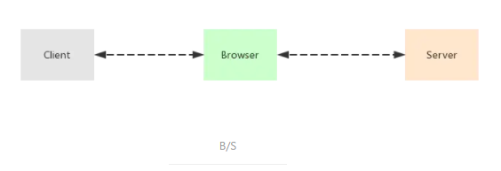
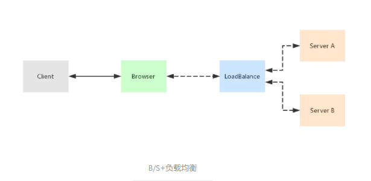
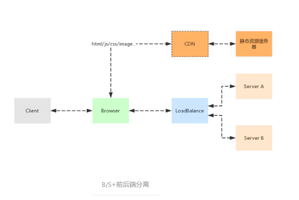
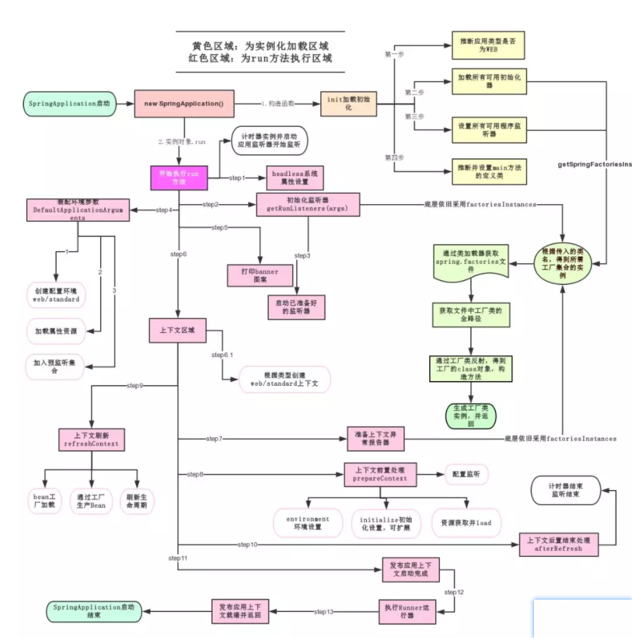
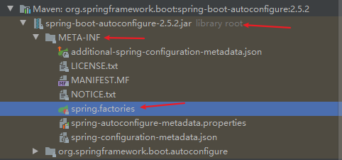
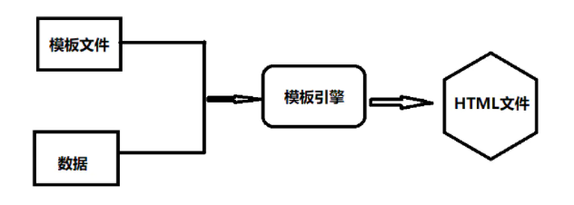

# 1、介绍

### 1.1 SpringBoot 简介

> 一种全新框架，用于简化Spring应用的初始搭建以及开发过程；

- 开箱即用，约定优于配置；

- 提供各种默认配置来简化项目配置；
- 内嵌Tomcat等Servlet 容器，应用无需打成 war 包；
- 无代码生成，不需要配置XML；

### 1.2 单体应用

> 一个软件应用，将应用所有功能都开发和打包在一起；

- 简单的单体应用：

  

- 用户访问量变大导致一台服务器无法支撑时，增加服务器，负载均衡：

  


- 将静态资源独立出来，通过CDN等手段进行加速，从而提升应用整体效率：

  

- 单体应用的优点：
  - 开发效率高：功能都在单个程序内部；
  - 易部署：程序单一，不存在分布式集群的复杂部署环境；
  - 易测试：没有各种复杂的服务调用关系；
- 单体应用的缺点：
  - 代码臃肿，应用启动时间长；
  - 容错性差，小功能的出错可能导致整个系统宕机；
  - 扩展性不好，只能对整个应用进行扩展；
  - 开发协作困难。

### 1.3 微服务

> SOA

# 2、快速生成

- 官网配置生成，下载压缩包，解压后导入开发工具：[Spring Initializr](https://start.spring.io/)；
- IDEA => New Project => Spring Initializr => 快速创建；
- 说明：业务代码需在主入口程序同级目录下，以便spring能够扫描到；
- resources包下可放置一个banner.txt文件，它是SpringBoot启动时所展示的图形，在线生成工具：https://www.bootschool.net/ascii

# 3、启动原理

### 3.1 pom文件

```xml
<?xml version="1.0" encoding="UTF-8"?>
<project xmlns="http://maven.apache.org/POM/4.0.0" xmlns:xsi="http://www.w3.org/2001/XMLSchema-instance"
         xsi:schemaLocation="http://maven.apache.org/POM/4.0.0 https://maven.apache.org/xsd/maven-4.0.0.xsd">
    <modelVersion>4.0.0</modelVersion>
    
    <!-- 依赖的父项目，管理着项目的资源过滤及插件 -->
    <!-- 内部还包含一个父依赖，它是真正管理SpringBoot应用里面所有依赖版本的地方 -->
    <parent>
        <groupId>org.springframework.boot</groupId>
        <artifactId>spring-boot-starter-parent</artifactId>
        <version>2.5.2</version>
        <relativePath/> <!-- lookup parent from repository -->
    </parent>
    <!-- 内部父依赖 -->
    <!--<parent>-->
    <!--    <groupId>org.springframework.boot</groupId>-->
    <!--    <artifactId>spring-boot-dependencies</artifactId>-->
    <!--    <version>2.5.2</version>-->
    <!--</parent>-->
    <groupId>com.xinx</groupId>
    <artifactId>springboot-demo</artifactId>
    <version>0.0.1-SNAPSHOT</version>
    <name>springboot-demo</name>
    <description>Demo project for Spring Boot</description>
    <properties>
        <java.version>1.8</java.version>
    </properties>
    
    <dependencies>
        <!-- web启动器，导入web模块所需的依赖 -->
        <dependency>
            <groupId>org.springframework.boot</groupId>
            <artifactId>spring-boot-starter-web</artifactId>
        </dependency>

        <!-- 上方的web启动器包含该启动器，不重复导入 -->
        <!-- Spring Boot的核心启动器，包含了自动配置支持、日志和YAML -->
        <!--<dependency>-->
        <!--    <groupId>org.springframework.boot</groupId>-->
        <!--    <artifactId>spring-boot-starter</artifactId>-->
        <!--</dependency>-->
        	
        <!-- 单元测试 -->
        <dependency>
            <groupId>org.springframework.boot</groupId>
            <artifactId>spring-boot-starter-test</artifactId>
            <scope>test</scope>
        </dependency>
    </dependencies>

    <build>
        <plugins>
            <!-- 打jar包插件 -->
            <plugin>
                <groupId>org.springframework.boot</groupId>
                <artifactId>spring-boot-maven-plugin</artifactId>
            </plugin>
        </plugins>
    </build>

</project>
```

- SpringBoot 将所有的功能场景都抽取出来，封装成一个个starter（启动器），在pom.xml中引用所需的启动器，启动器就会将所需依赖导入进来；
- 启动器命名规则：
  - 官方：`spring-boot-starter-*` ；
  - 第三方依赖：`*-spring-boot-starter` ；

### 3.2 主启动类

（1）主入口程序

```java
// 组合注解，标注该类是一个 SpringBoot 应用
@SpringBootApplication
public class SpringbootDemoApplication {

    public static void main(String[] args) {
        // 启动 SpringBoot 应用
        SpringApplication.run(SpringbootDemoApplication.class, args);
    }

}
```

（2）`@SpringBootApplication` 层级关系

```java
@Target({ElementType.TYPE})
@Retention(RetentionPolicy.RUNTIME)
@Documented
@Inherited
@SpringBootConfiguration // 表明是一个SpringBoot配置类，
@EnableAutoConfiguration // 开启自动配置
@ComponentScan( // 扫描组件或Bean，加载到IOC容器中
    excludeFilters = {@Filter(
    type = FilterType.CUSTOM,
    classes = {TypeExcludeFilter.class}
), @Filter(
    type = FilterType.CUSTOM,
    classes = {AutoConfigurationExcludeFilter.class}
)}
)
public @interface SpringBootApplication {
    // ...
}
```

- `@ComponentScan`：自动扫描并加载符合条件的组件或Bean，并注入带IOC容器中；
- `@SpringBootConfiguration`：标注于类，表明是一个SpringBoot配置类；
  - `@Configuration`：表示一个配置类；
    - `@Component`：说明启动类本身也是Spring中的一个组件，负责启动应用；
- `@EnableAutoConfiguration`：开启自动配置；
  - `@AutoConfigurationPackage`：自动配置包；
    - `@Import({Registrar.class})`：Sprin底层注解，导入一个组件到容器中；`Registrar.class`：将主启动类所在包及包下所有组件扫描到Spring容器，这就是为什么业务代码位置需要在主启动类所在包或子包下；
  - `@Import({AutoConfigurationImportSelector.class})`：给容器导入组件；`AutoConfigurationImportSelector.class`：自动配置导入选择器，用于获取候选配置。

### 3.3 SpringApplication.run()

- 该方法主要做了以下两件事：

- 一是创建一个`SpringApplication`对象；

  - 推断应用类型是普通项目还是Web项目；
  - 查找并加载所有的可用初始化器，设置到`initializers`属性中；
  - 查找所有的应用程序监听器，设置到`listeners`属性中；
  - 推断并设置`main`方法的主配置类；

- 二是通过创建好的`SpringApplication`调用`run()`方法；

  - 准备Spring的上下文，完成容器的初始化、创建、加载等，在不同情况触发不同的监听事件。

  ```java
  public class SpringApplication {
      
      // ......
      
      // 1
      public static ConfigurableApplicationContext run(Class<?> primarySource, String... args) {
          return run(new Class[]{primarySource}, args);
      }
  
      // 2
      public static ConfigurableApplicationContext run(Class<?>[] primarySources, String[] args) {
          return (new SpringApplication(primarySources)).run(args);
      }
      
  }
  ```

  

# 4、配置文件

### 4.1 语法

##### 4.1.1 介绍

- SpringBoot 使用一个全局的配置文件，且配置文件的名称是固定的；

- `application.yml`（或`.yaml`或`.properties`），默认先读取`.properties`；
  - `.properties`

  - - 语法结构：key=value；

  - `.yml`
    - 语法结构：key：空格 value；


##### 4.1.2 properties 语法

- 全限定key

  ```properties
  userInfo.id=1
  userInfo.name=孙悟空
  # ...
  ```

##### 4.1.3 yml 语法

- 字面量：正常的数字、布尔值、字符串等；

  - 字符串默认不用加引号；
  - 双引号不会转义里面的特殊字符，即特殊字符生效；
  - 单引号会转义特殊字符，转义后变成普通字符串；

  ```yaml
  # 注意有一个空格
  key: value
  ```

- Object、Map

  ```yaml
  # 对象、Map格式
  userInfo: 
      id: 1
      name: 孙悟空
      
  # 或者采用行内写法
  userInfo: {id: 1, name: 孙悟空}
  ```

- Array、List等

  ```yaml
  pets:
   - cat
   - dog
   - pig
   
  # 或者采用行内写法
  pets: [cat,dog,pig]
  ```

### 4.2 配置注入

- 通过@Value注入

  ```java
  @Component //注册bean
  public class userInfo {
      @Value("张三")
      private String name;
      @Value("1")
      private int code;
  }
  ```

- 通过yml配置文件注入

  ```yaml
  # yaml
  user:
    name: 张三
    code: 1
  ```
  
  ```java
  // 将实体类与全局配置文件进行绑定；
  // prefix = "user" 对应全局配置文件user下的属性
  @ConfigurationProperties(prefix = "user")
  @Component // 注册bean
  public class UserInfo {
   
      // ......
      
  }
  ```
  
  ```java
  // 此注解可以指定非全局配置文件，value的值可以是数组
  @PropertySource(value ={"classpath:user.properties"}) 
  @ConfigurationProperties(prefix = "user")
  @Component // 注册bean
  public class UserInfo {
   
      // ......
      
  }
  ```

### 4.3 多配置文件

##### 4.3.1 读取顺序

- 配置文件在不同位置的读取顺序如下：
  - <1> 项目根目录下的`config`目录下；
  - <2> 项目根目录下；
  - <3> 项目`resources`目录下的`config`项目下；
  - <4> 项目`resources`目录下；
- SpringBoot会加载所有的主配置文件，若有相同属性，则由高优先级覆盖低优先级，即互补配置。

##### 4.3.2 使用

> 项目不同环境使用不同配置，如开发环境、测试环境使用不同的配置；

- 命名规范：`application-profile.yml`或`.properties`；profile表示配置文件的标识；

- 示例：

  ```properties
  # 默认使用的主配置文件 application.properties 
  # 指定激活哪个配置环境
  spring.profiles.active=dev
  ```

  ```properties
  # application-dev.properties
  server.port=8081
  ```

  ```properties
  # application-test.properties
  server.port=8082
  ```

- 在yaml中还支持多文档模块：

  ```yaml
  server:
    port: 8080
  # 选择要激活那个环境块
  spring:
    profiles:
      active: prod
      
  # 使用 --- 分隔文档模块
  ---
  server:
    port: 8081
  spring:
    profiles: dev #配置环境的名称
  
  ---
  server:
    port: 8082
  spring:
    profiles: prod  #配置环境的名称
  ```

# 5、自动配置原理

### 5.1 介绍

- 主启动类上`@SpringBootApplication`包含一个`@EnableAutoConfiguration`注解，用于自动配置；


- `@EnableAutoConfiguration`：开启自动配置；
  - `@AutoConfigurationPackage`：自动配置包；
    - `@Import({Registrar.class})`：Sprin底层注解，导入一个组件到容器中；`Registrar.class`：将主启动类所在包及包下所有组件扫描到Spring容器，这就是为什么业务代码位置需要在主启动类所在包或子包下；
  - `@Import({AutoConfigurationImportSelector.class})`：给容器导入组件；`AutoConfigurationImportSelector.class`：自动配置导入选择器，用于获取候选配置。

### 5.2 自动配置导入选择器类

- `AutoConfigurationImportSelector.class`，用于获取候选配置；

  ```java
  // 自动配置导入选择器
  public class AutoConfigurationImportSelector implements DeferredImportSelector, BeanClassLoaderAware,
  		ResourceLoaderAware, BeanFactoryAware, EnvironmentAware, Ordered {
              
  	// ......            
      
      // 获取候选配置
   	protected List<String> getCandidateConfigurations(AnnotationMetadata metadata, AnnotationAttributes attributes) {
  		// 调用SpringFactoriesLoader的静态方法loadFactoryNames()获取候选配置
          List<String> configurations = SpringFactoriesLoader.loadFactoryNames(getSpringFactoriesLoaderFactoryClass(),
  				getBeanClassLoader());
  		Assert.notEmpty(configurations, "No auto configuration classes found in META-INF/spring.factories. If you "
  				+ "are using a custom packaging, make sure that file is correct.");
  		return configurations;
  	}
  
  	/**
  	 * Return the class used by {@link SpringFactoriesLoader} to load configuration candidates.
  	 * @return the factory class
  	 */
  	protected Class<?> getSpringFactoriesLoaderFactoryClass() {
  		return EnableAutoConfiguration.class;
  	}
      
  	protected ClassLoader getBeanClassLoader() {
  		return this.beanClassLoader;
  	}    
              
      // ......         
  }
  ```

  ```java
  // Spring工厂加载器
  public final class SpringFactoriesLoader {
  	
      // 加载工厂名称
      public static List<String> loadFactoryNames(Class<?> factoryType, @Nullable ClassLoader classLoader) {
          ClassLoader classLoaderToUse = classLoader;
          if (classLoader == null) {
              classLoaderToUse = SpringFactoriesLoader.class.getClassLoader();
          }
  
          String factoryTypeName = factoryType.getName();
          return (List)loadSpringFactories(classLoaderToUse).getOrDefault(factoryTypeName, Collections.emptyList());
      }
      
      // 加载spring工厂
      private static Map<String, List<String>> loadSpringFactories(ClassLoader classLoader) {
          Map<String, List<String>> result = (Map)cache.get(classLoader);
          if (result != null) {
              return result;
          } else {
              HashMap result = new HashMap();
  
              try {
                  // 获取一个资源 "META-INF/spring.factories"，里面是自动配置类信息，是自动配置的源头
                  Enumeration urls = classLoader.getResources("META-INF/spring.factories");
  				// 将读取到的资源遍历，封装成为一个Properties
                  while(urls.hasMoreElements()) {
                      URL url = (URL)urls.nextElement();
                      UrlResource resource = new UrlResource(url);
                      Properties properties = PropertiesLoaderUtils.loadProperties(resource);
                      Iterator var6 = properties.entrySet().iterator();
  
                      while(var6.hasNext()) {
                          Entry<?, ?> entry = (Entry)var6.next();
                          String factoryTypeName = ((String)entry.getKey()).trim();
                          String[] factoryImplementationNames = StringUtils.commaDelimitedListToStringArray((String)entry.getValue());
                          String[] var10 = factoryImplementationNames;
                          int var11 = factoryImplementationNames.length;
  
                          for(int var12 = 0; var12 < var11; ++var12) {
                              String factoryImplementationName = var10[var12];
                              ((List)result.computeIfAbsent(factoryTypeName, (key) -> {
                                  return new ArrayList();
                              })).add(factoryImplementationName.trim());
                          }
                      }
                  }
  
                  result.replaceAll((factoryType, implementations) -> {
                      return (List)implementations.stream().distinct().collect(Collectors.collectingAndThen(Collectors.toList(), Collections::unmodifiableList));
                  });
                  cache.put(classLoader, result);
                  return result;
              } catch (IOException var14) {
                  throw new IllegalArgumentException("Unable to load factories from location [META-INF/spring.factories]", var14);
              }
          }
      }
      
      // ......
  }
  ```

### 5.3 `spring.factories` 

- 配置文件，存放了用于自动配置的候选配置类信息；

- 所在位置：

  

- 部分自动配置类信息如下：

  ```properties
  # 省略......
  
  # Auto Configure
  org.springframework.boot.autoconfigure.EnableAutoConfiguration=\
  org.springframework.boot.autoconfigure.admin.SpringApplicationAdminJmxAutoConfiguration,\
  org.springframework.boot.autoconfigure.aop.AopAutoConfiguration,\
  org.springframework.boot.autoconfigure.amqp.RabbitAutoConfiguration,\
  org.springframework.boot.autoconfigure.jdbc.DataSourceAutoConfiguration
  
  # 省略......
  ```

- 查看其中一个自动配置类，如 `DataSourceAutoConfiguration`；

    ```java
    // 表示是一个配置类
    @Configuration(proxyBeanMethods = false)
    // 条件注解，判断当前应用是否存在 DataSource.class, EmbeddedDatabaseType.class 这些类（即是否引入jar包等），若无则不实例化此配置类
    @ConditionalOnClass({ DataSource.class, EmbeddedDatabaseType.class })
    // 条件注解，判断容器是否含有该组件
    @ConditionalOnMissingBean(type = "io.r2dbc.spi.ConnectionFactory")
    // 将配置文件中对应的值与 DataSourceProperties.class 中的属性绑定，并加载到IOC容器中
    @EnableConfigurationProperties(DataSourceProperties.class)
    @Import({ DataSourcePoolMetadataProvidersConfiguration.class,
    		DataSourceInitializationConfiguration.InitializationSpecificCredentialsDataSourceInitializationConfiguration.class,
    		DataSourceInitializationConfiguration.SharedCredentialsDataSourceInitializationConfiguration.class })
    public class DataSourceAutoConfiguration {
        
        @Configuration(proxyBeanMethods = false)
    	@Conditional(EmbeddedDatabaseCondition.class)
    	@ConditionalOnMissingBean({ DataSource.class, XADataSource.class })
    	@Import(EmbeddedDataSourceConfiguration.class)
    	protected static class EmbeddedDatabaseConfiguration {
    
    	}
        // ......
    }
    ```

- 其中，`@EnableConfigurationProperties(DataSourceProperties.class)`，将SpringBoot主配置文件中配置的相关信息与`DataSourceProperties.class`类中的属性相绑定，并加载到 `IOC` 容器中；

    ```java
    // 从配置文件中获取指定的值和此bean的属性进行绑定
    @ConfigurationProperties(prefix = "spring.datasource")
    public class DataSourceProperties implements BeanClassLoaderAware, InitializingBean {
    
    	private ClassLoader classLoader;
    
    	// ......
    
    	/**
    	 * Fully qualified name of the JDBC driver. Auto-detected based on the URL by default.
    	 */
    	private String driverClassName;
    
    	/**
    	 * JDBC URL of the database.
    	 */
    	private String url;
    
    	/**
    	 * Login username of the database.
    	 */
    	private String username;
    
    	/**
    	 * Login password of the database.
    	 */
    	private String password;
    
    	// ......
    }
    ```

    ```yaml
    # yaml
    spring:
      datasource:
        url: jdbc:mysql://localhost:3306/jxin?useUnicode=true&characterEncoding=utf8&useSSL=false&serverTimezone=UTC
        username: root
        password: 123456
    ```

### 5.4  `@Conditional`

- 条件注解，根据某个条件创建特定的Bean；
- 上述自动配置类所用条件注解由`@Conditional`派生，用于控制该配置类的创建行为；
- @ConditionalOnClass：容器中存在指定的类；
- @ConditionalOnMissingBean：容器中不存在指定的bean；
- ......

### 5.5 总结

- SpringBoot启动时会从`META-INF/spring.factories`中加载大量的候选配置类 `xxxAutoConfigurartion`；
- 根据条件（是否引入所需组件的依赖等）判断这些配置类是否生效；
- 若生效，这些配置类就会向容器中添加各种组件（通过反射实例化对应标注了 `@Configuration`的JavaConfig形式的组件）；
- 这些组件的属性从对应的`xxxProperties`类中获取，这些类里面的属性都和配置文件绑定，即配置文件能生效的配置属性都封装在该类中。

# 6、整合常用框架

- MyBatis

  ```xml
  <!-- mysql驱动 -->
          <dependency>
              <groupId>mysql</groupId>
              <artifactId>mysql-connector-java</artifactId>
          </dependency>
  
          <!-- jdbc -->
          <dependency>
              <groupId>org.springframework.boot</groupId>
              <artifactId>spring-boot-starter-jdbc</artifactId>
          </dependency>
  
          <!-- 数据库连接池-druid -->
          <dependency>
              <groupId>com.alibaba</groupId>
              <artifactId>druid</artifactId>
              <version>1.1.21</version>
          </dependency>
  
          <!-- mybatis，封装了jdbc，可不引jdbc-->
          <dependency>
              <groupId>org.mybatis.spring.boot</groupId>
              <artifactId>mybatis-spring-boot-starter</artifactId>
              <version>2.2.0</version>
          </dependency>
  ```
  
  ```yaml
  spring:
    datasource:
      url: jdbc:mysql://localhost:3306/jxin?useUnicode=true&characterEncoding=utf8&useSSL=false&serverTimezone=UTC
      username: root
      password: 123456
      # mysql驱动，mysql8及以上class-name不同
      driver-class-name: com.mysql.jdbc.Driver
      # 指定数据库连接池
      type: com.alibaba.druid.pool.DruidDataSource
  
  mybatis:
    type-aliases-package: com.xinx.dao
    mapper-locations: classpath:mybatis/mapper/*.xml
    configuration:
      # 打印sql
      log-impl: org.apache.ibatis.logging.stdout.StdOutImpl
  ```

# 7、静态资源

### 7.1 静态资源

- 对于一个普通的Web应用，静态资源存放于`webapp`目录下；单对于现在的SpringBoot应用来说，打包方式是`jar`，没有`webapp`目录，而是存放于其它地方；

- 在SpringBoot中，SpringMVC的web配置都在`WebMvcAutoConfiguration`这个自动配置类中；

- 第一种，webjars方式

  - 本质是以jar包的方式引入静态资源，需要引入相应的依赖；

    ```xml
    <dependency>
        <groupId>org.webjars</groupId>
        <artifactId>jquery</artifactId>
        <version>3.4.1</version>
    </dependency>
    ```

- 第二种，静态资源映射

  - SpringBoot可以识别以下四个目录存放的静态资源（`resources`目录下）

    ```bash
    "classpath:/META-INF/resources/"
    "classpath:/resources/"
    "classpath:/static/"
    "classpath:/public/"
    ```

  - SpringBoot应用默认使用`static`文件夹存放静态资源；

### 7.2 模板引擎

- 模板引擎是为了使用户界与业务数据分离，可以生成特定格式的文档，用于网站的模板引擎就是将模板文件和业务数据通过模板引擎生成一个HTML文件；

  

- 常用的模板引擎有 `Thymeleaf`、`Freemarker`、`Jsp` 等；
- SpringBoot应用以`jar`方式打包，且使用内嵌`Tomcat`，默认不支持jsp；
- SpringBoot 应用默认使用 `Thymeleaf`模板引擎；

### 7.3 Thymeleaf

- 网址：https://www.thymeleaf.org/、https://github.com/thymeleaf/thymeleaf；

- 引入依赖

  ```xml
  <!-- 模板引擎 Thymeleaf -->
  <dependency>
      <groupId>org.springframework.boot</groupId>
      <artifactId>spring-boot-starter-thymeleaf</artifactId>
  </dependency>
  ```

- 只需要将`html`页面放在类路径下的`templates`文件夹下，`thymeleaf`就会自动渲染。

- `Thymeleaf`的自动配置类：`ThymeleafProperties`

  ```java
  // Thymeleaf 的自动配置类
  @ConfigurationProperties(
      prefix = "spring.thymeleaf"
  )
  public class ThymeleafProperties {
      
      private static final Charset DEFAULT_ENCODING;
      public static final String DEFAULT_PREFIX = "classpath:/templates/";
      public static final String DEFAULT_SUFFIX = ".html";
      private boolean checkTemplate = true;
      private boolean checkTemplateLocation = true;
      private String prefix = "classpath:/templates/";
      private String suffix = ".html";
      private String mode = "HTML";
      private Charset encoding;
      
      // ...
  }
  ```

# 8、任务

### 8.1 异步任务

- 异步任务默认关闭，需要使用`@EnableAsync`开启异步任务支持；

- `@Async`通常作用与方法上，也可作用于类上，表示类中的方法都为异步方法；

- 异步任务依靠AOP，即代理；因此只对public方法生效，也需避免同一个类内调用异步方法，同`@Transcational`注解失效情况一致；

- 若异步方法有返回值，需要使用`Future<T>`接收，T为返回值类型，`AsyncResult<T>`继承自`Future<T>`。

  ```java
  @EnableAsync // 开启异步任务支持
  @SpringBootApplication
  public class SpringbootDemoApplication {
  
      public static void main(String[] args) {
          SpringApplication.run(SpringbootDemoApplication.class, args);
      }
  
  }
  ```

  ```java
  public class AsyncTest throws InterruptedException {
  
      @Async
      public void myAsync() {
  
          // 睡眠5秒
          Thread.sleep(5000);
          System.out.println("=== 结束 ===" + new Date());
      }
  
      @Async
      public Future<String> myAsyncHasReturn() throws InterruptedException {
  
          // 睡眠5秒
          Thread.sleep(5000);
          System.out.println("=== 结束时间 ===" + new Date());
          // AsyncResult<T>继承自Future<T>
          return new AsyncResult<String>("我的异步任务返回结果");
      }
      
  }
  ```

### 8.2 定时任务

##### （1）介绍

- 使用`@EnableScheduling`开启定时任务支持；

- 使用`@Scheduled()`声明定时任务，常用cron表达式指定在什么时间执行；

- 定时任务所在的类，要声明为一个组件交由Spring管理；

- 需执行定时任务的方法不能有返回值；

- Spring提供了异步执行任务调度的方式：`TaskExecutor`接口与`TaskScheduler`接口；

  ```java
  @Component
  @EnableScheduling // 开启定时任务支持
  public class ScheduledTest {
  
      // 使用 cron 表达式开启定时任务
      // 秒 分 时 日 月 星期几
      @Scheduled(cron = "30 15 * * * ?")
      public void test() {
          System.out.println("=== 结束 ===" + new Date());
      }
  
  }
  ```

##### （2）注意事项

- 前言：Spring使用`@Scheduled`执行的定时任务在单线程中执行；
- 任务未定时执行：
  - 如果有多个任务，当前任务执行时间过长，可能导致其他后续任务被阻塞直到当前任务执行完成；

- 任务丢失：
  - 若当前任务执行时间超过该任务的下一次执行时间，则会跳过下一次的任务执行；
  - 可转为异步执行，如使用`@Async`
- 单线程无法满足时可增加配置，改为多线程执行（待研究）；

# 9、集成Redis
