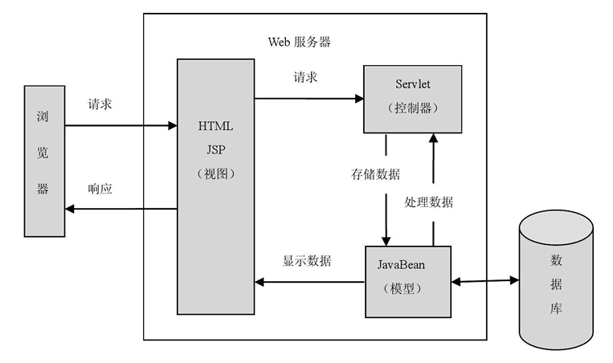
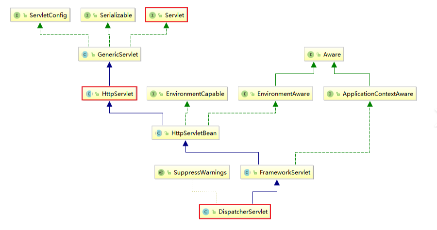
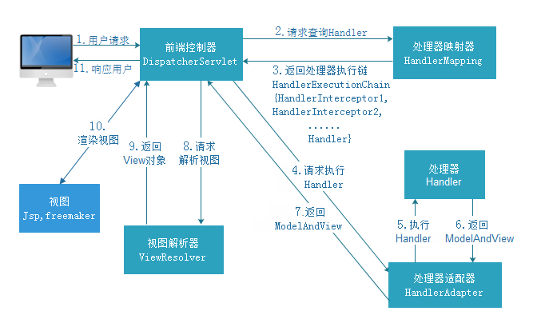

# Spring MVC

### 1、 介绍

- MVC 设计模式

  - Model（模型）：数据模型，封装了数据和对数据的操作，是实际进行数据处理的地方，如数据DAO层和服务层Service；

  - View（视图）：数据模型包含的数据的可视化展示；

  - Controller（控制器）：负责视图与模型之间的交互，控制数据流向模型对象，并在数据变化时更新视图。

  - 示例-基于servlet的MVC模式：

    

- Spring MVC 

  - 一个基于Java的实现了MVC设计模式的轻量级web框架；

  - 通过把Model、View、Controller分离，将web层进行解耦，简化开发；

  - 围绕 `DispatcherServlet`（Servlet调度器）设计，由它将请求将分发到不同的处理器，处理所有的 HTTP 请求和响应；

  - 优点：

    - 轻量级；
    - 与Spring兼容性好；

    - 支持各种视图技术；
    - 灵活、扩展性好。

### 2、主要组件

| 名称                              | 说明                                                   | 备注 |
| --------------------------------- | ------------------------------------------------------ | ---- |
| `DispatcherServlet`（前端控制器） | 控制中心，接受请求，响应结果                           |      |
| `HandlerMapping`（处理器映射器）  | 据请求的URL来查找Handler                               |      |
| `HandlerAdapter`（处理器适配器）  | 通过HandlerAdapter对处理器进行执行                     |      |
| `Handler` （后端处理器）          | 具体的用户业务                                         |      |
| `ViewResolver`（视图解析器）      | 进行视图的解析，根据视图逻辑名解析成真正的视图（view） |      |
| `View`（视图）                    | 返回给用户的视图，常用的是 jsp                         |      |

- `DispatcherServlet` 继承关系图：

  

### 3、运行流程

 - <1> 用户发送请求至前端控制器`DispatcherServlet`；
 - <2> `DispatcherServlet`调用处理器映射器`HandlerMapping`，`HandlerMapping`根据URL请求查找相匹配的`Handler`，并返回一个执行链给`DispatcherServlet`；
 - <3> `DispatcherServlet`请求处理器适配器`HandlerAdapter`调用相应的处理器`Handler`（`Controller`）处理相应的业务，并返回`ModelAndView`给`HandlerAdapter`，`HandlerAdapter`再将其返回给`DispatcherServlet`；
 - <4> `DispatcherServlet`将`ModelAndView`传给视图解析器`ViewResolver`进行解析，返回具体`View`；
 - <5> `DispatcherServlet`对`View`进行渲染视图（即将模型数据填充至视图中），后响应给用户。



### 4、使用

##### 4.1 导包

```xml
<!-- spring-webmvc 包含spring基础包 -->
<dependency>
    <groupId>org.springframework</groupId>
    <artifactId>spring-webmvc</artifactId>
    <version>5.1.10.RELEASE</version>
</dependency>

<!-- servlet 接口相关 -->
<dependency>
    <groupId>javax.servlet</groupId>
    <artifactId>servlet-api</artifactId>
    <version>2.5</version>
</dependency>
```

##### 4.2 配置

- application-context.xml

  ```java
  <?xml version="1.0" encoding="UTF-8"?>
  <beans xmlns="http://www.springframework.org/schema/beans"
         xmlns:xsi="http://www.w3.org/2001/XMLSchema-instance"
         xmlns:context="http://www.springframework.org/schema/context"
         xmlns:mvc="http://www.springframework.org/schema/mvc"
         xsi:schemaLocation="http://www.springframework.org/schema/beans
                             http://www.springframework.org/schema/beans/spring-beans.xsd
                             http://www.springframework.org/schema/context
                             http://www.springframework.org/schema/context/spring-context.xsd
                             http://www.springframework.org/schema/mvc
                             http://www.springframework.org/schema/mvc/spring-mvc.xsd">
  
      <!-- 导入 servlet 配置 -->
      <import resource="classpath:spring-servlet.xml"/>
          
      <!-- 自动扫描-->
      <context:component-scan base-package="com.xinx.controller"/>
          
      <!-- 注解驱动-->
      <mvc:annotation-driven/>
          
      <!-- 静态资源处理：DispatcherServlet 配置【/】拦截所有请求会将静态资源拦截;
      使用此配置会将静态资源交由Web应用服务器默认的Servlet处理 -->
      <mvc:default-servlet-handler/>
  
  </beans>
  ```

- spring-servlet.xml

  ```xml
  <!-- 视图解析器 -->
  <bean id="InternalResourceViewResolver" class="org.springframework.web.servlet.view.InternalResourceViewResolver">
      <property name="prefix" value="/WEB-INF/jsp/"/>
      <property name="suffix" value=".jsp"/>
  </bean>
  ```

- web.xml

  ```xml
  <?xml version="1.0" encoding="UTF-8"?>
  <web-app xmlns="http://xmlns.jcp.org/xml/ns/javaee"
           xmlns:xsi="http://www.w3.org/2001/XMLSchema-instance"
           xsi:schemaLocation="http://xmlns.jcp.org/xml/ns/javaee http://xmlns.jcp.org/xml/ns/javaee/web-app_4_0.xsd"
           version="4.0">
  
      <!-- 配置 DispatcherServlet -->
      <servlet>
          <servlet-name>spring-mvc</servlet-name>
          <servlet-class>org.springframework.web.servlet.DispatcherServlet</servlet-class>
          <!-- 绑定spring配置文件-->
          <init-param>
              <param-name>contextConfigLocation</param-name>
              <param-value>classpath:application-context.xml.xml</param-value>
          </init-param>
          <!-- 启动级别 -->
          <load-on-startup>1</load-on-startup>
      </servlet>
      <!-- 配置servlet映射器-->
      <!-- / 只匹配请求，不匹配jsp页面，/* 匹配所有请求和jsp页面 -->
      <servlet-mapping>
          <servlet-name>spring-mvc</servlet-name>
          <url-pattern>/</url-pattern>
      </servlet-mapping>
  
  </web-app>
  ```

##### 4.3 代码示例

```java
@Controller
@RequestMapping("/manager")
public class ManagerController {

    @ResponseBody // 若无此注解，则会将返回值解析为页面路径
    @RequestMapping("/getMessage")
    public String getMessage() {
        return "this is a message !";
    }

}
```

##### 4.4 注解说明

- @Controller

  - 标注为控制层，与@Componet、@Service作用类似；

- @RequestMapping

  - 处理请求地址映射；用于方法上，指示使用哪个方法完成请求动作；用于类上，表示具体动作的父路径；

  - @GetMapping是@RequestMapping扩展的组合注解，是@RequestMapping(method = RequestMethod.GET)等的缩写，类似的还有@PostMapping、@PutMapping、@DeleteMapping、@PatchMapping；

- @ResponseBody

  - 作用于方法上，将该方法的返回结果解析成 json 或 xml 等数据格式，写入到 HTTP 的 response body 中，用于后续异步获取数据；若只使用@RequestMapping，会将返回值解析为跳转路径；

- @RestController

  - 等价于 @Controller + @ResponseBody；

- @PathVariable

  - 接收请求路径中占位符的值；

  ```java
  // 如果请求的 URI 是 .../owners/fred，则 ownerId 的值就是 ‘fred’
  @GetMapping("/owners/{ownerId}")
  public Person getPerson(@PathVariable String ownerId) {
      // ...
  }
  ```

- @CookieValue

  - 将 HTTP cookie的值绑定到控制器中的方法参数；
  - cookie的请求：`JSESSIONID = 415A4AC178C59DACE0B2C9CA727CDD84`；

  ```java
  // 获取 cookie 值
  @GetMapping("/demo")
  public void handle(@CookieValue("JSESSIONID") String cookie) { 
      //...
  }
  ```

- @RequestParam

  - 用于接收 key-value 的参数；此注解有以下属性：
  - value：参数名称；
  - required：参数是否必须，默认为true，若请求中未带该参数，则报404；
  - defaultValue：默认值，若请求未带同名称参数，使用该默认值；

  ```java
  @GetMapping("/getA")
  public String setupForm(@RequestParam("petId") int petId) {
      ...
  }
  ```

- @RequestBody

  - 用于接收来自请求体中的参数；
  - 因 GET 请求无请求体，所以只接受 POST 请求的数据；

- @RequestParam与@RequestBody

  | 名称             | @RequestBody                         | @RequestParam                             |
  | ---------------- | ------------------------------------ | ----------------------------------------- |
  | 接受请求方式     | POST                                 | GET、POST                                 |
  | Content-Type类型 | application/json、application/xml 等 | application/x-www-form-urlencoded（默认） |
  | 使用个数         | 只能使用一个                         | 可使用多个                                |
  |                  |                                      |                                           |

  注：二者可同时使用，也可不使用，不使用以上两个注解时前后端传递的参数名称需一致。


