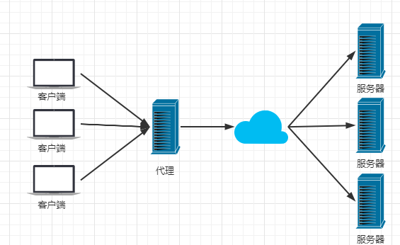
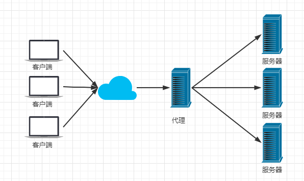
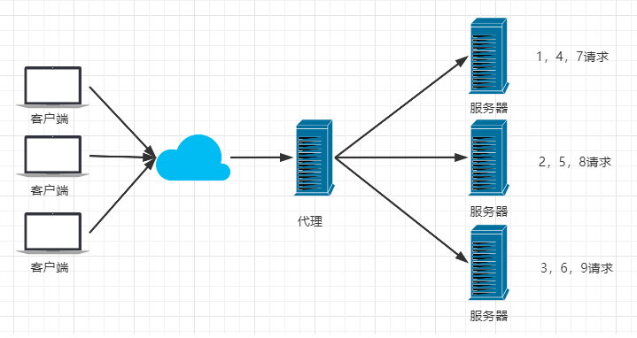
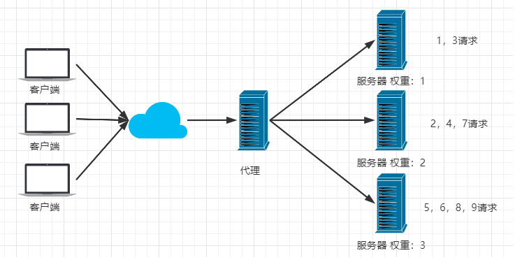
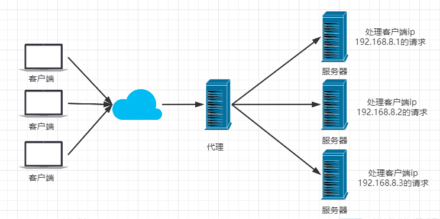
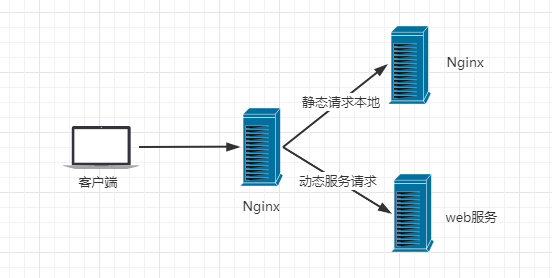

# Nginx 概述

### 1、正向代理与反向代理

##### 1）正向代理

- 一个位于客户端和原始服务器之间的代理服务器；

- 客户端需要配置正向代理服务器，通过代理服务器访问外部资源；

- 例如国内正常访问不到google，需要通过代理才能访问（搭梯子）；

  

- 用途
  - 访问原先无法访问的资源，如google；
  - 可做缓存，加速资源的访问；
  - 对客户端访问授权，进行上网认证；
  - 可记录用户访问记录，但对外隐藏用户信息；

##### 2）反向代理

- 以代理服务器来接受网络请求，然后将请求转发至内部网络上的服务器，并返回获取的响应结果；

  

- 用途
  - 保护和隐藏原始资源服务器；
  - 负载均衡；

##### 3）区别

- 正向代理
  - 代理客户端，服务端不知道实际发起请求的客户端；
  - 客户端需要配置相应的代理服务器；
- 反向代理
  - 代理服务器，客户端不知道实际提供服务的服务端；
  - 客户端不需要进行相应的设置；

### 2、Nginx

- 一个高性能的 HTTP 和反向代理的Web服务器；

- 占有内存少，并发能力强；

### 3、负载均衡

- 将原先集中到单台服务器的请求分发到多台服务器上，使各台服务器间的负载相对均衡；

- Nginx 提供的负载均衡策略有两种：内置策略与扩展策略；

- 内置策略分轮询、加权轮询、Iphash;

- 轮询

  

- 加权轮询

  

- Iphash

  - 对请求的`ip`进行`hash`操作，根据`hash`结果可将同一个客户端`ip`的请求分发到同一台服务器进行处理，可解决`session`不共享的问题；

  

### 4、动静分离

- 将动态页面和静态页面交由不同的服务器解析，加快解析速度，降低原先单个服务器的压力；

  

# Nginx 配置

### 1、启动

- 双击 `nginx.exe` 启动；
- nginx 解压目录下cmd命令：`nginx.exe`；
- 访问 http://localhost:80 查看是否启动成功；

### 2、常用命令

- 启动

  ```bash
  nginx.exe
  ```

- 重启 nginx，更改配置后不用关闭直接重启

  ```bash
  nginx -s reload
  ```

- 关闭

  ```bash
  # 快速停止
  nginx -s stop
  # 完整有序地停止
  nginx -s quit
  
  # 终止进程的方式 /f--强制终止 /t--终止指定的进程和任何由此启动的子进程 /im--指定进程名称
  taskkill /f /t /im nginx.exe
  ```

### 3、配置文件

- 位置：conf/nginx.conf；

- 

- 由三部分构成

  - **全局块**：全局指令，设置工作进程数，定义日志路径等；
  - **events块**：设置处理轮询事件模型、每个工作进程最大连接数、http层超时时间等；
  - **http块**：嵌套多个server，配置代理、缓存、日志定义等；
    - upstream：负载均衡服务器设置，可配置多个upstream；
    - server：配置虚拟主机相关参数，可配置多个server；
      - location：配置请求路由，各种页面处理情况；
  
  ```bash
  # ******************** 全局块 ********************
  #user  nobody;
  worker_processes  1; # nginx 处理并发的数量，值越大支持并发处理量越大
  
  #error_log  logs/error.log;
  #error_log  logs/error.log  notice;
  #error_log  logs/error.log  info;
  
  #pid        logs/nginx.pid;
  
  # ******************** events块 ********************
  events {
      worker_connections  1024;  # 支持的最大连接数
  }
  
  # ******************** http块 ********************
  http {
      include       mime.types;  # 文件扩展名与文件类型映射表
      default_type  application/octet-stream; # 默认文件类型-text/plain
  
      # ......
  
      #keepalive_timeout  0;
      keepalive_timeout  65;  # 连接超时时间，默认-75s，可配置在http|server|location块
  
      server {
          listen       80;  # 当前监听的端口号，可同时监听多个
          server_name  localhost;  # 监听的ip地址或域名，多个域名间空格分开
  
          # ......
  
  		# 配置请求转发，支持正则匹配与条件判断匹配
          location / { 
              root   html;  # 指定虚拟主机的网页根目录，可以是相对路径与绝对路径，此处指nginx根目录下的 html
              index  index.html index.htm;  # 指定访问的默认首页地址
          }
  
          #error_page  404              /404.html;  # 错误页
  
          # redirect server error pages to the static page /50x.html
          #
          error_page   500 502 503 504  /50x.html;
          location = /50x.html {
              root   html;
          }
      }
  
      # another virtual host using mix of IP-, name-, and port-based configuration
      #
      server {
          listen       9000 # 当前监听的端口号
          listen       somename:8080;
          server_name  somename  alias  another.alias;
  
          location /mytest1/ {
          	root          F:/xjsccb-trunck/xjsccb-web/src/main/webapp; # 指定访问资源根目录
          	alias         newtest;  # 指定访问别名
          	index         index.html index.htm;  # 指定具体访问资源名称，可配置多个，直到匹配为止
              paroxy_pass   http://127.0.0.1:8080 # 代理访问路径
          }
          location /mytest2/ {
              paroxy_pass   http://127.0.0.1:8081 # 代理访问路径
          }
          
      }
  
  }
  ```

### 4、root 与 alias

```bash
location /mytest1/ {
    root          src/main/webapp; 
    alias         newtest;  
    index         index.html index.htm; 
    paroxy_pass   http://127.0.0.1:8080 # 代理访问路径
}
```

- root 
  - 会将root值和location的值进行拼接，然后再拼接上URL剩余的部分以及index的值；
  - eg：`src/main/webapp/mytest1/index.html`；
- alias
  - 将 alias 的值替换 location 的值，然后再上URL剩余的部分以及index的值；
  - alias 的值后面需要带有 / ；
  - eg：`newtest/index.html`；

