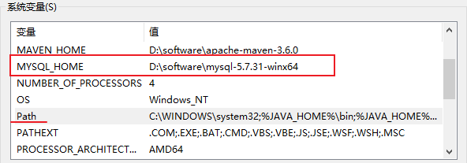
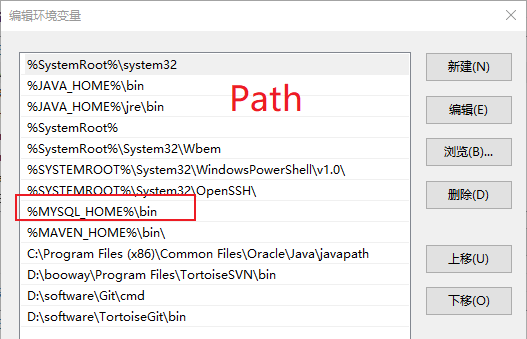

# Java

### 1、安装JDK

### 2、配置环境变量

# Mysql

### 1、卸载之前的mysql

- 停止mysqld服务：services.msc 打开服务列表；
- 删除mysql服务：cmd命令：sc remove mysql
- 卸载mysql程序；
- 删除注册表mysql文件：
  - HKEY_LOCAL_MACHINE\SYSTEM\ControlSet001\Services\Eventlog\Application\MySQL
  - HKEY_LOCAL_MACHINE\SYSTEM\CurrentControlSet\Services\Eventlog\Application\MySQL
  - 注：不一定是ControlSet001，可能是002、003等；

### 2、安装新版mysql

##### 2.1 下载压缩包并解压；

##### 2.2 配置文件

解压文件根目录新建`my.ini`文件：

```ini
[client]
port = 3306
default-character-set = utf8

[mysql]
default-character-set = utf8

[mysqld]
# 端口
port = 3306

# mysql安装目录，注意反斜杠
basedir = D:\\software\mysql-5.7.31-winx64

# mysql数据库存放目录
datadir = D:\\software\mysql-5.7.31-winx64\data

# 服务端字符集
character-set-server = utf8

# 数据库表的默认排序方式
collation-server = utf8_general_ci

# 创建新表时将使用的默认存储引擎
default-storage-engine=INNODB

# 允许最大连接数
max_connections=200

# strict模式
sql_mode = NO_ENGINE_SUBSTITUTION,STRICT_TRANS_TABLES
```

##### 2.3 配置环境变量





##### 2.4 DOS命令（管理员运行）

```bash
# 切换到mysql目录
cd /d D:\software\mysql-5.7.31-winx64
# 初始化，生成data文件夹
# mysqld  --initialize 生成一个随机root密码
mysqld  --initialize -insecure # 不设置 root 密码，建议使用
# 安装mysql服务
mysqld -install
# 启动mysql
net start mysql
# 第一次无密码登录，直接回车
mysql -u root -p
# 登陆后设置密码
set password for root@localhost =password('123456');
# 系统目录设置密码 mysqladmin -uroot -p旧密码 password 新密码

# 重启mysql服务
net stop mysql
net start mysql
```

##### 2.5 重置密码

- 方式一：

  ```bash
  # 停止mysql服务 
  net stop mysql
  # 无密码启动
  mysqld --console --skip-grant-tables --shared-memory
  
  # 打开新DOS窗口，无密码登录
  mysql -u root
  # 清空密码
  update mysql.user set authentication_string='' where user='root' and host='localhost';
  
  # 退出之前打开的两个DOS窗口，打开新DOS窗口，重启mysql
  net start mysql
  # 无密码登录
  mysql -u root
  # 切换到mysql数据库
  use mysql;
  # 设置密码 新密码为123456
  ALTER USER 'root'@'localhost' IDENTIFIED WITH mysql_native_password BY '123456';
  # 刷新权限
  FLUSH PRIVILEGES;
  # 退出    
  quit;
  ```

##### 2.6 问题

- 由于找不到MSVCR120.dll，无法继续执行代码。重新安装程序可能会解决此问题
  - 由于电脑系统缺少部分配置文件，安装 vcredist 下载相关配置文件即可；
  - 官网地址 (vcredist) ：https://www.microsoft.com/zh-CN/download/details.aspx?id=40784；

# Redis

### 
