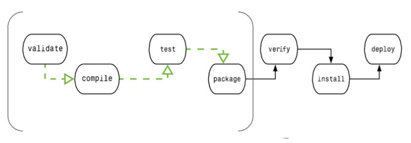

# Maven介绍

### 1、概述

> Maven是一个项目管理工具，可以对Java项目进行构建，依赖管理；

- 基于项目对象模型（POM）概念；
- 主要功能：
  - 提供了一套标准化的项目结构；
  - 提供了一套标准化的构建流程（编译，测试，打包，发布......）；
  - 提供了一套依赖管理机制；
  - 能够管理项目报告，文档生成等。

### 2、目录结构

```bash
a-maven-project
├── pom.xml
├── src
│   ├── main
│   │   ├── java
│   │   ├── resources
|   |   └── webapp-----------web项目含有此结构
│   |       └── WEB-INF
│   └── test
│       ├── java
│       └── resources
└── target-------------------打包输出目录
	├── classes
    └── test-classes
```

### 3、POM

> 项目对象模型：Project Object Model；

- Maven工程的基本工作单元，是一个XML文件，包含了项目的基本信息，用于描述项目如何构建，声明项目依赖等；

- 执行任务或目标时，Maven会在当前目录中查找pom.xml，获取所需的配置信息，然后执行目标；

- pom.xml中可指定如下配置：

  - 项目依赖；
  - 插件；
  - 执行目标；
  - 项目构建 Profile；
  - 项目版本；
  - 项目开发者列表；
  - 相关邮件列表信息；

- 所有的POM都继承自一个父POM，父POM包含了一些可以被继承的默认设置，父POM中的默认仓库为http://repo1.maven.org/maven2；

- Effective POM是经过原POM继承、插值后的POM，可读不可修改;

- pom.xml 文件

  ```xml
  <?xml version="1.0" encoding="UTF-8"?>
  <project xmlns="http://maven.apache.org/POM/4.0.0" xmlns:xsi="http://www.w3.org/2001/XMLSchema-instance"
  	xsi:schemaLocation="http://maven.apache.org/POM/4.0.0 http://maven.apache.org/xsd/maven-4.0.0.xsd">
      
  	<modelVersion>4.0.0</modelVersion>   <!-- 模型版本需要设置为4.0 -->
  	<groupId>com.xinx</groupId>   <!-- 项目组的标识 -->
  	<artifactId>com.xinx.my-test</artifactId>   <!-- 项目的标识 -->
  	<version>0.0.1-SNAPSHOT</version>   <!-- 项目当前版本号 -->
  	<packaging>pom</packaging>   <!-- 项目的构建类型，如 jar|war|pom|ear 等 -->
      
      <!--项目的名称, Maven产生的文档用 -->
      <name>banseon-maven</name>
      <!--项目主页的URL, Maven产生的文档用 -->
      <url>http://www.baidu.com/banseon</url>
      <!-- 项目的详细描述, Maven 产生的文档用。 当这个元素能够用HTML格式描述时（例如，CDATA中的文本会被解析器忽略，就可以包含HTML标 
          签）， 不鼓励使用纯文本描述。如果你需要修改产生的web站点的索引页面，你应该修改你自己的索引页文件，而不是调整这里的文档。 -->
      <description>A maven project to study maven.</description>
      
      <!-- 项目的子模块 -->
  	<modules>
  		<module>entity</module>
  		<module>common</module>
  		<module>sample-test</module>
  	</modules>
  
      <!-- 依赖 -->
  	<dependencies>
  		<dependency>
  			<groupId>org.springframework</groupId>
  			<artifactId>spring-webmvc</artifactId>
  			<version>5.2.0.RELEASE</version>
  		</dependency>
  		<dependency>
  			<groupId>junit</groupId>
  			<artifactId>junit</artifactId>
  			<version>4.12</version>
  			<scope>test</scope>
  		</dependency>
  	</dependencies>
  
  </project>
  ```

### 4、settings.xml

- Maven的全局配置文件，位于`maven根目录/conf/settings.xml`；

- 有三种类型：

  - 项目级：定义在项目的pom.xml中；
  - 用户级：定义在Maven的设置xml中，`%USER_HOME%/.m2/settings.xml`；
  - 全局：定义在 Maven 全局的设置 xml 文件中 ,`%M2_HOME%/conf/settings.xml`；

- 注意局部配置优先于用户配置优先于全局配置，即pom.xml > user settings.xml > global settings.xml；

- 常用全局配置：

  ```xml
  <!-- 配置本地仓库位置 --> 
  <localRepository>E:/maven/repository</localRepository>
  
  <!-- 镜像仓库，把maven中央库的地址改为国内阿里云的，提高jar包下载速度 -->
  </mirrors>
      <mirror>
          <id>alimaven</id>
          <name>aliyun maven</name>
          <url>http://maven.aliyun.com/nexus/content/groups/public/</url>
          <mirrorOf>central</mirrorOf>
      </mirror>
  </mirrors>
  
  <!-- jdk8环境 -->
  <profile>
      <id>jdk-1.8</id>
      <activation>
          <jdk>1.8</jdk>
          <activeByDefault>true</activeByDefault>
      </activation>
      <properties>
          <maven.compiler.source>1.8</maven.compiler.source>
          <maven.compiler.target>1.8</maven.compiler.target>
          <maven.compiler.compilerVersion>1.8</maven.compiler.compilerVersion>
      </properties>
  </profile>
  ```

# Maven生命周期

### 1、概述

> Maven 构建的生命周期是项目构建跟发布的过程

- maven有三个标准的生命周期：
  - clean：项目的清理；
  - default（或build）：项目的部署；
  - site：项目站点文档创建。
- 每个生命周期中都包含一系列阶段（phase），这些phase相当于Maven提供的统一接口，由Maven的插件来实现这些接口；
- 在执行某个阶段时，会先根据生命周期中阶段的顺序执行此阶段前的阶段；

- 使用maven命令（控制台跳转到pom.xml所在目录，执行maven命令）：
  - 例如 `mvn clean`，执行的是clean生命周期的clean阶段，在此执行会先执行pre-clean阶段（见clean生命周期）。

### 2、clean生命周期

包含以下三个阶段：

- pre-clean：执行一些需要在clean之前完成的工作；
- clean：移除所有上一次构建生成的文件；
- post-clean：执行一些需要在clean之后立刻完成的工作；

### 3、default生命周期

default（或build）生命周期用于构建项目，包含23个阶段，主要有以下几个阶段：



| 阶段     | 处理     | 描述                                                      |
| -------- | -------- | --------------------------------------------------------- |
| validate | 验证项目 | 验证项目是否正确且所有信息都是可用的；                    |
| compile  | 编译     | 编译源代码；                                              |
| test     | 测试     | 使用单元测试框架（如 Junit）等进行测试；                  |
| package  | 打包     | 创建在pom.xml中定义的项目构建类型的包，如 jar\|war 包等； |
| verfiry  | 检查     | 对集成测试的结果进行检查，以保证质量达标；                |
| install  | 安装     | 安装打包的项目到本地仓库，以供其他项目使用；              |
| deplay   | 部署     | 将最终的项目包复制到远程仓库中，共享给其他开发人员；      |

### 4、site生命周期

Maven Site 插件一般用来创建新的报告文档、部署站点等，包含以下几个阶段：

- pre-site：执行一些需要在生成站点文档之前完成的工作
- site：生成项目的站点文档
- post-site： 执行一些需要在生成站点文档之后完成的工作，并且为部署做准备
- site-deploy：将生成的站点文档部署到特定的服务器上

# Maven仓库

### 1、概述

Maven仓库是项目中依赖的第三方库，用于放置所有 jar|war|pom 包等，有三种类型：本地、中央、远程；

依赖搜索顺序：本地仓库 => 中央仓库 => 远程仓库（若已设置远程仓库）。

- 本地仓库

  - 在第一次执行maven命令时才被创建，默认位置为用户目录下`.m2/respository/`；

  - 当运行maven命令，maven将会下载依赖的文件到仓库的指定位置中；

  - 可通过`maven根目录/conf/settings.xml`配置文件更改默认仓库位置；

    ```xml
    <!-- 配置本地仓库位置 --> <localRepository>E:/maven/repository</localRepository>
    ```

- 中央仓库
  - 中央仓库是maven社区提供的仓库，包含了大量常用的库；
  - URL：http://search.maven.org/#browse 或 https://mvnrepository.com/；

- 远程仓库
  - 远程仓库是开发人员自己定制的仓库，包含了所需要的代码库等；
  - 中央仓库即为默认的远程仓库，不需要用户专门配置；

### 2、镜像仓库

Maven仓库默认在国外，国内访问较慢，可使用镜像仓库代替；

```xml
<!-- maven根目录/conf/settings.xml -->

<!-- 可配置多个，默认第一个生效 -->
<mirrors>
    <mirror>
      <id>alimaven</id>
      <name>aliyun maven</name>
      <url>http://maven.aliyun.com/nexus/content/groups/public/</url>
      <mirrorOf>central</mirrorOf>        
    </mirror>
</mirrors>
```

```xml
<!-- 项目 pom.xml -->

<repositories>
	<!-- aliyun镜像仓库 -->
    <repository>
        <id>aliyun</id>
        <url>https://maven.aliyun.com/repository/public</url>
        <releases>
            <enabled>true</enabled>
        </releases>
        <snapshots>
            <enabled>false</enabled>
        </snapshots>
    </repository>
</repositories>
<pluginRepositories>
	<!-- aliyun仓库插件，配合aliyun镜像仓库使用 -->
    <pluginRepository>
        <id>aliyun-plugin</id>
        <url>https://maven.aliyun.com/repository/public</url>
        <releases>
            <enabled>true</enabled>
        </releases>
        <snapshots>
            <enabled>false</enabled>
        </snapshots>
    </pluginRepository>
</pluginRepositories>
```

# Maven依赖管理

### 1、依赖的作用范围

```xml
<dependency>
    <groupId>junit</groupId>
    <artifactId>junit</artifactId>
    <version>4.12</version>
    <!-- 指定依赖的作用范围 -->
    <scope>test</scope>
</dependency>
```

| scope    | 描述                                                         | 示例            |
| -------- | ------------------------------------------------------------ | --------------- |
| compile  | 默认，编译时需要；                                           | commons-logging |
| test     | 编译测试代码时需要；                                         | junit           |
| runtime  | 编译时不需要，运行时需要；                                   | mysql           |
| provided | 编译时需要，但运行时由JDK或某服务器提供；                    | servlet-api     |
| system   | 与provided类似，但不会从maven仓库下载，而是从本地系统指定路径下寻找，需要配置systemPath 属性 |                 |

### 2、依赖原则

Maven具有依赖传递的特性，即组件A依赖B，B依赖C，则A会自动产生对C的依赖；当不同版本多依赖时，会采用以下原则：

- 就近原则

  间接依赖路径最短优先，如：

  A => S(V1.0)；A => B => S(V2.0)；

  此时组件`A`依赖`S(V1.0)`；

- 声明优先原则

  同依赖深度时，先声明的依赖覆盖其他同类依赖；

# 发布Artifact


